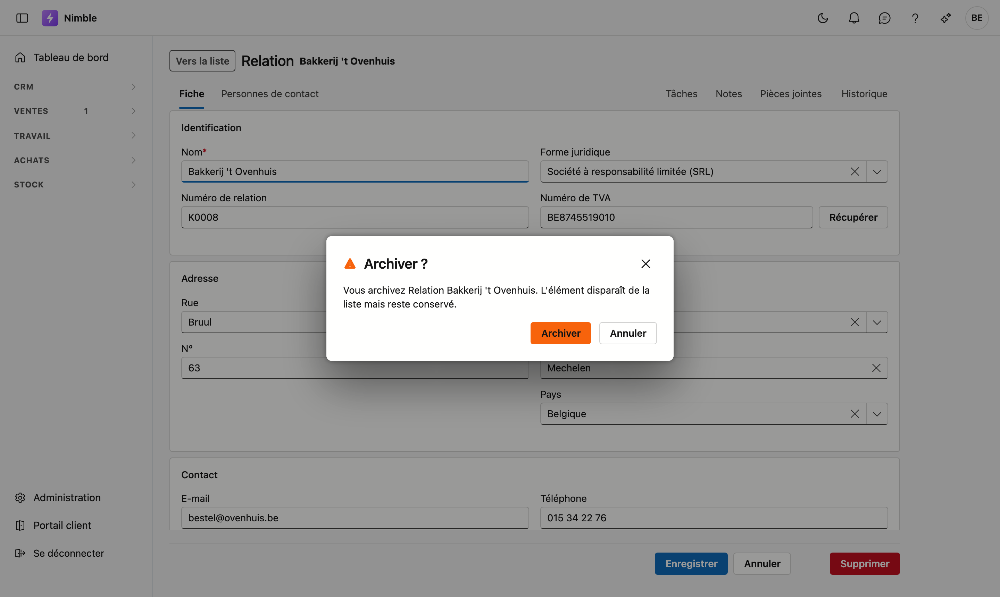

# Travailler avec une fiche

Un client, un lead, un article, une personne de contact — vous les ouvrez sur une **page dédiée** :
la fiche.

Cela fonctionne de la même manière sur **chaque fiche** de Nimble : cette page vaut donc pour tous les
écrans où vous ouvrez un enregistrement.

## Ouvrir une fiche

Double-cliquez une ligne dans la liste. Sur le tableau des leads, cliquez sur une carte.

Pour un nouvel enregistrement, utilisez le bouton en haut de la liste — **Nouvelle relation**,
**Nouvel article**, et ainsi de suite.

## Comment fonctionne une fiche

### Vous pouvez transmettre une fiche

Chaque fiche possède sa propre adresse web. Copiez la barre d'adresse et envoyez-la à un collègue :
il ouvrira exactement la même fiche.

C'est d'ailleurs le critère que nous utilisons pour décider si quelque chose mérite une fiche : *si vous
ne pouvez pas en faire un lien, ce n'est pas une entité.*

### Vers la liste

En haut à gauche se trouve **Vers la liste**. Le bouton Précédent de votre navigateur fonctionne
également et vous ramène à l'endroit de la liste d'où vous veniez.

### Modifications non enregistrées

Si vous avez modifié quelque chose et que vous quittez la page sans enregistrer, votre navigateur vous
demande d'abord confirmation.

### Onglets

En haut de la fiche se trouvent deux groupes d'onglets.

**À gauche**, les données de l'enregistrement lui-même. Sur la plupart des fiches il n'y en a qu'un —
**Général** ou **Fiche** — sur la fiche de relation il y en a deux, avec **Personnes de contact**.

**À droite**, le journal : **Tâches**, **Journal**, **Pièces jointes**, et sur une relation également
**Contacts**. Ce sont les éléments rattachés à l'enregistrement.

!!! info "Les boutons disparaissent sur un onglet du journal"
    Enregistrer et Supprimer appartiennent au formulaire. Si vous êtes sur **Pièces jointes**, ces boutons
    ne s'affichent pas — sinon « Supprimer » serait ambigu : cela supprimerait-il l'enregistrement ou la
    pièce jointe que vous consultez ?

### Tâches et Journal ont la même forme

Sur les deux onglets, chaque ligne est une fiche, avec au-dessus une barre d'outils qui reste visible.

Le **journal** montre ce qui s'est passé sur cet enregistrement : les notes que vous rédigez et les
appels téléphoniques que vous consignez. **Tâches** montre ce qui doit encore être fait, avec la
priorité et la date à laquelle ce doit être prêt.

<!-- AFBEELDING: l'onglet Journal avec la barre d'outils, le champ de recherche et trois lignes -->

- En haut se trouvent les **boutons d'ajout** de cet onglet — sur le journal **+ Note** et **+ Appel**,
  sur les tâches **+ Nouveau**. Cette barre d'outils **reste visible** pendant que vous faites défiler la
  liste : inutile de remonter pour ajouter quelque chose.
- Sur **Tâches** figure également **Afficher les tâches terminées**. Par défaut, vous ne voyez que ce qui
  reste ouvert.
- À droite se trouve un **champ de recherche**, sur les deux onglets. Si votre terme ne correspond à
  rien, vous lisez « Rien trouvé. » et non une liste vide — il y a donc bien des lignes, votre terme ne
  les atteint simplement pas.
- **Les sauts de ligne sont conservés.** Si vous rédigez une note de trois lignes, elle se lit comme
  trois lignes.
- La liste **remplit l'onglet** et défile à l'intérieur, pour que la barre d'outils reste en vue.

### L'onglet Pièces jointes

Les pièces jointes reçoivent la même barre d'outils, mais la liste est un **tableau**. La recherche porte
sur le nom et sur la description.

Le nombre de colonnes dépend de la largeur :

- **Sur un écran large**, fichier, description, taille et date figurent côte à côte.
- **Dans le panneau étroit du journal**, il reste fichier et description ; la taille et la date passent sous
  le nom du fichier. Ainsi, même un nom long comme `Vorderingsstaat_project_P2026-0004_augustus (1).xlsx`
  tient sans défilement latéral.

<!-- AFBEELDING: l'onglet Pièces jointes avec le bouton + Pièce jointe, le champ de recherche et deux fichiers dans le tableau -->

- **+ Pièce jointe** ouvre une fenêtre où vous choisissez des fichiers ou les y glissez. Vous pouvez en
  sélectionner **plusieurs à la fois** ; la description que vous indiquez vaut alors pour toute la série.
  Pour les décrire séparément, ajustez-les ensuite ligne par ligne via le menu **⋯**.
- Un clic sur le nom **ouvre** le fichier. Les photos et les PDF s'affichent directement dans votre
  navigateur ; le reste est téléchargé.
- La limite est de **25 Mo par fichier**.

## Enregistrer, annuler, supprimer

En bas à droite.

- **Enregistrer** conserve et vous ramène à la liste. Une brève confirmation s'affiche.
- **Annuler** revient en arrière sans conserver.
- **Supprimer** demande d'abord une confirmation — voir ci-dessous.

!!! warning "Supprimer, c'est archiver"
    Si vous cliquez sur **Supprimer**, la question « Archiver ? » apparaît, avec le nom de
    l'enregistrement. Celui-ci disparaît de la liste et **reste conservé** ; vous le retrouvez dans la
    **Corbeille**.

## Qui peut modifier

Sur les fiches **Articles**, **Relations** et **Personnes de contact**, Enregistrer et Supprimer dépendent
de votre **droit de modification**. Sans ce droit, vous pouvez ouvrir et lire la fiche, mais les champs
sont en lecture seule et seul un bouton de retour vers la liste subsiste.

<!-- AFBEELDING: la même fiche sans droit de modification : champs en gris, seul le bouton retour — nécessite un utilisateur SANS droit de modification, absent du tenant de démo -->

Consulter relève du droit de consultation ; écrire exige le droit de modification. C'est un réglage
distinct par rôle.

## Erreurs fréquentes

!!! warning
    - **Croire que vous avez perdu l'aperçu.** La fiche occupe l'écran. **Vers la liste** ou le bouton
      Précédent de votre navigateur vous ramène à la ligne d'où vous veniez.
    - **Quitter en pensant que c'est enregistré.** Enregistrer le fait, partir non. La question de votre
      navigateur est votre dernière chance.
    - **Lire « Supprimer » comme définitif.** Il s'agit d'un archivage. Ce que vous retirez se trouve dans
      la Corbeille.

## Voir aussi

- [Filtrer les listes](lijsten-filteren.md)
- [Relations](relations.md)
- [Leads](crm/leads.md)
- [Articles](inventory/articles.md)
- [Personnes de contact](crm/contactpersonen.md)
