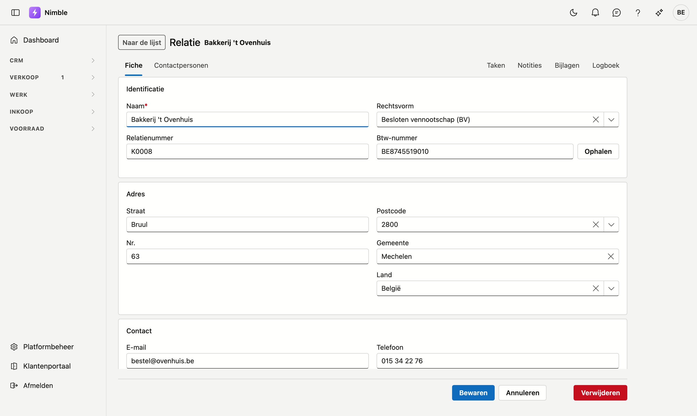
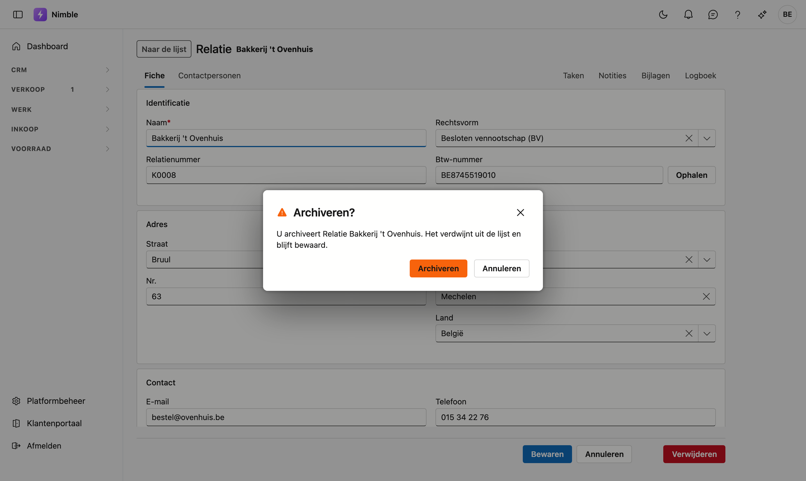

# Werken met een fiche

Een klant, een lead, een artikel, een contactpersoon — die opent u op een **eigen pagina**, de fiche.

Dit werkt op **elke fiche** in Nimble hetzelfde, dus deze pagina geldt voor alle schermen waar u een
record opent.

## Een fiche openen

Dubbelklik een rij in de lijst. Op het leadbord klikt u op een kaart.

Wilt u een nieuw record, klik dan op de knop bovenaan de lijst — **Nieuwe relatie**, **Nieuw artikel**,
en zo verder.

## Hoe een fiche werkt

### U kunt een fiche doorsturen

Elke fiche heeft een eigen webadres. Kopieer de adresbalk en stuur ze naar een collega: die opent exact
dezelfde fiche.

Dat is meteen de toets die we gebruiken om te beslissen of iets een fiche verdient: *kunt u er geen link
van maken, dan is het geen ding.*

### Naar de lijst

Linksboven staat **Naar de lijst**. De knop van uw browser om terug te gaan werkt ook, en die brengt u
terug op de plek in de lijst waar u vandaan kwam.

### Onbewaarde wijzigingen

Hebt u iets gewijzigd en navigeert u weg zonder te bewaren, dan vraagt uw browser eerst of u dat zeker
wil.

### Tabbladen

Bovenaan de fiche staan twee groepen tabbladen.

**Links** staan de gegevens van het record zelf. Op de meeste fiches is dat er één — **Algemeen** of
**Fiche** — op de relatiefiche zijn het er twee, met **Contactpersonen** erbij.

**Rechts** staat het journaal: **Taken**, **Logboek**, **Bijlagen**, en op een relatie ook
**Contacten**. Dat zijn de dingen die aan het record hangen.

!!! info "De knoppen verdwijnen op een journaal-tabblad"
    Opslaan en Verwijderen horen bij het formulier. Staat u op **Bijlagen**, dan ziet u die knoppen niet
    — anders zou "Verwijderen" dubbelzinnig zijn: verwijdert dat het record of de bijlage waar u naar
    kijkt?

### Taken en Logboek hebben dezelfde vorm

Op beide tabbladen is elke regel een kaart, met een werkbalk erboven die blijft staan.

Het **logboek** toont wat er gebeurd is bij dit record: notities die u zelf schrijft en
telefoongesprekken die u registreert. **Taken** toont wat er nog moet gebeuren, met de prioriteit en de
datum waartegen het klaar hoort te zijn.

<!-- AFBEELDING: het tabblad Logboek met de werkbalk, het zoekvak en drie regels -->

- Bovenaan staan de **toevoegknoppen** van dat tabblad — op het logboek **+ Notitie** en **+ Oproep**,
  op taken **+ Nieuw**. Die werkbalk **blijft staan** terwijl u door de lijst scrolt, dus u hoeft niet
  terug naar boven om iets toe te voegen.
- Op **Taken** staat er ook **Toon afgewerkte**. Standaard ziet u enkel wat nog openstaat.
- Rechts staat een **zoekvak**, op beide tabbladen. Raakt uw zoekterm niets, dan leest u
  *"Niets gevonden."* en niet een lege lijst — er zijn dus wél regels, uw term raakt ze enkel niet.
- **Regeleindes blijven staan.** Schrijft u een notitie van drie regels, dan leest ze ook als drie
  regels.
- De lijst **vult het tabblad** en schuift binnenin, zodat de werkbalk in beeld blijft.

### Het tabblad Bijlagen

Bijlagen krijgen dezelfde werkbalk, maar de lijst is een **tabel**: bestand, omschrijving, grootte en
datum naast elkaar. Zoeken doet u in de naam én de omschrijving.

<!-- AFBEELDING: het tabblad Bijlagen met de knop + Bijlage, het zoekvak en twee bestanden in de tabel -->

- **+ Bijlage** opent een venster waar u bestanden kiest of ernaartoe sleept. U kunt er **meerdere
  tegelijk** kiezen; de omschrijving die u meegeeft, geldt dan voor die hele reeks. Wilt u ze apart
  omschrijven, dan past u dat achteraf per regel aan via het **⋯**-menu.
- Klikt u op de naam, dan **opent** het bestand. Foto's en PDF's toont uw browser meteen; de rest wordt
  gedownload.
- Er geldt een bovengrens van **25 MB per bestand**.

## Opslaan, annuleren, verwijderen

Onderaan rechts.

- **Opslaan** bewaart en brengt u terug naar de lijst. U krijgt een korte bevestiging in beeld.
- **Annuleren** gaat terug zonder te bewaren.
- **Verwijderen** vraagt eerst een bevestiging — zie hieronder.

!!! warning "Verwijderen is archiveren"
    Klikt u op **Verwijderen**, dan verschijnt de vraag *"Archiveren?"* met de naam van het record erbij.
    Het verdwijnt uit de lijst en **blijft bewaard**; u vindt het terug in de **Prullenbak**.

## Wie mag wijzigen

Op de fiches van **Artikelen**, **Relaties** en **Contactpersonen** hangen Opslaan en Verwijderen aan uw
**bewerkrecht**. Hebt u dat niet, dan kunt u de fiche wél openen en lezen, maar staan de velden op
alleen-lezen en is er enkel een knop terug naar de lijst.

<!-- AFBEELDING: dezelfde fiche zonder bewerkrecht: velden grijs, enkel de terugknop — vraagt een gebruiker ZONDER bewerkrecht, en die heeft de demo-tenant niet -->

Kijken mag met het kijkrecht; schrijven vraagt het bewerkrecht. Dat is een aparte instelling per rol.

## Veelgemaakte fouten

!!! warning
    - **Denken dat u het overzicht kwijt bent.** De fiche neemt het scherm over. **Naar de lijst** of de
      terugknop van uw browser brengt u terug op de rij waar u vandaan kwam.
    - **Wegklikken en denken dat het bewaard is.** Opslaan doet dat, weggaan niet. De vraag van uw
      browser is uw laatste kans.
    - **"Verwijderen" lezen als definitief.** Het is archiveren. Wat u weghaalt, staat in de Prullenbak.

## Zie ook

- [Lijsten filteren](lijsten-filteren.md)
- [Relaties](relations.md)
- [Leads](crm/leads.md)
- [Artikelen](inventory/articles.md)
- [Contactpersonen](crm/contactpersonen.md)
