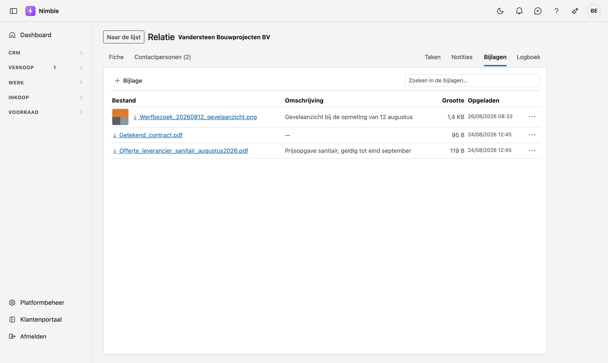

# Werken met een fiche

Een klant, een lead, een artikel, een contactpersoon — die opent u op een **eigen pagina**, de fiche.

Dit werkt op **elke fiche** in Nimble hetzelfde, dus deze pagina geldt voor alle schermen waar u een
record opent.

## Een fiche openen

Dubbelklik een rij in de lijst. Op het leadbord klikt u op een kaart.

Wilt u een nieuw record, klik dan op de knop bovenaan de lijst — **Nieuwe relatie**, **Nieuw artikel**,
en zo verder.

## Hoe een fiche werkt

### U kunt een fiche doorsturen

Elke fiche heeft een eigen webadres. Kopieer de adresbalk en stuur ze naar een collega: die opent exact
dezelfde fiche.

Dat is meteen de toets die we gebruiken om te beslissen of iets een fiche verdient: *kunt u er geen link
van maken, dan is het geen ding.*

### Naar de lijst

Linksboven staat **Naar de lijst**. De knop van uw browser om terug te gaan werkt ook, en die brengt u
terug op de plek in de lijst waar u vandaan kwam.

### Onbewaarde wijzigingen

Hebt u iets gewijzigd en navigeert u weg zonder te bewaren, dan vraagt uw browser eerst of u dat zeker
wil.

### Tabbladen

Bovenaan de fiche staan twee groepen tabbladen.

**Links** staan de gegevens van het record zelf. Op de meeste fiches is dat er één — **Algemeen** of
**Fiche** — op de relatiefiche zijn het er twee, met **Contactpersonen** erbij.

**Rechts** staat het journaal: **Taken**, **Notities**, **Bijlagen** en **Logboek**. Dat zijn de dingen
die aan het record hangen.

!!! info "De knoppen verdwijnen op een journaal-tabblad"
    Bewaren en Verwijderen horen bij het formulier. Staat u op **Bijlagen**, dan ziet u die knoppen niet
    — anders zou "Verwijderen" dubbelzinnig zijn: verwijdert dat het record of de bijlage waar u naar
    kijkt?

### De werkbalk van een journaal-tabblad

Elk journaal-tabblad heeft bovenaan een werkbalk die **blijft staan** terwijl u door de lijst scrolt. U hoeft
dus niet terug naar boven om iets toe te voegen.

| Tabblad | In de werkbalk |
|---|---|
| **Taken** | **Nieuw**, en rechts het vinkje **Toon afgewerkte**. Standaard ziet u enkel wat nog openstaat |
| **Notities** | **Notitie**, en rechts het zoekvak **Zoeken in de notities…** |
| **Bijlagen** | **+ Bijlage**, en een zoekvak |
| **Logboek** | Niets: het Logboek is een naslag, u schrijft er niets in |

De knoppen om toe te voegen ziet u enkel als u het record mag wijzigen.

### Het tabblad Taken

Elke taak is een kaart met de titel, de omschrijving, de prioriteit, de datum waartegen ze klaar hoort te
zijn (**Tot …**) en wie ze opvolgt.

**Nieuw** opent een venster met deze velden:

| Veld | |
|---|---|
| **Onderwerp** | Wat er moet gebeuren. Verplicht |
| **Toegewezen aan** | Wie de taak opvolgt |
| **Prioriteit** | Staat standaard op **Normaal** |
| **Vanaf** en **Tot** | Wanneer u eraan begint en wanneer het klaar moet zijn |
| **Herinnering** | Een datum en uur. Op dat moment verschijnt de taak bij het belletje bovenaan in de app — er wordt geen e-mail verstuurd |
| **Tekst** | De details |

Klik **Bewaren**. De taak verschijnt ook op het scherm [Taken](crm/tasks.md), waar ze aan dit record hangt.

<!-- AFBEELDING: het venster Nieuw op het tabblad Taken van een relatiefiche in tenant demo (bv. Vandersteen Bouwprojecten BV), met de velden leeg. Er is nog geen blok voor in gen-screenshots.mjs. -->

### Het tabblad Notities

Notities is wat u zelf schrijft over dit record. Elke notitie is een kaart met het onderwerp, de tekst en de
datum. **Regeleindes blijven staan**: een notitie van drie regels leest ook als drie regels. Zie
[Notities](notities.md).

### Het tabblad Logboek

Het Logboek is de **geschiedenis van de fiche**: wie welk veld wijzigde, wanneer, en van welke waarde naar
welke. Onderaan elke reeks staat wie de fiche aanmaakte.

U schrijft er zelf niets in. Er is geen toevoegknop en u kunt niets verwijderen — een geschiedenis waarin
u kunt schrappen is geen geschiedenis.

<!-- AFBEELDING: het tabblad Logboek met enkele wijzigingsregels — een gekleurd label Gewijzigd of Aangemaakt, de datum, wie het deed, en eronder de velden met hun oude en nieuwe waarde. Demotoestand: een relatie in tenant demo die na het aanmaken minstens één keer gewijzigd en bewaard is. -->

- Elke regel begint met een label: **Aangemaakt**, **Gewijzigd** of **Verwijderd**.
- Daaronder staan de velden die veranderden, met hun waarde ervóór en erna.
- Wijzigde er veel tegelijk, dan ziet u de eerste vier velden en daaronder **+ n andere velden**.
- Van de recentste 200 wijzigingen wordt de geschiedenis getoond; is er meer, dan meldt de lijst dat
  onderaan.

### Het tabblad Bijlagen

Bijlagen krijgen dezelfde werkbalk, maar de lijst is een **tabel**. Zoeken doet u in de naam én de
omschrijving.

Hoeveel kolommen u ziet, hangt af van de breedte:

- **Op een breed scherm** staan bestand, omschrijving, grootte en datum naast elkaar.
- **In het smalle journaalpaneel** blijven bestand en omschrijving over; grootte en datum schuiven onder de
  bestandsnaam. Zo past ook een lange naam als `Vorderingsstaat_project_P2026-0004_augustus (1).xlsx` zonder
  dat u opzij moet schuiven.

- **+ Bijlage** opent een venster waar u bestanden kiest of ernaartoe sleept. U kunt er **meerdere
  tegelijk** kiezen; de omschrijving die u meegeeft, geldt dan voor die hele reeks. Wilt u ze apart
  omschrijven, dan past u dat achteraf per regel aan via het **⋯**-menu.
- Klikt u op de naam, dan **opent** het bestand. Een foto toont uw browser meteen; andere bestanden kunnen
  ook als download binnenkomen. Zie [Bijlagen](bijlagen.md).
- Er geldt een bovengrens van **25 MB per bestand**.

## Bewaren, annuleren, verwijderen

De knoppen staan onderaan rechts, in deze volgorde:

1. **Bewaren** bewaart en brengt u terug naar de lijst. U krijgt een korte bevestiging in beeld.
2. De acties die bij die fiche horen, zoals **Omzetten naar klant** op een lead.
3. **Annuleren** gaat terug naar de lijst zonder te bewaren.
4. **Verwijderen** staat apart, helemaal rechts. Het vraagt eerst een bevestiging — zie hieronder.

Ontbreekt er nog iets verplichts wanneer u op **Bewaren** klikt, dan verschijnt bovenaan de fiche een melding
die zegt welk veld. Verplichte velden herkent u aan het rode sterretje.

!!! warning "Verwijderen is archiveren"
    Klikt u op **Verwijderen**, dan verschijnt de vraag *"Archiveren?"* met de naam van het record erbij.
    Het verdwijnt uit de lijst en **blijft bewaard**; u vindt het terug in de **Prullenbak**.

## Wie mag wijzigen

Op de fiches hangen Bewaren en Verwijderen aan uw **bewerkrecht** — onder meer bij **Leads**, **Relaties**,
**Contactpersonen** en **Artikelen**. Hebt u dat niet, dan kunt u de fiche wél openen en lezen, maar ziet u
geen **Bewaren** en geen **Verwijderen**. In de plaats van **Annuleren** staat dan **Naar de lijst**.

<!-- AFBEELDING: dezelfde fiche zonder bewerkrecht: velden grijs, enkel de terugknop — vraagt een gebruiker ZONDER bewerkrecht, en die heeft de demo-tenant niet -->

Kijken mag met het kijkrecht; schrijven vraagt het bewerkrecht. Dat is een aparte instelling per rol.

## Veelgemaakte fouten

!!! warning
    - **Denken dat u het overzicht kwijt bent.** De fiche neemt het scherm over. **Naar de lijst** of de
      terugknop van uw browser brengt u terug op de rij waar u vandaan kwam.
    - **Wegklikken en denken dat het bewaard is.** Bewaren doet dat, weggaan niet. De vraag van uw
      browser is uw laatste kans.
    - **"Verwijderen" lezen als definitief.** Het is archiveren. Wat u weghaalt, staat in de Prullenbak.

## Zie ook

- [Lijsten filteren](lijsten-filteren.md)
- [Relaties](relations.md)
- [Leads](crm/leads.md)
- [Artikelen](inventory/articles.md)
- [Contactpersonen](crm/contactpersonen.md)
