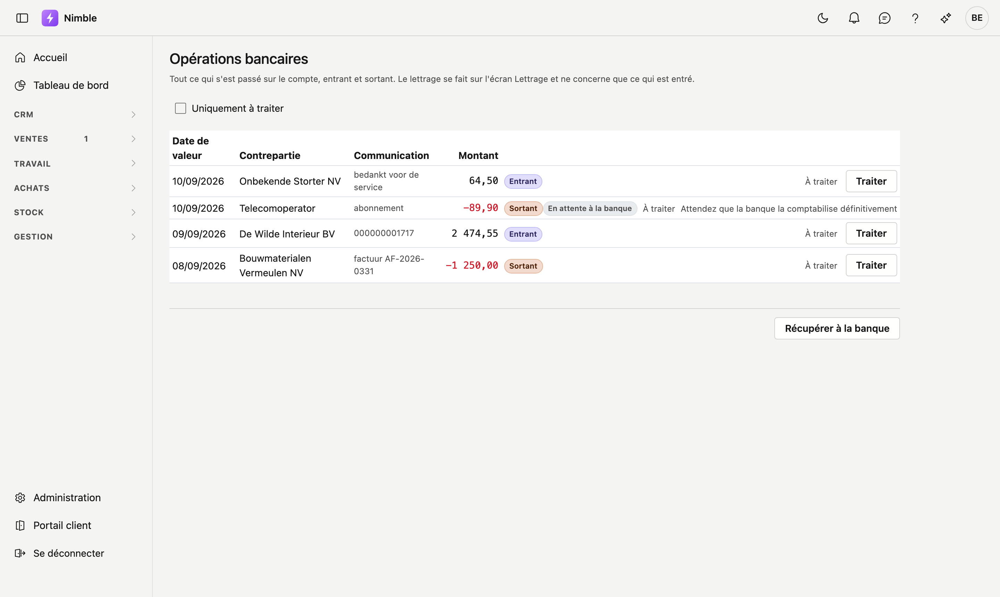

# Opérations bancaires

Tout ce qui s'est passé sur votre compte, entrant et sortant. Nimble les récupère auprès d'ADM One ; vous
connectez votre banque une seule fois dans le portail client.

## Ouvrir l'écran

Cliquez dans la barre latérale sur **Ventes → Opérations bancaires**.

## Récupérer à la banque

**Récupérer à la banque** demande ce qui est arrivé depuis la dernière fois. Nimble retient où elle s'était
arrêtée : vous ne récupérez donc jamais deux fois la même opération.

Si rien ne vient, l'écran indique *« Rien de nouveau n'est arrivé. »* Cela signifie que la banque n'avait
rien de neuf — pas qu'une erreur s'est produite.

!!! warning "Votre banque doit d'abord être connectée"
    La connexion se fait dans le portail client d'ADM One, pas dans Nimble. Tant qu'aucun compte n'est
    connecté, ce bouton ne rapporte rien.

## Ce que montre la liste

| Colonne | Signification |
|---|---|
| **Date de valeur** | Le jour que la banque attribue à l'opération. C'est à cette date qu'un paiement est comptabilisé |
| **Contrepartie** | Le nom tel que la banque le fournit — pour un paiement entrant, votre client |
| **Communication** | S'il y a une communication structurée, c'est la clé sur laquelle repose le lettrage |
| **Montant** | Négatif et en rouge = de l'argent sorti |

À côté du montant figure **Entrant** ou **Sortant**. Ce mot est là à dessein : une ligne qui n'affiche que
`-89,90` se lit, d'un coup d'œil, comme 89,90.

## Traiter une opération

Toutes les opérations ne concernent pas une facture. Salaire, loyer, frais bancaires : vous les retirez de
la liste avec **Traiter**, sans rien comptabiliser. En cas d'erreur, **Rouvrir** la remet dans la liste.

!!! warning "Une opération en attente ne peut pas être traitée"
    Tant que la banque ne l'a pas comptabilisée définitivement, elle peut encore changer ou disparaître. La
    traiter reviendrait à la masquer au moment où elle devient définitive. Vous voyez donc la raison, pas un
    bouton.

## La différence avec le Lettrage

Cette liste montre **tout**. L'écran **Lettrage** ne montre que ce qui est entré, car seule une recette peut
lettrer une facture de vente. Un paiement que vous avez effectué se traite ici.
