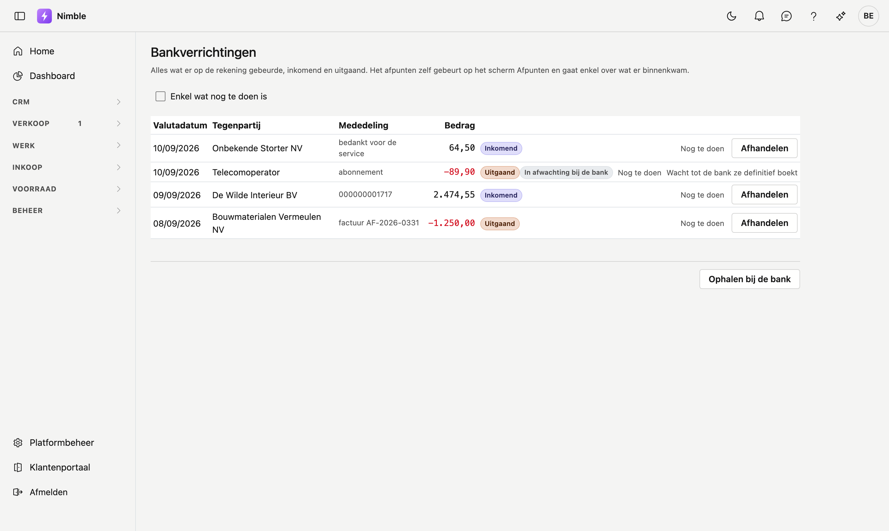

# Bankverrichtingen

Alles wat er op uw rekening gebeurde, inkomend en uitgaand. Nimble haalt het op bij ADM One; uw bank
koppelt u één keer in het klantenportaal.

## Het scherm openen

Klik in de zijbalk op **Verkoop → Bankverrichtingen**.

## Ophalen bij de bank

**Ophalen bij de bank** vraagt op wat er sinds de vorige keer bij kwam. Nimble onthoudt waar ze gebleven
was, dus u haalt nooit twee keer hetzelfde binnen.

Komt er niets, dan staat er *"Er kwam niets nieuws binnen."* Dat betekent dat de bank niets nieuws had —
niet dat er iets misging.

!!! warning "Uw bank moet eerst gekoppeld zijn"
    De koppeling gebeurt in het klantenportaal van ADM One, niet in Nimble. Zolang er geen rekening
    gekoppeld is, levert deze knop niets op.

## Wat u in de lijst ziet

| Kolom | Wat het betekent |
|---|---|
| **Valutadatum** | De dag die de bank aan de verrichting geeft. Daarop wordt een betaling geboekt |
| **Tegenpartij** | De naam zoals de bank ze aanlevert — bij een inkomende betaling dus uw klant |
| **Mededeling** | Staat er een gestructureerde mededeling, dan is dat de sleutel waarmee het afpunten werkt |
| **Bedrag** | Negatief en in het rood = geld dat wegging |

Naast het bedrag staat **Inkomend** of **Uitgaand**. Dat woord staat er met opzet bij: een rij die enkel
`-89,90` toont, leest bij vluchtig kijken als 89,90.

## Een verrichting afhandelen

Niet elke verrichting hoort bij een factuur. Loon, huur, een bankkost: die zet u met **Afhandelen** uit de
lijst, zonder dat er iets geboekt wordt. Vergist u zich, dan zet **Terug openzetten** de rij er weer in.

!!! warning "Een verrichting in afwachting kunt u niet afhandelen"
    Zolang de bank ze niet definitief geboekt heeft, kan ze nog wijzigen of verdwijnen. Ze afhandelen zou
    haar verbergen op het moment dat ze wél vastligt. U ziet daarom geen knop maar de reden.

## Het verschil met Afpunten

Deze lijst toont **alles**. Het scherm **Afpunten** toont enkel wat er binnenkwam, want alleen een
ontvangst kan een verkoopfactuur afpunten. Een betaling die u zelf deed, handelt u hier af.
