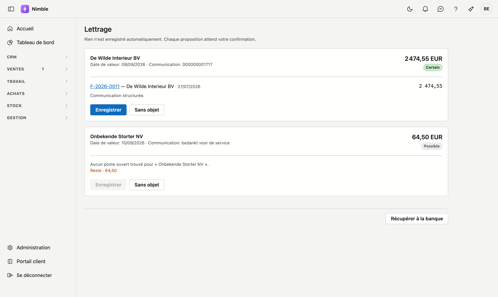

# Lettrage

Quel paiement correspond à quelle facture ouverte. Nimble propose ; **vous** confirmez.

## Ouvrir l'écran

Cliquez dans la barre latérale sur **Ventes → Lettrage**.

!!! warning "Rien n'est enregistré automatiquement"
    Même une proposition **Certain** attend votre clic. Un lettrage automatique erroné coûte plus cher qu'un
    poste ouvert qui subsiste : ce poste reste visible, un paiement erroné se perd dans les chiffres.

## Les trois niveaux de certitude

| | Sur quoi cela repose |
|---|---|
| **Certain** | La communication structurée désigne une seule facture. Ce numéro figure sur votre facture et le client l'a repris |
| **Probable** | Le montant correspond exactement à une seule facture ouverte de ce client |
| **Possible** | Le montant est la somme de plusieurs factures, ou un paiement partiel |

Sous chaque proposition figure **pourquoi** Nimble la propose. Lisez cette phrase pour *Probable* et
*Possible* — elle dit précisément ce qui n'est pas établi.

!!! warning "Un abonnement produit des montants identiques"
    Si un client paie chaque mois le même montant, plusieurs factures ouvertes portent exactement ce
    montant. Le montant seul ne permet alors **pas** de déterminer laquelle est visée. L'explication indique
    combien il y en a : deux, c'est une vérification ; douze signifie qu'il vous faut la communication.

## Enregistrer

**Enregistrer** comptabilise un paiement sur la facture, à la **date de valeur de la banque** — pas au jour
où vous cliquez. Si le client solde ainsi la facture, celle-ci passe d'elle-même à *Payée*.

En cas de paiement partiel, le solde reste ouvert, et le paiement suivant de ce client réapparaîtra
simplement dans cette liste.

## Sans objet

Si une recette ne correspond à aucune facture — un remboursement, un versement d'un tiers — **Sans objet**
la retire de la liste sans rien comptabiliser. Elle reste visible dans **Opérations bancaires**, où vous
pouvez au besoin la rouvrir.

## Ce que vous ne trouverez pas ici

Les paiements sortants. Seule une recette peut lettrer une facture de vente ; ce que vous avez payé
vous-même figure dans **Opérations bancaires**.
