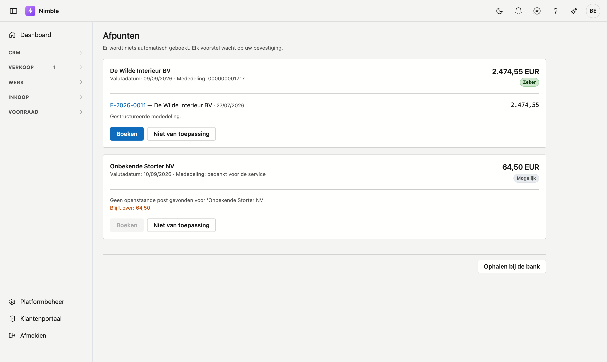

# Afpunten

Welke betaling hoort bij welke openstaande factuur. Nimble stelt voor; **u** bevestigt.

## Het scherm openen

Klik in de zijbalk op **Verkoop → Afpunten**. Het scherm vraagt het recht om facturen te bewerken.

Onderaan staat **Ophalen bij de bank**, net als op [Bankverrichtingen](bank.md): daarmee haalt u nieuwe
verrichtingen binnen zonder van scherm te wisselen.

!!! warning "Er wordt niets automatisch geboekt"
    Ook een voorstel met zekerheid **Zeker** wacht op uw klik. Een verkeerde automatische afpunting is
    duurder dan een openstaande post die blijft staan: die post blijft zichtbaar, een verkeerde betaling
    verdwijnt in de cijfers.

## De drie zekerheden

| | Waarop het berust |
|---|---|
| **Zeker** | De gestructureerde mededeling wijst één factuur aan. Dat nummer staat op uw factuur en de klant nam het over |
| **Waarschijnlijk** | Het bedrag klopt exact met één openstaande factuur van deze klant |
| **Mogelijk** | Het bedrag is de som van meerdere facturen, of een deelbetaling — of Nimble vond geen enkele openstaande post |

Elk voorstel toont de tegenpartij, de valutadatum, de mededeling en het bedrag. Daaronder staan de facturen
waarop Nimble wil boeken; klik een factuurnummer om die factuur te openen. Onder elk voorstel staat
**waarom** Nimble het voorstelt. Lees die zin bij *Waarschijnlijk* en *Mogelijk* —
ze zegt precies wat er niet zeker is.

!!! warning "Een abonnement geeft identieke bedragen"
    Betaalt een klant elke maand hetzelfde, dan staan er meerdere openstaande facturen met exact dat bedrag.
    Uit het bedrag alleen is dan **niet** af te leiden welke bedoeld is. De uitleg zegt hoeveel het er zijn:
    twee is een controle, twaalf betekent dat u de mededeling nodig hebt.

## Boeken

**Boeken** registreert een betaling op de factuur, met de **valutadatum van de bank** — niet de dag waarop u
klikt. Betaalt de klant daarmee alles, dan gaat de factuur vanzelf naar *Betaald*.

Bij een deelbetaling blijft de rest openstaan, en de volgende betaling van die klant komt gewoon opnieuw in
deze lijst.

Past het bedrag niet volledig op de voorgestelde facturen, dan staat er **Blijft over:** met het restbedrag.
Vond Nimble geen enkele factuur, dan staat **Boeken** grijs: er is niets om op te boeken.

## Niet van toepassing

Hoort een ontvangst bij geen enkele factuur — een teruggave, een storting van een derde — dan haalt **Niet
van toepassing** ze uit de lijst zonder te boeken. Ze blijft zichtbaar bij **Bankverrichtingen**, waar u ze
desnoods weer openzet.

## Wat u hier niet vindt

Uitgaande betalingen. Alleen een ontvangst kan een verkoopfactuur afpunten; wat u zelf betaalde, staat bij
**Bankverrichtingen**.
