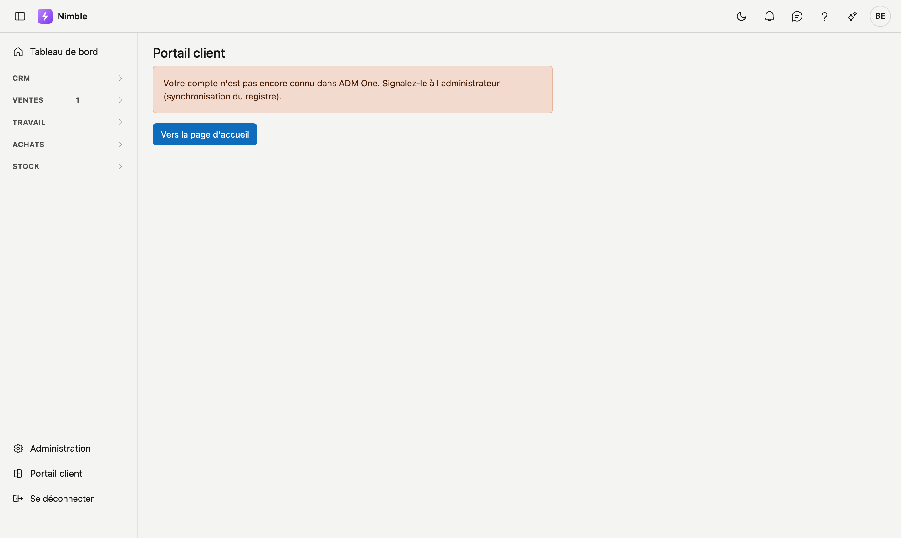

# Portail client

Le **portail client** est votre espace chez ADM-Concept, géré dans ADM One. Nimble l'ouvre pour vous en un
clic : vous ne devez pas vous y connecter séparément.

Le portail lui-même ne se trouve **pas dans Nimble**. Ce que vous y voyez et y faites est géré dans ADM One.
Vous y connectez par exemple votre compte bancaire pour les [Opérations bancaires](../finance/bank.md).

## Ouvrir le portail

Cliquez en bas de la barre latérale sur **Portail client**, sous **Administration**.

Le portail s'ouvre dans un **nouvel onglet**. Vous y voyez d'abord brièvement **Ouverture du portail client en
cours…**, puis le portail apparaît. Votre onglet Nimble reste ouvert.

## Quand le portail ne s'ouvre pas

Si l'ouverture échoue, le nouvel onglet reste sur Nimble, avec le titre **Portail client**, un message et le
bouton **Vers la page d'accueil**.

| Message | Ce qu'il signifie | Ce que vous faites |
|---|---|---|
| **Votre compte n'est pas encore connu dans ADM One. Signalez-le à l'administrateur (synchronisation du registre).** | Votre utilisateur n'est pas encore enregistré dans ADM One. Nimble essaie d'abord de corriger cela lui-même ; en cas d'échec, vous voyez ce message | Signalez-le à votre administrateur. Vous ne pouvez rien y faire vous-même |
| **Votre compte n'a pas encore accès au portail client. Contactez ADM-Concept pour obtenir l'accès.** | Votre compte existe, mais le portail ne lui est pas encore ouvert | Contactez ADM-Concept |
| **Le portail client n'a pas pu être ouvert. Réessayez plus tard.** | Le portail n'était pas joignable à ce moment | Réessayez plus tard |

**Vers la page d'accueil** vous ramène dans Nimble, vers le premier écran auquel vous avez accès. Cela varie
selon votre rôle.

## Erreurs fréquentes

!!! warning
    - **Rien ne se passe au clic.** Votre navigateur bloque peut-être le nouvel onglet. Autorisez les fenêtres
      pop-up pour Nimble et cliquez à nouveau.
    - **Chercher le portail dans Nimble.** Ce que vous réglez dans le portail ne se trouve pas dans les écrans
      de Nimble.

## Voir aussi

- [Administration](../administration/platform-management.md)
- [Opérations bancaires](../finance/bank.md) — la connexion bancaire se fait dans le portail client
