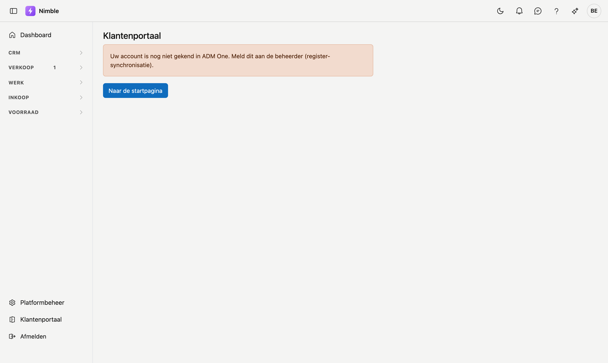

# Klantenportaal

Het **klantenportaal** is uw omgeving bij ADM-Concept, beheerd in ADM One. Nimble opent het voor u in één
klik: u hoeft daar niet apart aan te melden.

Het portaal zelf staat **niet in Nimble**. Wat u er ziet en doet, wordt in ADM One beheerd. U koppelt er
bijvoorbeeld uw bankrekening voor [Bankverrichtingen](../finance/bank.md).

## Het portaal openen

Klik onderaan in de zijbalk op **Klantenportaal**, onder **Platformbeheer**.

Het portaal opent in een **nieuw tabblad**. Daar ziet u eerst kort **Bezig met openen van het
klantenportaal…**, waarna het portaal verschijnt. Uw tabblad met Nimble blijft open.

## Wanneer het portaal niet opent

Lukt het openen niet, dan blijft het nieuwe tabblad op Nimble staan, met de titel **Klantenportaal**, een
melding en de knop **Naar de startpagina**.

| Melding | Wat het betekent | Wat u doet |
|---|---|---|
| **Uw account is nog niet gekend in ADM One. Meld dit aan de beheerder (register-synchronisatie).** | Uw gebruiker is nog niet geregistreerd in ADM One. Nimble probeert dat eerst zelf recht te zetten; lukt dat niet, dan ziet u deze melding | Meld het aan uw beheerder. Zelf kunt u er niets aan doen |
| **Uw account heeft nog geen toegang tot het klantenportaal. Neem contact op met ADM-Concept om toegang te krijgen.** | Uw account bestaat, maar het portaal is er nog niet voor opengezet | Neem contact op met ADM-Concept |
| **Het klantenportaal kon niet geopend worden. Probeer het later opnieuw.** | Het portaal was op dat moment niet bereikbaar | Probeer het later opnieuw |

**Naar de startpagina** brengt u terug in Nimble, naar het eerste scherm waar u toegang toe hebt. Dat verschilt
per rol.

## Veelgemaakte fouten

!!! warning
    - **Er gebeurt niets bij een klik.** Uw browser blokkeert mogelijk het nieuwe tabblad. Sta pop-ups toe voor
      Nimble en klik opnieuw.
    - **Het portaal zoeken in Nimble.** Wat u in het portaal regelt, staat niet in de schermen van Nimble.

## Zie ook

- [Platformbeheer](../administration/platform-management.md)
- [Bankverrichtingen](../finance/bank.md) — de bankkoppeling gebeurt in het klantenportaal
