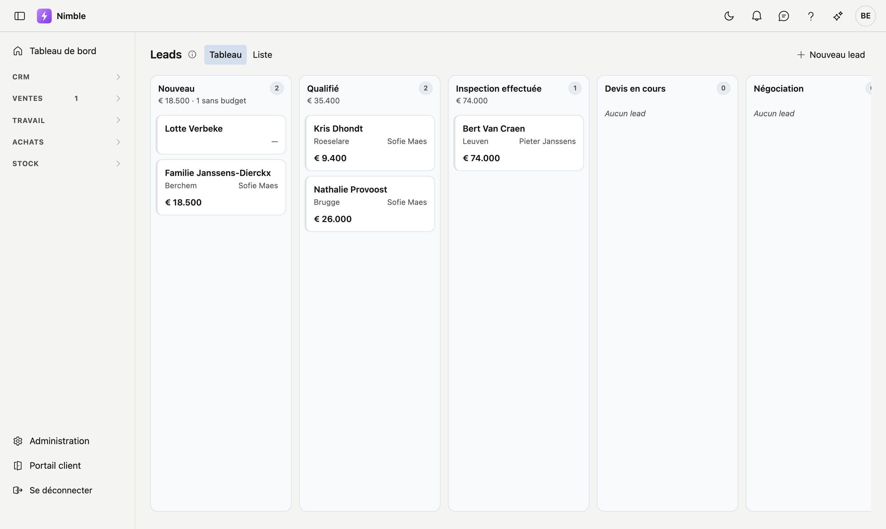

---
hide:
  - navigation
  - toc
---

# Toute votre entreprise dans un seul dossier

De la première demande à la dernière facture. Nimble réunit leads, clients,
projets, planning, stock et facturation — sans que vous saisissiez deux fois les
mêmes données.

[Pour commencer](fiches.fr.md){ .nb-knop .nb-knop--vol }
[Tous les sujets](#veelgezocht){ .nb-knop .nb-knop--rand }

{ .off-glb }

:material-arrow-decision-outline:

### De la demande au client

Chaque demande sur un tableau, par phase que **vous** composez. Ce qui traîne
reçoit automatiquement une tâche — et lors de la conversion, Nimble demande si
ce client existe déjà.

:material-folder-open-outline:

### Tout auprès du dossier

Documents, photos, tâches et l'historique complet se trouvent auprès du client,
du lead ou du projet lui-même. Plus personne ne doit chercher où quelque chose a
été rangé.

:material-account-lock-outline:

### À chacun son rôle

Un commercial qui rédige des devis mais consulte seulement le planning, un chef
d'équipe qui remplit des bons de travail sans toucher à la facturation. Vous le
définissez par rôle.

!!! tip "Vous cherchez quelque chose de précis ?"
    Utilisez le **champ de recherche** en haut à droite. C'est presque toujours plus
    rapide que de cliquer de page en page — tapez ce que vous cherchez et vous arrivez
    au bon paragraphe.

    Vous êtes dans Nimble ? Cliquez alors en haut à droite sur **?** pour une explication
    sur l'écran où vous vous trouvez, avec un lien vers la page complète ici.

## Vous débutez ? Commencez par ces trois-ci

1. **[Travailler avec une fiche](fiches.fr.md)** — chaque écran de Nimble fonctionne de
   la même façon : une liste où vous cherchez, et une fiche où vous modifiez. Qui
   maîtrise ce schéma connaît la moitié de l'application.
2. **[Filtrer les listes](lijsten-filteren.fr.md)** — chercher, filtrer sur une colonne,
   et conserver votre filtre pour qu'il soit encore là demain.
3. **[Fiche d'entreprise](settings/company-profile.fr.md)** — vos propres données, à
   remplir une seule fois. Elles reviennent sur chaque document que vous envoyez.

## Sujets fréquemment consultés { #veelgezocht }

- **[Convertir un lead en client](crm/leads.fr.md#convertir-un-lead-en-client)** — avec la question de savoir si ce client existe déjà
- **[Leads depuis votre site web](crm/leads-webformulier.fr.md)** — votre formulaire de contact directement dans Nimble
- **[Adapter les phases de votre tableau](administration/lead-status.fr.md)** — ajouter, renommer ou masquer vos propres phases
- **[Définir les droits par rôle](administration/roles.fr.md)** — qui peut consulter, qui peut modifier
- **[Conserver documents et photos](bijlagen.fr.md)** — chez un client, un contact, un lead ou un projet
- **[Les tâches en souffrance](crm/tasks.fr.md)** — avec des rappels via la cloche

## Les modules

**CRM** — [Leads](crm/leads.fr.md) · [Relations](relations.fr.md) ·
[Contacts](crm/contactpersonen.fr.md) · [Tâches](crm/tasks.fr.md) ·
[Pièces jointes](bijlagen.fr.md)

**Stock** — [Articles](inventory/articles.fr.md)

**Configuration** — [Gestion de la plateforme](administration/platform-management.fr.md) ·
[Données de base](administration/master-data.fr.md) ·
[Paramètres des leads](administration/lead-status.fr.md)

**Administration** — [Utilisateurs](administration/users.fr.md) ·
[Rôles](administration/roles.fr.md) · [Corbeille](administration/recycle-bin.fr.md) ·
[Journal des actions](administration/audit-log.fr.md)
