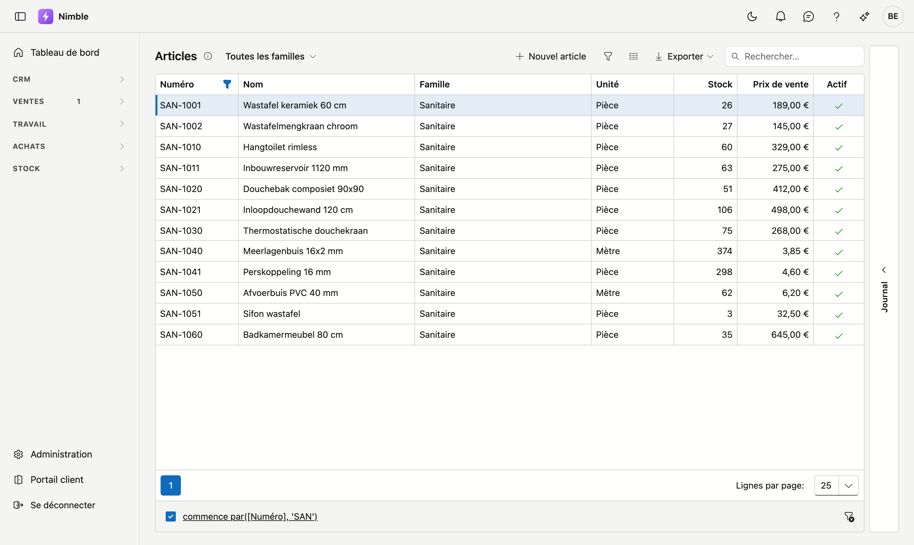
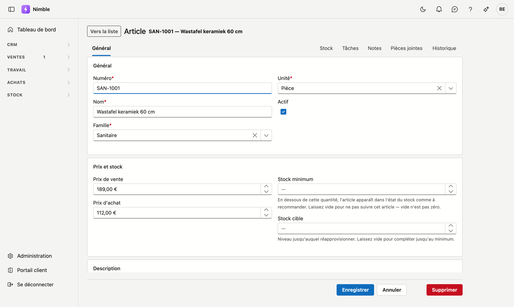
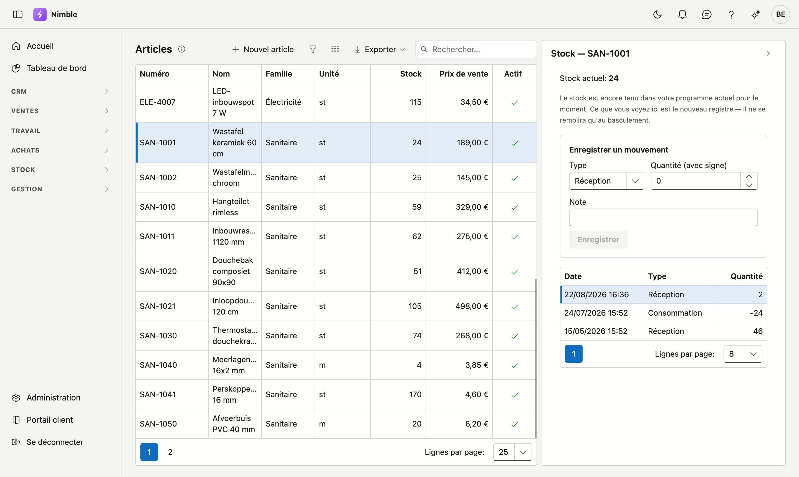

# Articles

L'écran **Articles** contient tout ce que vous livrez ou posez : la description, les prix et la famille à
laquelle l'article appartient. C'est la liste à partir de laquelle vous composerez vos devis et bons de
travail.

## Ouvrir l'écran

Dans la barre latérale, cliquez sur **Stock → Articles**.

## La liste

| Colonne | Ce que c'est |
|---|---|
| **Numéro** | Votre propre numéro d'article |
| **Nom** | Dénomination courte |
| **Famille** | Le groupe auquel l'article appartient |
| **Unité** | Pièce, mètre, m², heure … |
| **Stock** | Le stock actuel — voir la remarque ci-dessous |
| **Prix de vente** | Prix par unité |
| **Actif** | Une coche pour les articles que vous utilisez encore |

Vous pouvez rechercher, trier, filtrer et exporter comme dans les autres listes. Double-cliquez une ligne
pour ouvrir l'article.

## Créer ou modifier un article

Cliquez sur **Nouvel article**, ou double-cliquez une ligne existante.

| Champ | Remarque |
|---|---|
| **Numéro** | Obligatoire |
| **Nom** | Obligatoire |
| **Famille** | Obligatoire — gérée via [Familles d'articles](../administration/article-families.md) |
| **Unité** | Obligatoire — gérée via [Unités](../administration/units.md) |
| **Prix de vente** | Ce que paie le client |
| **Prix d'achat** | Ce que vous payez vous-même |
| **Description** | Texte plus long, par ex. pour un devis |
| **Actif** | Décochez pour les articles que vous n'utilisez plus ; ils restent visibles sur les anciens documents |

!!! info "La famille et l'unité sont obligatoires"
    Un article sans famille est introuvable dans toute liste, et sans unité personne ne sait si « 10 »
    signifie dix pièces ou dix mètres. D'où l'obligation des deux. Si la famille ou l'unité dont vous avez
    besoin n'existe pas, créez-la d'abord via l'administration.

## Le rail Stock

Cliquez sur **Stock** à droite pour déplier le panneau. Choisissez un article dans la liste et vous voyez
son état actuel et ses mouvements.

!!! warning "Le stock est encore tenu dans votre programme actuel pour le moment"
    Tant que vous travaillez avec les deux programmes, c'est votre **ancien programme** qui tient le stock.
    Nimble affiche déjà le nouveau registre, mais chez vous il ne se remplira qu'au moment du basculement —
    les stocks que vous voyez ne viennent donc pas encore de Nimble. (L'image ci-dessus montre bien des
    chiffres : elle provient d'un environnement de démonstration.)

    C'est volontaire : si deux systèmes tiennent le stock en même temps, ils divergent inévitablement, et
    vous ne le constatez qu'au premier inventaire. Il n'y a donc qu'un seul endroit qui fait foi, et c'est
    pour l'instant votre ancien programme.

    Les écritures ne sont donc pas encore possibles. Lors du basculement, l'état initial sera repris et la
    suite se fera ici.

### Les trois types de mouvement

| Type | Ce qu'il signifie |
|---|---|
| **Réception** | Des marchandises entrent — une livraison, une réception. La quantité est positive |
| **Consommation** | Des marchandises sortent — utilisées sur un bon de travail ou un projet. La quantité est négative |
| **Correction** | Une rectification manuelle après un inventaire. Le signe dépend du sens |

Le registre n'est **jamais modifié** : une erreur se corrige par un nouveau mouvement, pas en retouchant
l'ancien. Ce qui s'est passé, et quand, reste ainsi visible.

## Erreurs fréquentes

!!! warning
    - **Croire que le stock est erroné** parce qu'il affiche 0 — voir la remarque ci-dessus ; cet état
      n'arrivera qu'au basculement.
    - **Supprimer un article figurant sur d'anciens documents** — mettez-le sur **non actif** plutôt que de
      le supprimer. Il disparaît alors des listes de choix mais reste lisible sur l'existant.
    - **Deux fois le même numéro** — le numéro est votre propre clé ; gardez-le unique.

## Voir aussi

- [Familles d'articles](../administration/article-families.md)
- [Unités](../administration/units.md)
- [Filtrer les listes](../lijsten-filteren.md) — le bouton entonnoir, le générateur de filtres et la barre de filtre
- [Travailler avec une fiche](../fiches.md) — adresse propre, onglets, enregistrer et archiver
