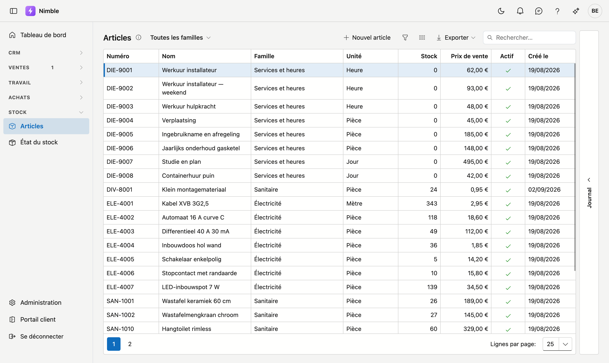
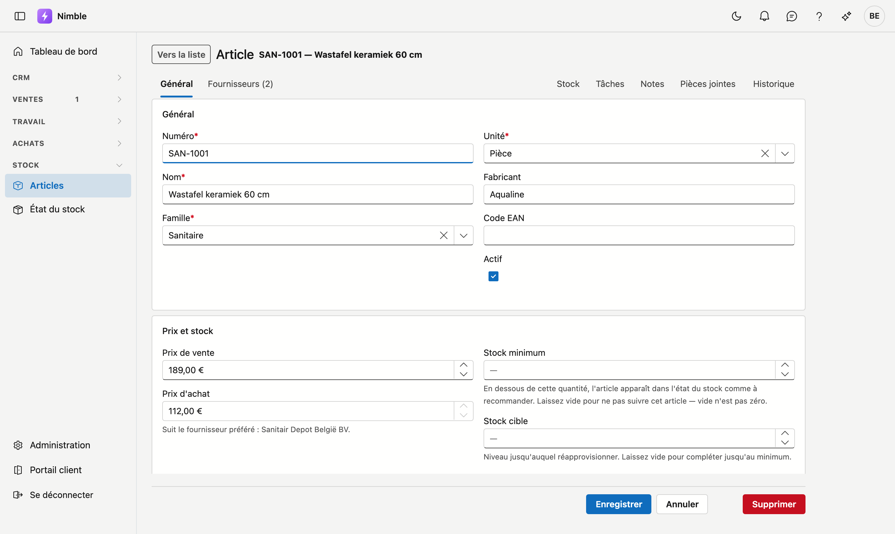
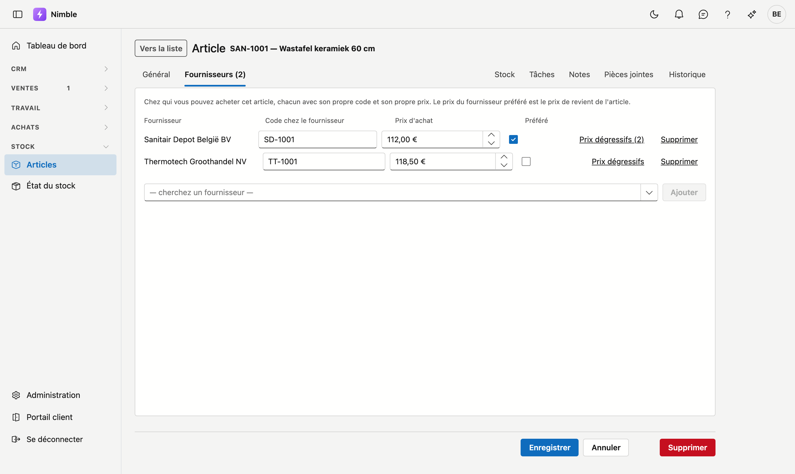
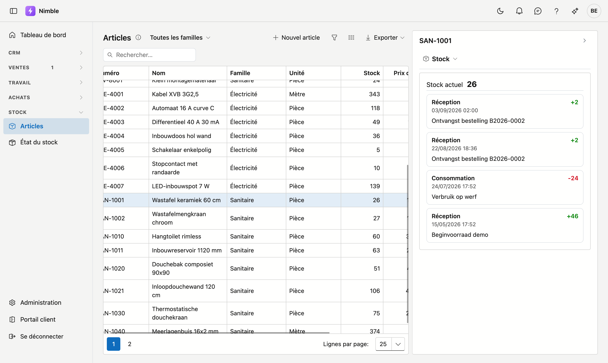

# Articles

L'écran **Articles** contient tout ce que vous livrez ou posez : la description, les prix et la famille à
laquelle l'article appartient. C'est la liste à partir de laquelle vous composez vos devis et vos commandes.

## Ouvrir l'écran

Dans la barre latérale, cliquez sur **Stock → Articles**.

## La liste

| Colonne | Ce que c'est |
|---|---|
| **Numéro** | Votre propre numéro d'article |
| **Nom** | Dénomination courte |
| **Famille** | Le groupe auquel l'article appartient |
| **Unité** | Pièce, mètre, heure … |
| **Stock** | Le stock actuel — voir la remarque ci-dessous |
| **Prix de vente** | Prix par unité. Vide si aucun prix n'est renseigné |
| **Actif** | Une coche pour les articles que vous utilisez encore |
| **Créé le** | Le jour où l'article a été créé |

La liste de choix **Toutes les familles** en haut limite la liste aux articles d'une seule famille. Vous
pouvez aussi rechercher, trier, filtrer et exporter comme dans les autres listes. Double-cliquez une ligne
pour ouvrir l'article.

## Créer ou modifier un article

Cliquez sur **Nouvel article**, ou double-cliquez une ligne existante.

La fiche comporte deux onglets propres : **Général** et **Fournisseurs**. L'onglet **Général** contient trois cartes.

**Général**

| Champ | Remarque |
|---|---|
| **Numéro** | Obligatoire et unique — voir ci-dessous |
| **Nom** | Obligatoire |
| **Famille** | Obligatoire — gérée via [Familles d'articles](../administration/article-families.md) |
| **Unité** | Obligatoire — gérée via [Unités](../administration/units.md) |
| **Fabricant** | La marque ou le fabricant de l'article |
| **Code EAN** | Le code-barres de l'article |
| **Actif** | Décochez pour les articles que vous n'utilisez plus ; ils restent visibles sur les anciens documents |

**Prix et stock**

| Champ | Remarque |
|---|---|
| **Prix de vente** | Ce que paie le client |
| **Prix d'achat** | Le prix de revient de l'article : c'est avec lui que calculent le pré- et le post-calcul d'un projet et la marge du tableau de bord. Si l'article a des fournisseurs, c'est le prix du **fournisseur préféré** et vous le modifiez dans l'onglet **Fournisseurs** — le champ indique alors de quel fournisseur il s'agit. Sans fournisseur, vous le saisissez vous-même ici |
| **Stock minimum** | En dessous de cette quantité, l'article apparaît dans l'[état du stock](stock-level.md) comme à recommander. Laissez vide pour ne pas suivre l'article — vide n'est pas zéro |
| **Stock cible** | Niveau jusqu'auquel réapprovisionner. Laissez vide pour compléter jusqu'au minimum |

**Description** — texte plus long, par exemple pour un devis.

Cliquez sur **Enregistrer**. S'il manque un champ obligatoire, le message en haut le cite par son nom. Après
l'enregistrement, vous restez sur la fiche.

!!! info "La famille et l'unité sont obligatoires"
    Un article sans famille est introuvable dans toute liste, et sans unité personne ne sait si « 10 »
    signifie dix pièces ou dix mètres. D'où l'obligation des deux. Si la famille ou l'unité dont vous avez
    besoin n'existe pas, créez-la d'abord via l'administration.

!!! info "Le numéro est unique"
    Deux articles avec le même numéro, c'est impossible : Nimble refuse d'enregistrer et en donne la raison.
    Cela vaut aussi pour le numéro d'un article qui se trouve dans la corbeille.

À droite de la fiche figurent les onglets **Stock**, **Tâches**, **Notes**, **Pièces jointes** et
**Historique** — les mêmes que dans le journal à côté de la liste.

## Fournisseurs d'un article

Vous pouvez acheter un article chez plus d'un fournisseur, chacun avec son propre numéro d'article et son
propre prix. Vous l'enregistrez dans l'onglet **Fournisseurs** de la fiche. Pour un nouvel article,
enregistrez d'abord la fiche ; l'onglet apparaît ensuite.

| Colonne | Ce que c'est |
|---|---|
| **Fournisseur** | Une relation marquée comme fournisseur |
| **Code chez le fournisseur** | Le numéro d'article qu'utilise ce fournisseur. Il figure à côté de l'article lorsque vous créez une commande |
| **Prix d'achat** | Ce que coûte cet article chez ce fournisseur, hors TVA |
| **Préféré** | Le fournisseur chez qui vous achetez habituellement. Son prix est le prix d'achat de l'article |

Voici comment procéder :

1. Choisissez un fournisseur en bas dans **— cherchez un fournisseur —** et cliquez sur **Ajouter**. Le
   premier fournisseur devient aussitôt le préféré.
2. Saisissez le **code** et le **prix d'achat**.
3. Pour acheter chez un autre fournisseur, cochez **Préféré** chez ce fournisseur. Le prix d'achat de
   l'onglet Général suit.
4. Cliquez sur **Enregistrer**. Les fournisseurs sont enregistrés avec le reste de la fiche ; avec
   **Annuler**, tout reste tel quel.

**Supprimer** sur une ligne retire un fournisseur. Si vous retirez tous les fournisseurs, le dernier prix
d'achat reste en place et vous le saisissez à nouveau vous-même dans l'onglet Général.

!!! info "Exactement un fournisseur préféré"
    Si un article a des fournisseurs, exactement un doit être le préféré : son prix est le prix de revient.
    Si vous supprimez le fournisseur préféré, Nimble n'en choisit pas un autre lui-même — le message en haut
    vous demande d'indiquer un **Fournisseur préféré** avant d'enregistrer.

## Supprimer un article

Cliquez sur **Supprimer** sur la fiche et confirmez. L'article disparaît de la liste et arrive dans la
[corbeille](../administration/recycle-bin.md). De là, **Restaurer** le remet en place.

Si vous n'utilisez simplement plus un article, mettez-le plutôt sur **non actif**.

## Le journal à côté de la liste

Cliquez sur le rail **Journal** à droite et choisissez un article dans la liste. Le panneau affiche alors le
dossier de cet article, réparti sur cinq onglets :

- **Stock** — le solde actuel et tous les mouvements de cet article.
- **Tâches** — ce qu'il reste à faire pour cet article.
- **Notes** — des notes libres sur cet article. Voir [Notes](../notities.md).
- **Pièces jointes** — documents et photos liés à cet article, par exemple une fiche technique. Voir
  [Pièces jointes](../bijlagen.md).
- **Historique** — qui a modifié quel champ de cet article, et quand. En lecture seule.

Vous consultez ainsi le stock article après article sans ouvrir chaque fiche.

!!! warning "Le stock est encore tenu dans votre programme actuel pour le moment"
    Tant que vous travaillez avec les deux programmes, c'est votre **programme actuel** qui tient le stock.
    L'onglet Stock le dit aussi : *Le stock est encore tenu dans votre programme actuel. Ce registre se
    remplit au basculement.* Les stocks que vous voyez ici ne viennent donc pas encore de Nimble. (L'image
    ci-dessus montre bien des chiffres : elle provient d'un environnement de démonstration.)

    C'est volontaire : si deux systèmes tiennent le stock en même temps, ils divergent inévitablement, et
    vous ne le constatez qu'au premier inventaire. Il n'y a donc qu'un seul endroit qui fait foi, et c'est
    pour l'instant votre programme actuel.

    Les écritures ne sont donc pas encore possibles. Lors du basculement, l'état initial sera repris et la
    suite se fera ici.

### Les trois types de mouvement

| Type | Ce qu'il signifie |
|---|---|
| **Réception** | Des marchandises entrent — par exemple une commande réceptionnée. La quantité est positive |
| **Consommation** | Des marchandises sortent — utilisées sur un bon de travail ou un projet. La quantité est négative |
| **Correction** | Une rectification manuelle après un inventaire. Le signe dépend du sens |

Chaque mouvement indique son type, la quantité, la date et l'heure, et une éventuelle note. Une commande
réceptionnée y figure par exemple comme *Ontvangst bestelling* suivi du numéro de commande.

Le registre n'est **jamais modifié** : une erreur se corrige par un nouveau mouvement, pas en retouchant
l'ancien. Ce qui s'est passé, et quand, reste ainsi visible. Les mouvements se suivent, le plus récent en
haut ; un plus signifie une entrée, un moins une sortie.

## Erreurs fréquentes

!!! warning
    - **Croire que le stock est erroné** parce qu'il affiche 0 — voir la remarque ci-dessus ; cet état
      n'arrivera qu'au basculement.
    - **Supprimer un article que vous n'utilisez simplement plus** — mettez-le sur **non actif**. Il reste
      alors lisible sur l'existant.
    - **Indiquer un minimum de 0 pour ne pas suivre un article** — laissez alors le champ vide. Avec 0,
      Nimble suit bien l'article.
    - **Chercher le prix d'achat dans l'onglet Général** alors que l'article a des fournisseurs — vous le
      modifiez alors chez le fournisseur préféré dans l'onglet **Fournisseurs**.

## Voir aussi

- [État du stock](stock-level.md)
- [Commandes](../purchasing/purchase-orders.md) — le prix d'une ligne de commande vient du fournisseur
- [Relations](../relations.md) — un fournisseur est une relation cochée Fournisseur
- [Familles d'articles](../administration/article-families.md)
- [Unités](../administration/units.md)
- [Filtrer les listes](../lijsten-filteren.md) — le bouton entonnoir, le générateur de filtres et la barre de filtre
- [Travailler avec une fiche](../fiches.md) — adresse propre, onglets, enregistrer et archiver
