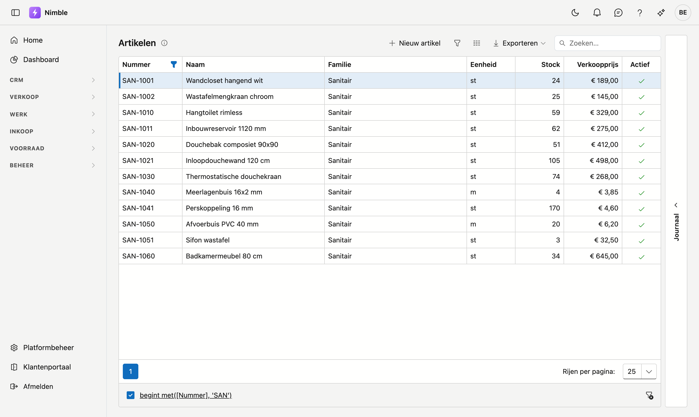
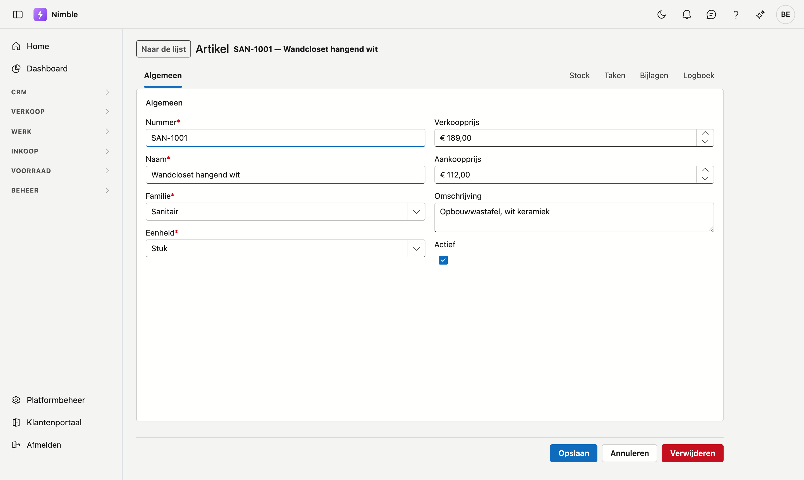
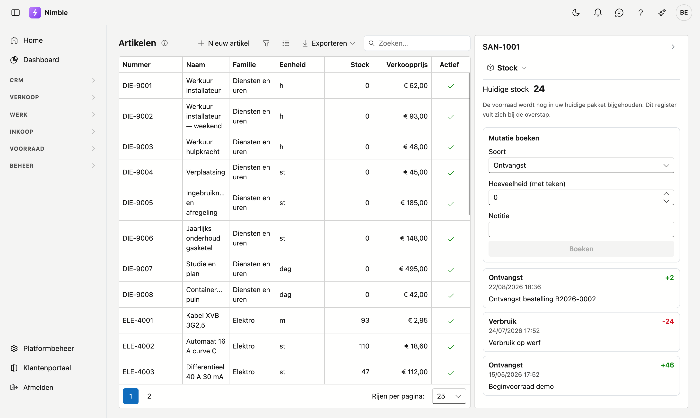

# Artikelen

Op het scherm **Artikelen** staat alles wat u levert of plaatst: de omschrijving, de prijzen en de familie
waarin het hoort. Het is de lijst waaruit u straks offertes en werkbonnen samenstelt.

## Het scherm openen

Klik in de zijbalk op **Voorraad → Artikelen**.

## De lijst

| Kolom | Wat het is |
|---|---|
| **Nummer** | Uw eigen artikelnummer |
| **Naam** | Korte benaming |
| **Familie** | De groep waarin het artikel hoort |
| **Eenheid** | Stuk, meter, m², uur … |
| **Stock** | De huidige voorraad — zie de opmerking onderaan |
| **Verkoopprijs** | Prijs per eenheid |
| **Actief** | Een vinkje bij artikelen die u nog gebruikt |

U kunt zoeken, sorteren, filteren en exporteren zoals in de andere lijsten. Dubbelklik een rij om het
artikel te openen.

## Een artikel aanmaken of bewerken

Klik **Nieuw artikel**, of dubbelklik een bestaande rij.

| Veld | Opmerking |
|---|---|
| **Nummer** | Verplicht |
| **Naam** | Verplicht |
| **Familie** | Verplicht — beheerd via [Artikelfamilies](../administration/article-families.md) |
| **Eenheid** | Verplicht — beheerd via [Eenheden](../administration/units.md) |
| **Verkoopprijs** | Wat de klant betaalt |
| **Aankoopprijs** | Wat u zelf betaalt |
| **Omschrijving** | Langere tekst, bv. voor op een offerte |
| **Actief** | Zet dit uit voor artikelen die u niet meer gebruikt; ze blijven bestaan op oude documenten |

!!! info "Familie en eenheid zijn verplicht"
    Een artikel zonder familie is in geen enkele lijst terug te vinden, en zonder eenheid weet niemand of
    "10" tien stuks of tien meter betekent. Vandaar dat beide moeten. Ontbreekt de familie of eenheid die u
    nodig hebt, maak ze dan eerst aan via Platformbeheer.

## Het journaal naast de lijst

Klik rechts op de rail **Journaal** en kies een artikel in de lijst. Het paneel toont dan de zijkant van dát
artikel, verdeeld over vier tabbladen:

- **Stock** — de huidige stand en alle bewegingen van dit artikel.
- **Taken** — wat er voor dit artikel nog moet gebeuren.
- **Logboek** — wat er gebeurd is: notities en afspraken.
- **Bijlagen** — documenten en foto's bij dit artikel, bijvoorbeeld een technische fiche. Zie
  [Bijlagen](../bijlagen.md).

Bovenaan het paneel staat de naam van het tabblad dat u bekijkt; klik erop om naar een ander over te
stappen.

!!! warning "De voorraad wordt voorlopig nog in uw huidige pakket bijgehouden"
    Zolang u met beide pakketten werkt, houdt uw **oude pakket** de voorraad bij. Nimble toont hier al het
    nieuwe stockregister, maar bij u vult dat zich pas bij de overstap — de standen die u ziet komen dus nog
    niet uit Nimble. (Op de afbeelding hierboven staan wél cijfers: die komt uit een demo-omgeving.)

    Dat is bewust: als twee systemen tegelijk voorraad bijhouden, lopen ze gegarandeerd uit elkaar, en dat
    merkt u pas bij de eerste telling. Er is dus één plek die telt, en dat is voorlopig uw oude pakket.

    Boekingen kunnen daarom nog niet gedaan worden. Bij de overstap wordt de beginstand overgenomen en gaat
    het hier verder.

### De drie soorten beweging

| Soort | Wat het betekent |
|---|---|
| **Ontvangst** | Goederen komen binnen — een levering, een receptionering. Het aantal is positief |
| **Verbruik** | Goederen gaan eruit — verwerkt op een werkbon of een project. Het aantal is negatief |
| **Correctie** | Een handmatige rechtzetting na een telling. Het teken hangt af van de richting |

Het grootboek wordt **nooit gewijzigd**: een fout zet u recht met een nieuwe beweging, niet door de oude aan
te passen. Zo blijft zichtbaar wat er wanneer gebeurd is. De bewegingen staan onder elkaar, met de jongste
bovenaan; een plus betekent erbij, een min eraf.

## Veelgemaakte fouten

!!! warning
    - **Denken dat de voorraad fout staat** omdat er 0 staat — zie de opmerking hierboven; die stand komt
      pas bij de overstap.
    - **Een artikel verwijderen dat op oude documenten staat** — zet het op **niet actief** in plaats van
      het te verwijderen. Dan verdwijnt het uit de keuzelijsten maar blijft het leesbaar op wat er al was.
    - **Twee keer hetzelfde nummer** — het nummer is uw eigen sleutel; houd het uniek.

## Zie ook

- [Artikelfamilies](../administration/article-families.md)
- [Eenheden](../administration/units.md)
- [Lijsten filteren](../lijsten-filteren.md) — de trechterknop, de filterbouwer en de filterbalk
- [Werken met een fiche](../fiches.md) — eigen adres, tabbladen, opslaan en archiveren
