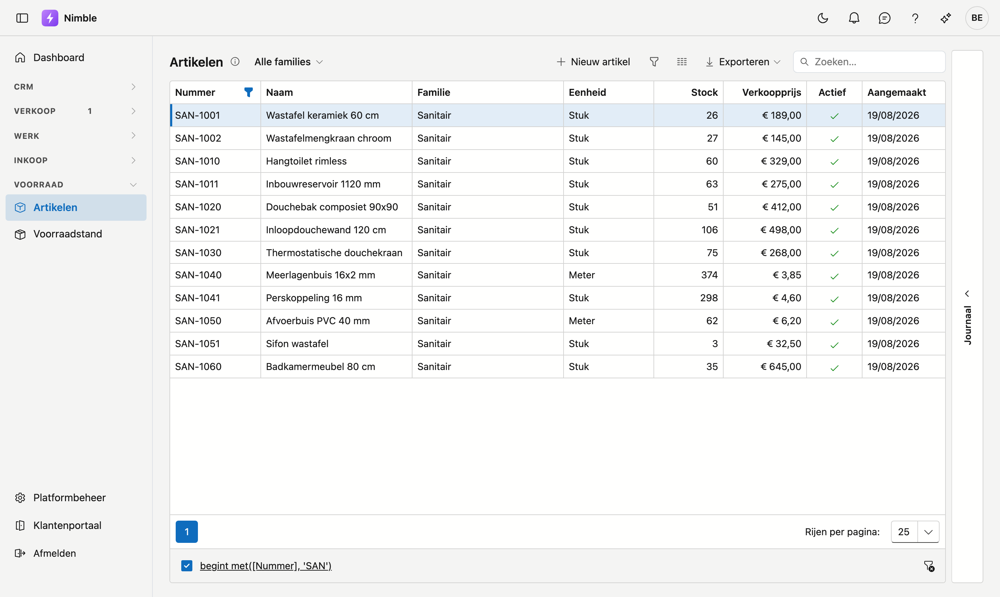
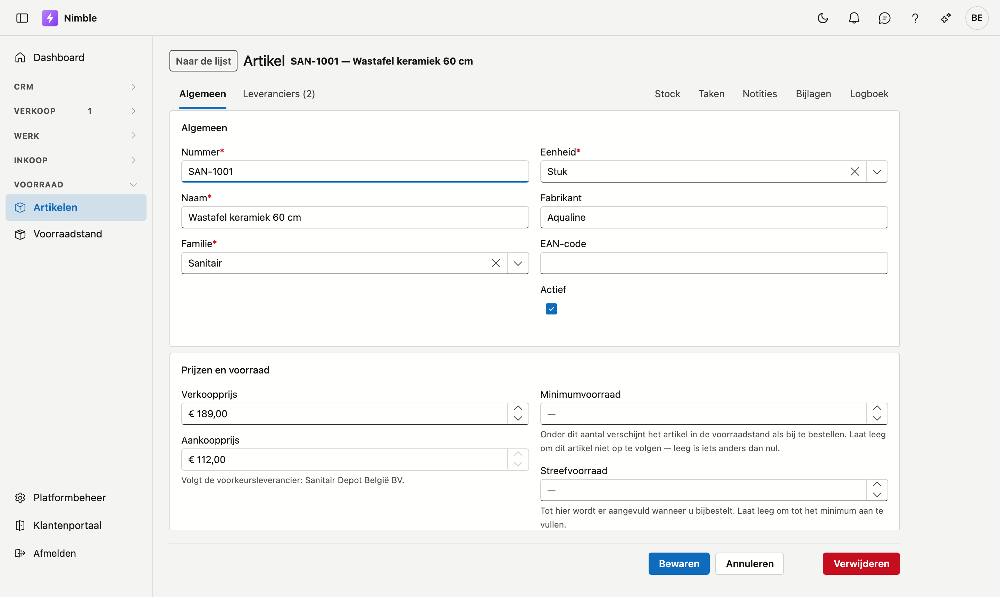
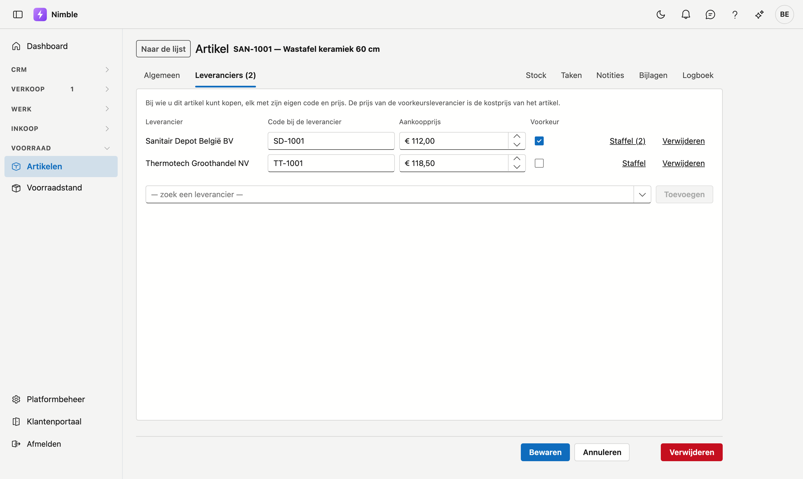
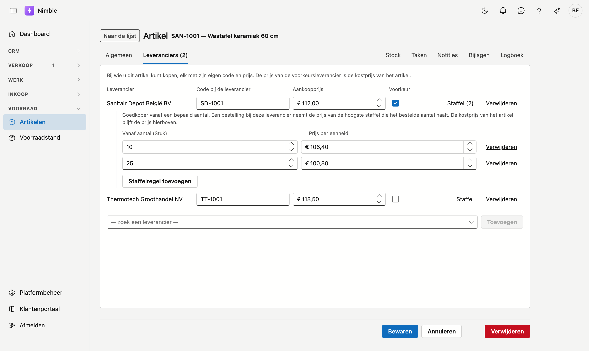
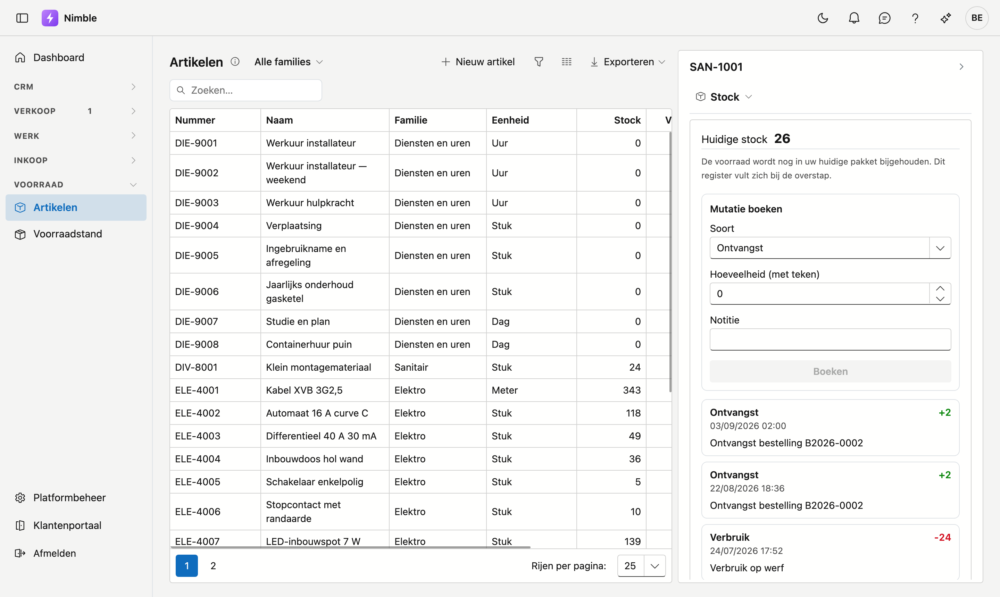

# Artikelen

Op het scherm **Artikelen** staat alles wat u levert of plaatst: de omschrijving, de prijzen en de familie
waarin het hoort. Het is de lijst waaruit u offertes en bestellingen samenstelt.

## Het scherm openen

Klik in de zijbalk op **Voorraad → Artikelen**.

## De lijst

| Kolom | Wat het is |
|---|---|
| **Nummer** | Uw eigen artikelnummer |
| **Naam** | Korte benaming |
| **Familie** | De groep waarin het artikel hoort |
| **Eenheid** | Stuk, meter, uur … |
| **Stock** | De huidige voorraad — zie de opmerking onderaan |
| **Verkoopprijs** | Prijs per eenheid. Leeg wanneer er geen prijs is ingevuld |
| **Actief** | Een vinkje bij artikelen die u nog gebruikt |
| **Aangemaakt** | De dag waarop het artikel is aangemaakt |

Met de keuzelijst **Alle families** bovenaan toont u enkel de artikelen van één familie. U kunt ook
zoeken, sorteren, filteren en exporteren zoals in de andere lijsten. Dubbelklik een rij om het artikel te
openen.

## Een artikel aanmaken of bewerken

Klik **Nieuw artikel**, of dubbelklik een bestaande rij.

De fiche heeft twee eigen tabbladen: **Algemeen** en **Leveranciers**. Op **Algemeen** staan drie kaarten.

**Algemeen**

| Veld | Opmerking |
|---|---|
| **Nummer** | Verplicht en uniek — zie hieronder |
| **Naam** | Verplicht |
| **Familie** | Verplicht — beheerd via [Artikelfamilies](../administration/article-families.md) |
| **Eenheid** | Verplicht — beheerd via [Eenheden](../administration/units.md) |
| **Fabrikant** | Het merk of de fabrikant van het artikel |
| **EAN-code** | De streepjescode van het artikel |
| **Actief** | Zet dit uit voor artikelen die u niet meer gebruikt; ze blijven bestaan op oude documenten |

**Prijzen en voorraad**

| Veld | Opmerking |
|---|---|
| **Verkoopprijs** | Wat de klant betaalt |
| **Aankoopprijs** | De kostprijs van het artikel: ermee rekenen de voor- en nacalculatie van een project en de marge op het dashboard. Heeft het artikel leveranciers, dan is dit de prijs van de **voorkeursleverancier** en wijzigt u ze op het tabblad **Leveranciers** — het veld zegt dan welke leverancier het is. Zonder leveranciers vult u ze hier zelf in |
| **Minimumvoorraad** | Onder dit aantal verschijnt het artikel op de [Voorraadstand](stock-level.md) als bij te bestellen. Laat leeg om het artikel niet op te volgen — leeg is iets anders dan nul |
| **Streefvoorraad** | Tot hier wordt er aangevuld wanneer u bijbestelt. Laat leeg om tot het minimum aan te vullen |

**Omschrijving** — langere tekst, bijvoorbeeld voor op een offerte.

Klik **Bewaren**. Ontbreekt er een verplicht veld, dan noemt de melding bovenaan het veld bij naam. U blijft
na het bewaren op de fiche.

!!! info "Familie en eenheid zijn verplicht"
    Een artikel zonder familie is in geen enkele lijst terug te vinden, en zonder eenheid weet niemand of
    "10" tien stuks of tien meter betekent. Vandaar dat beide moeten. Ontbreekt de familie of eenheid die u
    nodig hebt, maak ze dan eerst aan via Platformbeheer.

!!! info "Het nummer is uniek"
    Twee artikelen met hetzelfde nummer kan niet: Nimble weigert te bewaren en zegt waarom. Dat geldt ook
    voor een nummer van een artikel in de prullenbak.

Rechts op de fiche staan de tabbladen **Stock**, **Taken**, **Notities**, **Bijlagen** en **Logboek** —
dezelfde als in het journaal naast de lijst.

## Leveranciers van een artikel

Een artikel kunt u bij meer dan één leverancier kopen, elk met zijn eigen artikelnummer en zijn eigen prijs.
Dat legt u vast op het tabblad **Leveranciers** van de fiche. Bij een nieuw artikel bewaart u eerst de fiche;
daarna verschijnt het tabblad.

| Kolom | Wat het is |
|---|---|
| **Leverancier** | Een relatie die als leverancier is aangeduid |
| **Code bij de leverancier** | Het artikelnummer dat deze leverancier gebruikt. Het staat bij het artikel wanneer u een bestelling maakt |
| **Aankoopprijs** | Wat dit artikel bij deze leverancier kost, excl. btw |
| **Voorkeur** | De leverancier bij wie u gewoonlijk koopt. Zijn prijs is de aankoopprijs van het artikel |

Zo werkt u ermee:

1. Kies onderaan een leverancier in **— zoek een leverancier —** en klik **Toevoegen**. De eerste leverancier
   wordt meteen de voorkeur.
2. Vul de **code** en de **aankoopprijs** in.
3. Wilt u bij een andere leverancier kopen, vink dan bij die leverancier **Voorkeur** aan. De aankoopprijs op
   het tabblad Algemeen volgt mee.
4. Klik **Bewaren**. De leveranciers worden samen met de rest van de fiche bewaard; met **Annuleren** blijft
   alles zoals het was.

Met **Verwijderen** op een regel haalt u een leverancier weg. Haalt u alle leveranciers weg, dan blijft de
laatste aankoopprijs staan en vult u ze weer zelf in op het tabblad Algemeen.

!!! info "Precies één voorkeursleverancier"
    Heeft een artikel leveranciers, dan moet er precies één de voorkeur hebben: zijn prijs is de kostprijs.
    Verwijdert u de voorkeursleverancier, dan kiest Nimble niet zelf een andere — de melding bovenaan vraagt
    u een **Voorkeursleverancier** aan te duiden voor u bewaart.

### Staffelprijzen

Geeft een leverancier een lagere prijs vanaf een bepaald aantal, dan legt u dat vast in zijn **staffel**. Klik
achter de leverancier op **Staffel**. Staan er al regels in, dan staat hun aantal op de knop: **Staffel (2)**.

| Veld | Wat het is |
|---|---|
| **Vanaf aantal** | Het aantal vanaf waar de prijs geldt, in de eenheid van het artikel |
| **Prijs per eenheid** | De prijs per eenheid vanaf dat aantal, excl. btw |

Met **Staffelregel toevoegen** komt er een regel bij; met **Verwijderen** achter een regel haalt u ze weg. De
staffel wordt bewaard wanneer u de fiche bewaart.

Een bestelling bij deze leverancier neemt de prijs van de hoogste staffel die het bestelde aantal haalt. Onder
het laagste vanaf-aantal geldt de **Aankoopprijs** van de leverancier. Die aankoopprijs blijft ook de kostprijs
van het artikel: de voor- en nacalculatie en de marge rekenen niet met een staffelprijs.

De aankoopprijs en **Staffel** ziet u alleen met het recht *Marges en kostprijzen bekijken*.

!!! info "Wat een staffelregel nodig heeft"
    Elke regel heeft een vanaf-aantal groter dan 0 én een prijs, en een vanaf-aantal staat maar één keer in
    de staffel van een leverancier. Klopt er iets niet, dan zegt de melding bovenaan het wanneer u bewaart.

## Een artikel verwijderen

Klik op de fiche op **Verwijderen** en bevestig. Het artikel verdwijnt uit de lijst en komt in de
[prullenbak](../administration/recycle-bin.md). Van daaruit zet u het met **Herstellen** terug.

Gebruikt u een artikel enkel niet meer, zet het dan liever op **niet actief**.

## Het journaal naast de lijst

Klik rechts op de rail **Journaal** en kies een artikel in de lijst. Het paneel toont dan de zijkant van dát
artikel, verdeeld over vijf tabbladen:

- **Stock** — de huidige stand en alle bewegingen van dit artikel.
- **Taken** — wat er voor dit artikel nog moet gebeuren.
- **Notities** — vrije notities bij dit artikel. Zie [Notities](../notities.md).
- **Bijlagen** — documenten en foto's bij dit artikel, bijvoorbeeld een technische fiche. Zie
  [Bijlagen](../bijlagen.md).
- **Logboek** — wie welk veld van dit artikel wijzigde, en wanneer. Alleen om te lezen.

Zo bekijkt u de voorraad van artikel na artikel zonder telkens een fiche te openen.

!!! info "Waar de bewegingen vandaan komen"
    Nimble houdt de voorraad bij. Een **ontvangen bestelling** telt erbij; materiaal dat op een **werkbon**
    verwerkt is, gaat eraf. De huidige stock is de som van alle bewegingen van het artikel.

### De drie soorten beweging

| Soort | Wat het betekent |
|---|---|
| **Ontvangst** | Goederen komen binnen — bijvoorbeeld een ontvangen bestelling. Het aantal is positief |
| **Verbruik** | Goederen gaan eruit — verwerkt op een werkbon of een project. Het aantal is negatief |
| **Correctie** | Een handmatige rechtzetting na een telling. Het teken hangt af van de richting |

Elke beweging toont haar soort, het aantal, de datum en het uur, en een eventuele notitie. Een ontvangen
bestelling staat er bijvoorbeeld als *Ontvangst bestelling* gevolgd door het bestelnummer.

Het grootboek wordt **nooit gewijzigd**: een fout zet u recht met een nieuwe beweging, niet door de oude aan
te passen. Zo blijft zichtbaar wat er wanneer gebeurd is. De bewegingen staan onder elkaar, met de jongste
bovenaan; een plus betekent erbij, een min eraf.

## Veelgemaakte fouten

!!! warning
    - **Denken dat de voorraad fout staat** omdat er 0 staat — de stand is de som van de bewegingen. Bij 0
      is er voor dit artikel nog niets ontvangen of verbruikt.
    - **Een artikel verwijderen dat u enkel niet meer gebruikt** — zet het op **niet actief**. Dan blijft
      het leesbaar op wat er al was.
    - **Een minimum van 0 invullen om een artikel niet op te volgen** — laat het veld dan leeg. Met 0 volgt
      Nimble het artikel wél op.
    - **De aankoopprijs zoeken op het tabblad Algemeen** terwijl het artikel leveranciers heeft — u wijzigt
      ze dan bij de voorkeursleverancier op het tabblad **Leveranciers**.

## Zie ook

- [Voorraadstand](stock-level.md)
- [Bestellingen](../purchasing/purchase-orders.md) — de prijs op een bestelregel komt van de leverancier, met zijn staffel
- [Relaties](../relations.md) — een leverancier is een relatie met het vinkje Leverancier
- [Artikelfamilies](../administration/article-families.md)
- [Eenheden](../administration/units.md)
- [Lijsten filteren](../lijsten-filteren.md) — de trechterknop, de filterbouwer en de filterbalk
- [Werken met een fiche](../fiches.md) — eigen adres, tabbladen, bewaren en archiveren
