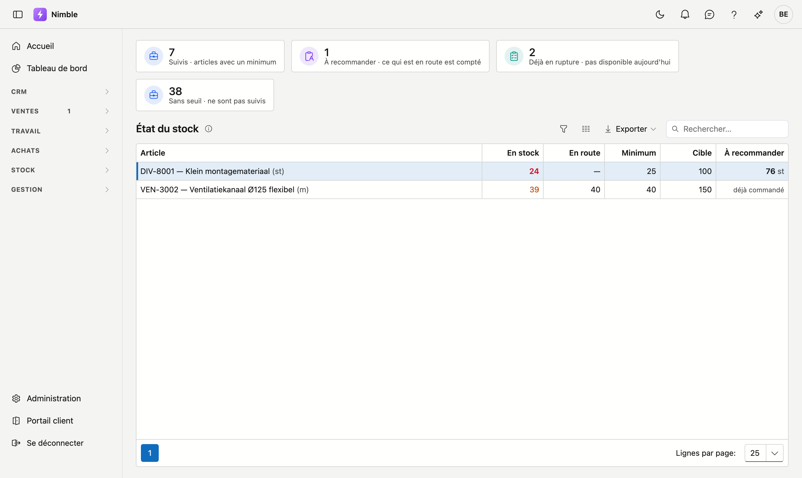

# État du stock

L'**état du stock** n'est pas un aperçu de tout ce qui est en réserve — cela figure sur la liste des
articles. C'est un **signal de commande** : uniquement les articles dont le stock passe sous le minimum
défini, les plus urgents en tête.

## Ouvrir l'écran

Cliquez dans la barre latérale sur **Stock** puis sur **État du stock**.

## D'abord : quels articles sont concernés ?

Uniquement les articles **avec un minimum**. Un minimum vide signifie « nous ne suivons pas cet article ».
Cette distinction a sa raison d'être : sans seuil, chaque article jamais créé apparaîtrait ici en
permanence dans le rouge, et plus personne n'y prêterait attention.

Vous définissez le minimum sur la **fiche article**, avec la valeur cible. La tuile **Sans seuil** compte
combien d'articles restent hors suivi.

## Les colonnes

| Colonne | Ce qu'elle indique |
|---|---|
| **En stock** | Ce qui est physiquement présent aujourd'hui |
| **En route** | Ce qui est commandé mais pas encore livré |
| **Minimum** | Sous cette limite, vous devez réapprovisionner |
| **Cible** | Le stock que vous souhaitez maintenir |
| **À recommander** | Combien il faut ajouter pour revenir à niveau |

Le **stock lui-même** est coloré, et cette différence compte : **rouge** signifie qu'il faut encore
commander, **orange** qu'il y a trop peu aujourd'hui mais que la livraison est déjà en cours.

!!! info "Ce qui est en route est compté"
    C'est la raison d'être de cet écran à côté de la colonne stock sur la liste des articles. Ce que vous
    avez déjà commandé est pris en compte — sinon vous commandez une deuxième fois ce qui est déjà en route.

## « déjà commandé » au lieu d'un nombre

Si la mention **déjà commandé** apparaît sous **À recommander**, il y a trop peu en stock aujourd'hui, mais
le réapprovisionnement est en route et il suffit. Vous n'avez rien à faire.

Une telle ligne figure quand même dans la liste, car physiquement il y a une rupture : celui qui a besoin du
matériel aujourd'hui doit savoir qu'il n'est pas là. C'est pourquoi les deux tuiles comptent différemment :

| Tuile | Compte |
|---|---|
| **À recommander** | les lignes où vous devez réellement commander |
| **Déjà en rupture** | les lignes où le matériel n'est pas là aujourd'hui — même s'il y en a assez en route |

L'écart entre ces deux nombres correspond exactement au nombre de livraisons que vous attendez.

## Combien il faut recommander

**À recommander** complète jusqu'à votre **cible**, pas seulement jusqu'au-dessus du minimum. Si un article
est à 24 avec un minimum de 25 et une cible de 100, la proposition est de 76 — pas de 1. Vous achetez ainsi
une quantité suffisante en une fois au lieu d'une poignée chaque semaine.

Si un article n'a pas de valeur cible, le complément va jusqu'au minimum.

## Ce que vous faites avec cet écran

La liste indique ce qui doit se passer ; la commande elle-même se fait sous **Achats → Commandes**. La tuile
**À recommander** vous y mène directement.
