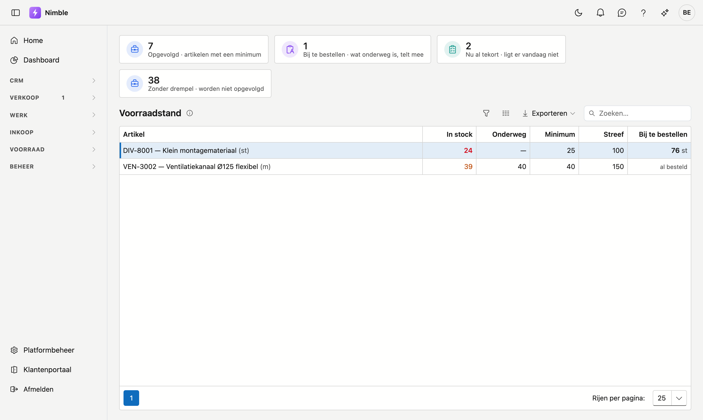

# Voorraadstand

De **Voorraadstand** is geen overzicht van alles wat er ligt — dat staat op de artikelenlijst. Het is een
**bestelsignaal**: enkel de artikelen waarvan de voorraad onder het ingestelde minimum zakt, met het
dringendste bovenaan.

## Het scherm openen

Klik in de zijbalk op **Voorraad** en daarna op **Voorraadstand**.

## Eerst: welke artikelen doen mee?

Alleen artikelen **met een minimum**. Een leeg minimum betekent "dit volgen we niet op". Dat onderscheid is
er met reden: zonder drempel zou elk artikel dat ooit aangemaakt is hier permanent in het rood staan, en dan
kijkt er niemand meer naar.

U zet het minimum op de **artikelfiche**, samen met de streefwaarde. De tegel **Zonder drempel** telt hoeveel
artikelen buiten de opvolging vallen.

## De kolommen

| Kolom | Wat het zegt |
|---|---|
| **In stock** | Wat er vandaag fysiek ligt |
| **Onderweg** | Wat besteld is maar nog niet geleverd |
| **Minimum** | Onder deze grens moet u aanvullen |
| **Streef** | De voorraad die u wil aanhouden |
| **Bij te bestellen** | Hoeveel er bij moet om weer op peil te komen |

De **voorraad zelf** is gekleurd, en dat verschil telt: **rood** betekent dat er nog besteld moet worden,
**oranje** dat er vandaag te weinig ligt maar de levering al loopt.

!!! info "Onderweg telt mee"
    Dit is waarom dit scherm bestaat naast de voorraadkolom op de artikelenlijst. Wat u al besteld hebt,
    wordt meegerekend — anders bestelt u een tweede keer wat al onderweg is.

## "al besteld" in plaats van een aantal

Staat er bij **Bij te bestellen** het woord **al besteld**, dan ligt er vandaag te weinig, maar is de
aanvulling al onderweg en volstaat ze. U hoeft niets te doen.

Zo'n regel staat er toch bij, want fysiek is er een tekort: wie vandaag materiaal nodig heeft, moet weten
dat het er niet ligt. Daarom tellen de twee tegels ook verschillend:

| Tegel | Telt |
|---|---|
| **Bij te bestellen** | regels waar u werkelijk moet bestellen |
| **Nu al tekort** | regels waar het materiaal er vandaag niet ligt — ook als er genoeg onderweg is |

Het verschil tussen die twee getallen is precies het aantal leveringen waar u op wacht.

## Hoeveel er bijbesteld moet worden

**Bij te bestellen** vult aan tot uw **streefwaarde**, niet tot net boven het minimum. Staat een artikel op
24 met minimum 25 en streef 100, dan is het voorstel 76 — niet 1. Zo koopt u in één keer genoeg in plaats
van elke week een handvol.

Heeft een artikel geen streefwaarde, dan wordt er aangevuld tot het minimum.

## Wat u met dit scherm doet

De lijst zegt wat er moet gebeuren; het bestellen zelf doet u onder **Inkoop → Bestellingen**. De tegel
**Bij te bestellen** brengt u daar rechtstreeks naartoe.
