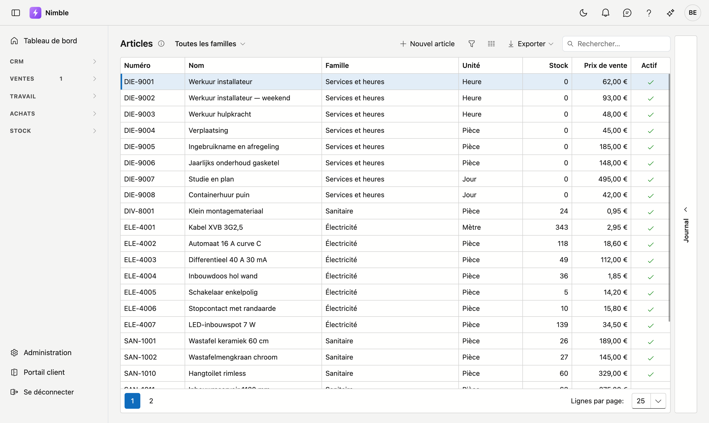
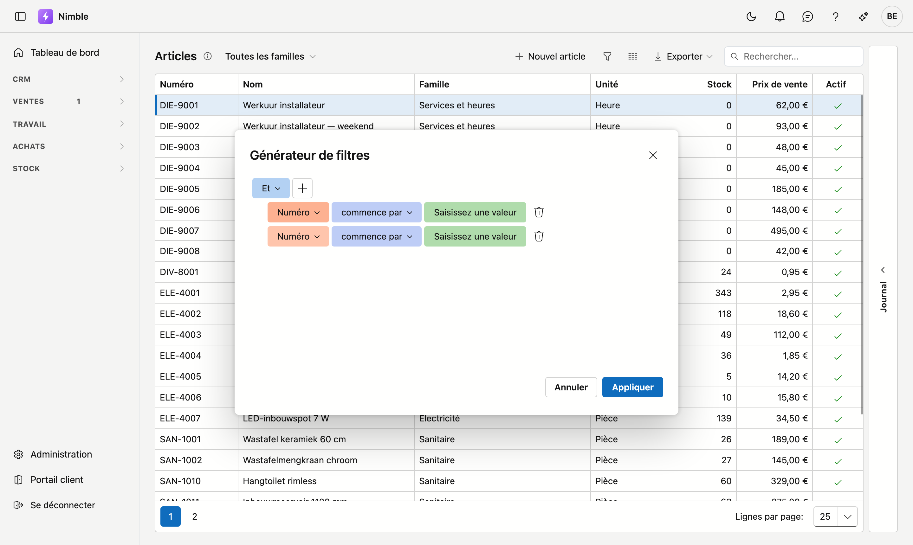

# Filtrer les listes

Vos listes s'allongent. Après un an, elles contiennent des milliers d'articles, des centaines d'offres et
des dizaines de chantiers en cours. Pour y retrouver quelque chose, vous disposez de trois moyens — du
plus rapide au plus précis.

Cela fonctionne de la même manière sur **chaque liste** de Nimble : articles, relations, offres,
projets, ordres de travail, factures. Cette page vaut donc pour tous les écrans de liste.

## Recherche rapide

En haut à droite de la liste se trouve le champ **Rechercher…**. Tapez-y un mot et la liste se limite
aussitôt aux lignes qui le contiennent — dans **toutes** les colonnes à la fois.

Utilisez-le lorsque vous savez *ce que* vous cherchez : un nom de client, un numéro d'article, une rue.

!!! tip "Rechercher n'est pas filtrer"
    Le champ de recherche parcourt toutes les colonnes et ne connaît aucune condition. Si vous voulez
    « toutes les offres au-dessus de 5 000 euros », la recherche n'y arrivera pas — c'est le rôle du
    générateur de filtres.

## Filtrer sur une seule colonne

Passez la souris sur un en-tête de colonne. Un petit bouton de filtre apparaît. Cliquez dessus et
choisissez les valeurs que vous souhaitez voir.

C'est la voie la plus rapide lorsque votre condition ne porte que sur une colonne : uniquement les
articles actifs, uniquement les projets d'un seul client.

## Le générateur de filtres

Pour tout ce qui va plus loin, cliquez sur le **bouton entonnoir** dans la barre d'outils au-dessus de
la liste. L'infobulle indique **Filtres avancés**. Une fenêtre s'ouvre, intitulée **Générateur de
filtres**.

### Composer une condition

1. Cliquez sur **Ajouter une condition**.
2. Choisissez à gauche la **colonne** sur laquelle filtrer.
3. Choisissez au milieu la **comparaison** : *contient*, *est égal à*, *est compris entre*,
   *commence par*…
4. Saisissez la **valeur** à droite. Tant que ce champ est vide, il affiche *Saisissez une valeur*.
5. Cliquez sur **Appliquer**.

Si vous ne souhaitez finalement rien modifier, cliquez sur **Annuler** — la liste reste telle qu'elle
était.

### Plusieurs conditions

Cliquez de nouveau sur **Ajouter une condition** pour une deuxième ligne. En haut se trouve un bouton
**Et**. Vous y choisissez la façon dont les règles se combinent :

- **Et** — toutes les conditions doivent être remplies. *La famille d'articles contient « sanitaire »*
  **et** *le prix de vente est compris entre 20 et 50.*
- **Ou** — une seule suffit. *Le statut est Acceptée* **ou** *le statut est Envoyée.*

Avec **Ajouter un groupe**, vous créez un bloc à l'intérieur de l'ensemble, ce qui permet de combiner
les deux : *(statut Acceptée ou Envoyée) et date comprise entre le 1er janvier et le 31 mars.*

!!! tip "*Est compris entre* n'existe qu'ici"
    Un intervalle — deux montants, deux dates — ne s'exprime ni par la recherche ni par le filtre de
    colonne. Dans le générateur de filtres, si : avec la comparaison **est compris entre**.

## La barre de filtre : voir sur quoi vous filtrez

Dès qu'un filtre est actif, une barre apparaît sous la liste, reprenant la **condition
complète** en toutes lettres. Elle porte trois commandes :

- La **case à cocher** en tête désactive temporairement le filtre sans l'effacer. Cliquez de nouveau et
  il est de retour — pratique pour jeter un œil à la liste entière.
- La **croix** efface complètement le filtre.
- Un clic sur la **condition elle-même** rouvre le générateur de filtres pour la modifier.

Sur une liste non filtrée, cette barre n'apparaît pas.

## Votre filtre est conservé

Nimble retient, pour chaque liste, l'état dans lequel vous la quittez : votre filtre, l'ordre de vos
colonnes et leur largeur. Si vous revenez demain sur la liste des articles, votre filtre y est encore.

**Votre terme de recherche n'en fait pas partie** : le champ **Rechercher…** repart vide à chaque fois.
Un filtre, vous le posez sciemment et vous voulez le retrouver ; un terme de recherche sert à trouver une
chose précise, et la fois suivante il ne ferait qu'écarter des lignes à votre insu.

!!! warning "Par ordinateur, pas par utilisateur"
    Ces réglages sont conservés sur **votre ordinateur et dans votre navigateur**, pas dans votre
    compte. Si vous travaillez chez vous sur un autre ordinateur, la liste y repart à blanc. Et si vous
    effacez les données de votre navigateur, ils disparaissent aussi.

## Erreurs fréquentes

!!! warning
    - **« La liste est vide, quelque chose est cassé. »** Il reste presque toujours un filtre actif.
      Regardez la barre sous la liste : s'il y a une condition, cliquez sur la croix. C'est
      exactement à cela que sert cette barre. Si c'est votre recherche, la liste vous le dit
      elle-même — *Aucun résultat pour « … »* — avec un bouton **Effacer la recherche** en dessous.
    - **Et là où vous pensiez Ou.** *Le statut est Acceptée **et** le statut est Envoyée* ne donne aucune
      ligne — aucune offre ne porte deux statuts à la fois. Vous vouliez dire **Ou**.
    - **Confondre recherche et filtre.** Les deux se cumulent : si un filtre et un terme de recherche
      sont actifs, vous obtenez l'intersection des deux. Si vous ne retrouvez rien, videz d'abord le
      champ de recherche.
    - **Exporter en traînant un filtre.** L'export reprend la liste telle que vous la voyez à cet
      instant. Si vous voulez *tout* dans votre fichier, effacez d'abord le filtre.

## Voir aussi

- [Articles](inventory/articles.md)
- [Relations](relations.md)
- [Leads](crm/leads.md)
