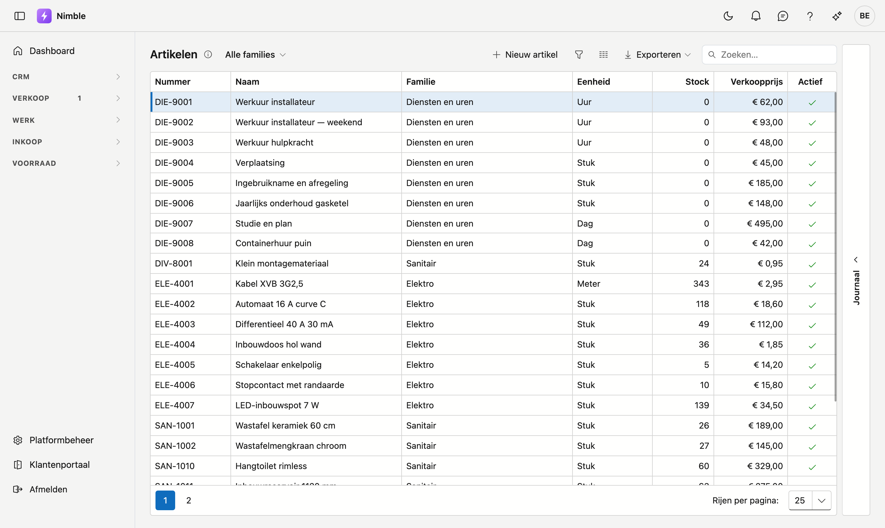
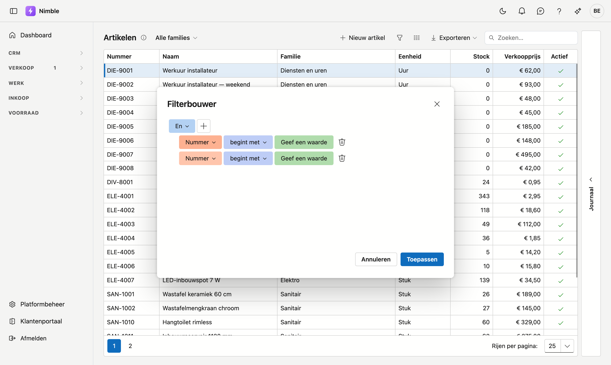

# Lijsten filteren

Uw lijsten groeien. Na een jaar staan er duizenden artikelen, honderden offertes en tientallen lopende
projecten in. Om daar iets in terug te vinden, hebt u drie manieren — van snel en grof naar precies.

Dit werkt op **elke lijst** in Nimble op dezelfde manier: artikelen, relaties, offertes, projecten,
werkorders, facturen. Deze pagina geldt dus voor alle lijstschermen.

## Snel zoeken

Rechtsboven de lijst staat het vak **Zoeken…**. Typ er een woord in en de lijst beperkt zich meteen tot
de rijen waarin dat woord voorkomt — in **alle** kolommen tegelijk.

Gebruik dit wanneer u weet wát u zoekt: een klantnaam, een artikelnummer, een straat.

!!! tip "Zoeken is geen filter"
    Het zoekvak kijkt over alle kolommen tegelijk en kent geen voorwaarden. Wilt u "alle offertes boven
    5 000 euro", dan komt u daar met zoeken niet — daarvoor is de filterbouwer.

## Filteren op één kolom

Beweeg met de muis over een kolomkop. Er verschijnt een klein filterknopje. Klik erop en u kiest de
waarden die u wilt zien.

Dit is de snelste weg wanneer uw voorwaarde over één kolom gaat: enkel de actieve artikelen, enkel de
projecten van één klant.

## De filterbouwer

Voor alles wat verder gaat, klikt u op de **trechterknop** in de werkbalk boven de lijst. De tooltip
leest **Uitgebreid filteren**. Er opent een venster met de titel **Filterbouwer**.

### Een voorwaarde samenstellen

1. Klik op **Voorwaarde toevoegen**.
2. Kies links de **kolom** waarop u wilt filteren.
3. Kies in het midden de **vergelijking**: *bevat*, *is gelijk aan*, *ligt tussen*, *begint met* …
4. Vul rechts de **waarde** in. Zolang dat vak leeg is, staat er *Geef een waarde*.
5. Klik op **Toepassen**.

Wilt u toch niets wijzigen, klik dan op **Annuleren** — de lijst blijft dan zoals ze was.

### Meerdere voorwaarden

Klik nogmaals op **Voorwaarde toevoegen** voor een tweede regel. Bovenaan staat een knop **En**. Daar
kiest u hoe de regels samenwerken:

- **En** — alle voorwaarden moeten kloppen. *Artikelfamilie bevat "sanitair"* **en** *verkoopprijs ligt
  tussen 20 en 50.*
- **Of** — één ervan volstaat. *Status is Aanvaard* **of** *status is Verstuurd.*

Met **Groep toevoegen** maakt u een blok binnen het geheel, zodat u de twee kunt combineren:
*(status is Aanvaard of Verstuurd) en datum ligt tussen 1 januari en 31 maart.*

!!! tip "*Ligt tussen* bestaat enkel hier"
    Een bereik — twee bedragen, twee datums — kunt u met het zoekvak of het kolomfilter niet uitdrukken.
    In de filterbouwer wel, met de vergelijking **ligt tussen**.

## De filterbalk: zien waarop u filtert

Zodra er gefilterd is, verschijnt onder de lijst een balk met de **volledige voorwaarde** uitgeschreven.
Daarop staan drie bedieningen:

- Het **vinkje** vooraan zet de filter tijdelijk uit zonder hem te wissen. Klik nogmaals en hij staat
  er weer — handig om even de volledige lijst te zien.
- Het **kruisje** wist de filter helemaal.
- Een klik op de **voorwaarde zelf** heropent de filterbouwer, zodat u ze kunt bijwerken.

Op een lijst waarop niet gefilterd is, staat die balk er niet.

## Uw filter blijft bewaard

Nimble onthoudt per lijst hoe u ze achterlaat: uw filter, uw kolomvolgorde en uw kolombreedtes. Komt u
morgen terug op de artikelenlijst, dan staat uw filter er nog.

**Uw zoekterm hoort daar niet bij**: het vak **Zoeken…** begint elke keer leeg. Een filter stelt u bewust
in en wilt u terugvinden; een zoekterm typt u om één ding op te zoeken, en die zou u de volgende keer
alleen maar rijen wegnemen zonder dat u eraan denkt.

!!! warning "Per computer, niet per gebruiker"
    Die instellingen worden op **uw computer en in uw browser** bewaard, niet in uw account. Werkt u
    thuis op een andere computer, dan begint die lijst weer blanco. Wist u de gegevens van uw browser,
    dan verdwijnen ze ook.

## Veelgemaakte fouten

!!! warning
    - **"De lijst is leeg, er is iets stuk."** Er staat bijna altijd nog een filter aan. Kijk naar de
      balk onder de lijst: staat daar een voorwaarde, klik dan op het kruisje. Precies daarvoor is die
      balk er. Ligt het aan uw zoekterm, dan zegt de lijst dat zelf — *Geen resultaat voor "…"* — met
      een knop **Zoekterm wissen** eronder.
    - **En waar Of bedoeld is.** *Status is Aanvaard **en** status is Verstuurd* geeft nul rijen — geen
      enkele offerte heeft twee statussen tegelijk. U bedoelt **Of**.
    - **Zoeken en filteren door elkaar.** Ze werken samen: staat er een filter én een zoekterm, dan
      krijgt u de doorsnede van de twee. Vindt u niets terug, maak dan eerst het zoekvak leeg.
    - **Een filter blijven meeslepen bij het exporteren.** Exporteren neemt de lijst zoals u ze op dat
      moment ziet. Wilt u álles in uw bestand, wis dan eerst de filter.

## Zie ook

- [Artikelen](inventory/articles.md)
- [Relaties](relations.md)
- [Leads](crm/leads.md)
