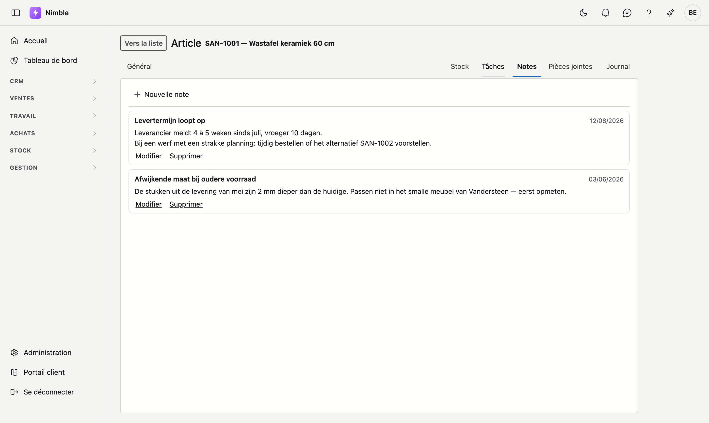
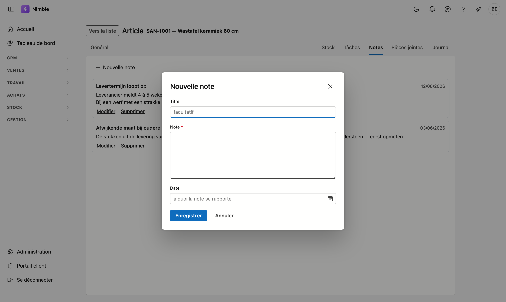

# Notes

Sur chaque fiche, vous pouvez **noter ce qu'il faut en savoir** : un accord conclu avec un client, une
particularité d'un fournisseur, un avertissement pour celui qui reprendra le dossier. Vous les retrouvez dans
le journal, sur l'onglet **Notes**.

Le fonctionnement est identique partout : cette page vaut donc pour tous les écrans dotés d'un journal.

!!! tip "Notes ou Journal ?"
    Les deux onglets se côtoient, ce qui prête parfois à confusion. Le **Journal** retient ce qui *s'est
    passé* — un appel, un e-mail, une modification. Une **note** est ce que vous voulez que quelqu'un *sache*
    avant de travailler sur cette fiche. Le journal se remplit tout seul ; une note, vous l'écrivez
    délibérément.

## Ouvrir l'onglet

Le journal est rattaché à *chaque* enregistrement, et deux chemins y mènent :

- **Sur la fiche** — ouvrez l'enregistrement (double-cliquez dessus dans la liste) et cliquez en haut à
  droite sur **Notes**.
- **Depuis la liste** — sélectionnez une ligne et cliquez à droite sur le rail **Journal**. Cliquez-y en
  haut sur le nom de l'onglet et choisissez **Notes**.

## Ajouter une note

Cliquez en haut sur **Nouvelle note**. Une fenêtre s'ouvre avec trois champs :

| Champ | |
|---|---|
| **Titre** | Facultatif. Un intitulé court rend une longue liste plus lisible. |
| **Note** | Le texte lui-même. Ce champ est obligatoire. Les retours à la ligne sont conservés : une énumération reste une énumération. |
| **Date** | Le jour *auquel la note se rapporte* — pas celui de la saisie. Laissez-le vide si cela n'a pas d'importance. |

Cliquez sur **Enregistrer**. La note apparaît en haut de la liste.

!!! note "Pourquoi une date distincte"
    Si un client appelle le vendredi à propos d'une livraison de la semaine précédente, la date de la note
    est celle de la livraison — pas celle du vendredi. La liste suit ainsi l'ordre dans lequel les choses se
    sont produites, et non l'ordre dans lequel quelqu'un les a notées.

## Modifier ou supprimer une note

Sous chaque note figurent **Modifier** et **Supprimer**. Modifier rouvre la même fenêtre.

!!! warning "Supprimer, c'est archiver"
    La note n'est pas réellement effacée : elle est conservée et disparaît seulement de la vue. C'est
    volontaire — un texte rédigé il y a des années ne peut pas se perdre d'un seul clic. Si quelque chose a
    disparu et vous est nécessaire, adressez-vous à votre administrateur.

## Qui voit quelles notes

Contrairement aux pièces jointes, il existe **bien un droit distinct** sur les notes : *Voir les notes* et
*Modifier les notes*. Pouvoir consulter un article ne donne donc pas automatiquement accès à ce qu'un collègue
y a noté. Votre administrateur règle cela au niveau des rôles.

## Erreurs fréquentes

!!! warning
    - **Mauvaise fiche sélectionnée** — les notes affichées appartiennent à la ligne sélectionnée à ce
      moment-là. Vérifiez le nom en haut du panneau avant d'écrire.
    - **Utiliser une note comme tâche** — s'il s'agit de quelque chose qui doit *encore* être fait, placez-le
      dans **Tâches**. Une note n'appelle aucun suivi et sort du champ de vision dès que de plus récentes
      s'ajoutent.
    - **Tout rattacher au client** — un accord portant sur un seul chantier appartient au **projet**, pas au
      client. Sinon, après quelques années, une seule fiche porte des centaines de notes où plus personne ne
      retrouve rien.

## Voir aussi

- [Pièces jointes](bijlagen.fr.md)
- [Relations](relations.fr.md)
- [Articles](inventory/articles.fr.md)
