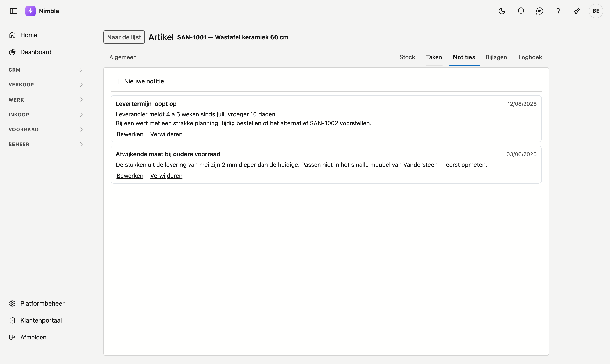
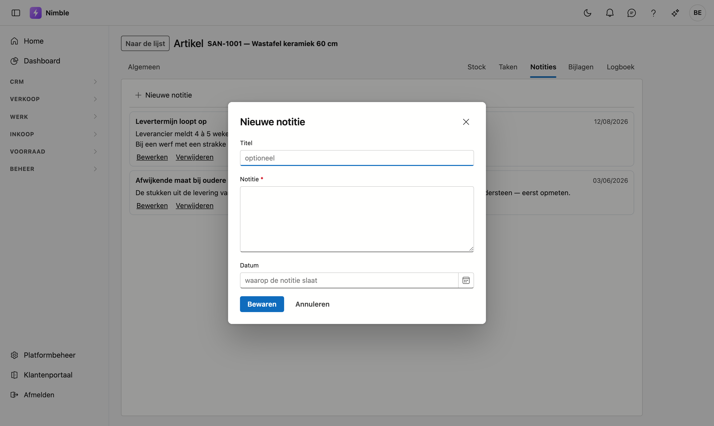

# Notities

Bij elk record kunt u **noteren wat u erover moet weten**: een afspraak met een klant, een eigenaardigheid
van een leverancier, een waarschuwing voor wie er na u mee werkt. U vindt ze in het journaal, op het tabblad
**Notities**.

Dit werkt overal op dezelfde manier, dus deze pagina geldt voor alle schermen met een journaal.

!!! tip "Notities of Logboek?"
    Ze staan naast elkaar en dat verwart soms. Het **Logboek** houdt bij wát er gebeurd is — een telefoontje,
    een mail, een wijziging. Een **notitie** is wat u wil dat iemand wéét voor hij met dit record aan de slag
    gaat. Het logboek groeit vanzelf; een notitie typt u bewust.

## Het tabblad openen

Het journaal hangt aan élk record, en er zijn twee wegen naartoe:

- **Op de fiche** — open het record (dubbelklik erop in de lijst) en klik bovenaan rechts op **Notities**.
- **Vanuit de lijst** — selecteer een rij en klik rechts op de rail **Journaal**. Klik daar bovenaan op de
  naam van het tabblad en kies **Notities**.

## Een notitie toevoegen

Klik bovenaan op **Nieuwe notitie**. Er opent een venster met drie velden:

| Veld | |
|---|---|
| **Titel** | Optioneel. Een korte kop maakt een lijst met veel notities overzichtelijk. |
| **Notitie** | De tekst zelf. Dit veld is verplicht. Regeleindes blijven behouden, dus een lijstje blijft een lijstje. |
| **Datum** | De dag waar de notitie *op slaat* — niet wanneer u ze typte. Laat hem leeg als dat er niet toe doet. |

Klik **Bewaren**. De notitie verschijnt bovenaan in de lijst.

!!! note "Waarom een aparte datum"
    Belt een klant op vrijdag over een levering van de week daarvoor, dan is de datum van de notitie die
    levering — niet de vrijdag. Zo staat de lijst in de volgorde waarin de dingen gebeurd zijn, en niet in de
    volgorde waarin iemand ze toevallig opschreef.

## Een notitie aanpassen of verwijderen

Onder elke notitie staan **Bewerken** en **Verwijderen**. Bewerken opent hetzelfde venster.

!!! warning "Verwijderen is archiveren"
    De notitie wordt niet echt gewist — ze blijft bewaard en verdwijnt alleen uit het zicht. Dat is met
    opzet: tekst die iemand jaren geleden typte, mag niet met één klik verloren gaan. Hebt u iets nodig dat
    verdwenen is, vraag het dan aan uw beheerder.

## Wie ziet welke notities

Anders dan bij bijlagen is er **wel een apart recht** op notities: *Notities bekijken* en *Notities
bewerken*. Wie een artikel mag zien, ziet daarmee dus niet automatisch wat een collega erover genoteerd
heeft. Uw beheerder stelt dat in bij de rollen.

## Veelgemaakte fouten

!!! warning
    - **Het verkeerde record geselecteerd** — de notities die u ziet, horen bij de rij die op dat moment
      geselecteerd is. Controleer bovenaan het paneel welke naam er staat vóór u iets typt.
    - **Een notitie gebruiken als taak** — staat er iets in dat nog móét gebeuren, zet het dan bij
      **Taken**. Een notitie vraagt niet om opvolging en verdwijnt uit beeld zodra er nieuwere bijkomen.
    - **Alles op de klant hangen** — een afspraak over één werf hoort bij het **project**, niet bij de klant.
      Anders staan er na een paar jaar honderden notities op één fiche waar niemand nog iets in vindt.

## Zie ook

- [Bijlagen](bijlagen.md)
- [Relaties](relations.md)
- [Artikelen](inventory/articles.md)
