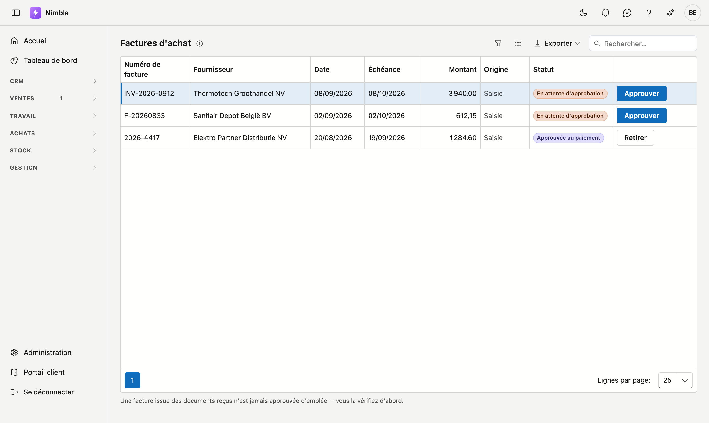

# Factures d'achat

Ce que vos fournisseurs vous facturent. Une facture ne devient payable qu'après approbation.

## Ouvrir l'écran

Cliquez dans la barre latérale sur **Achats → Factures d'achat**.

## D'où vient une facture

| Origine | Signification |
|---|---|
| **Peppol** | Arrivée par le réseau et traitée sur l'écran *Documents reçus*. Le lien ouvre le document original tel que le fournisseur l'a envoyé |
| **Saisie** | Ajoutée à la main, ou reprise de votre logiciel précédent |

## Les trois statuts

| Statut | Signification |
|---|---|
| **En attente d'approbation** | Elle est enregistrée, mais ne peut pas encore être payée |
| **Approuvée au paiement** | Quelqu'un l'a vérifiée et l'a libérée |
| **Payée** | Le montant est acquitté |

**Approuver** libère une facture ; **Retirer** annule cette approbation tant qu'elle n'est pas payée.

!!! warning "Approuver ne dit rien du contenu"
    Le drapeau signifie uniquement : *cette facture peut être payée*. Il n'affirme pas que les prix sont
    corrects ni que la livraison était conforme. Cette distinction compte si vous contestez une facture par
    la suite.

!!! warning "Une facture Peppol n'arrive jamais approuvée"
    Une facture issue des documents reçus est toujours d'abord *En attente d'approbation*. C'est
    intentionnel : le réseau livre un document, pas une décision.

## Ce que vous ne faites pas (encore) ici

Payer. Cet écran suit ce qui est dû et ce qui est libéré ; le lettrage des paiements sortants contre ces
factures viendra plus tard.
