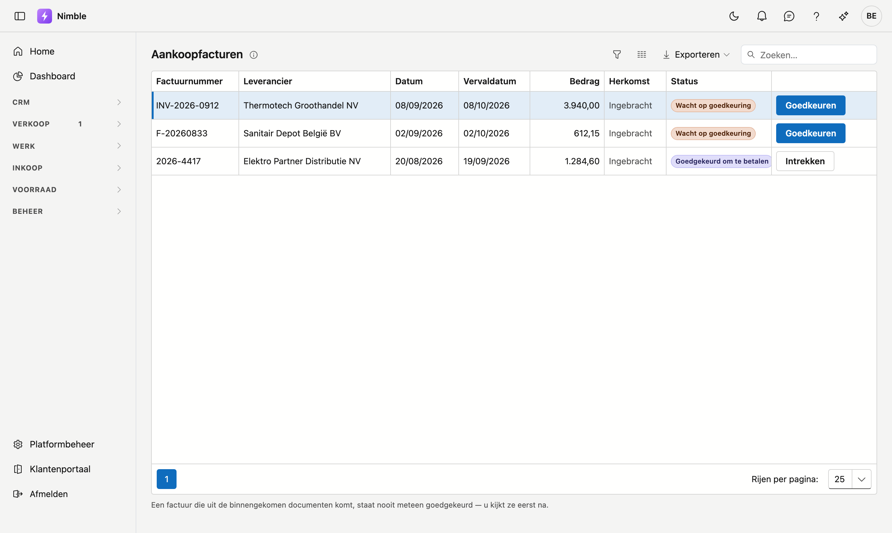

# Aankoopfacturen

Wat uw leveranciers u aanrekenen. Een factuur wordt pas betaalbaar nadat iemand ze goedkeurt.

## Het scherm openen

Klik in de zijbalk op **Inkoop → Aankoopfacturen**.

## Waar een factuur vandaan komt

| Herkomst | Wat het betekent |
|---|---|
| **Peppol** | Binnengekomen via het netwerk en verwerkt op het scherm *Binnengekomen documenten*. De link opent het originele document zoals de leverancier het stuurde |
| **Ingebracht** | Met de hand toegevoegd, of overgezet uit uw vorige pakket |

## De drie statussen

| Status | Wat het betekent |
|---|---|
| **Wacht op goedkeuring** | Ze staat er, maar mag nog niet betaald worden |
| **Goedgekeurd om te betalen** | Iemand heeft ze nagekeken en vrijgegeven |
| **Betaald** | Het bedrag is voldaan |

Met **Goedkeuren** zet u een factuur vrij; **Intrekken** draait dat terug zolang ze niet betaald is.

!!! warning "Goedkeuren zegt niets over de inhoud"
    De vlag betekent alleen: *deze factuur mag betaald worden*. Ze zegt niet dat de prijzen kloppen of dat
    de levering in orde was. Dat verschil telt wanneer u achteraf een factuur betwist.

!!! warning "Uit Peppol komt nooit goedgekeurd binnen"
    Een factuur die uit de binnengekomen documenten ontstaat, staat altijd eerst op *Wacht op goedkeuring*.
    Dat is met opzet: het netwerk levert een document af, niet een beslissing.

## Wat u hier (nog) niet doet

Betalen. Dit scherm houdt bij wat er openstaat en wat er vrijgegeven is; het afpunten van uitgaande
betalingen tegen deze facturen komt later.
