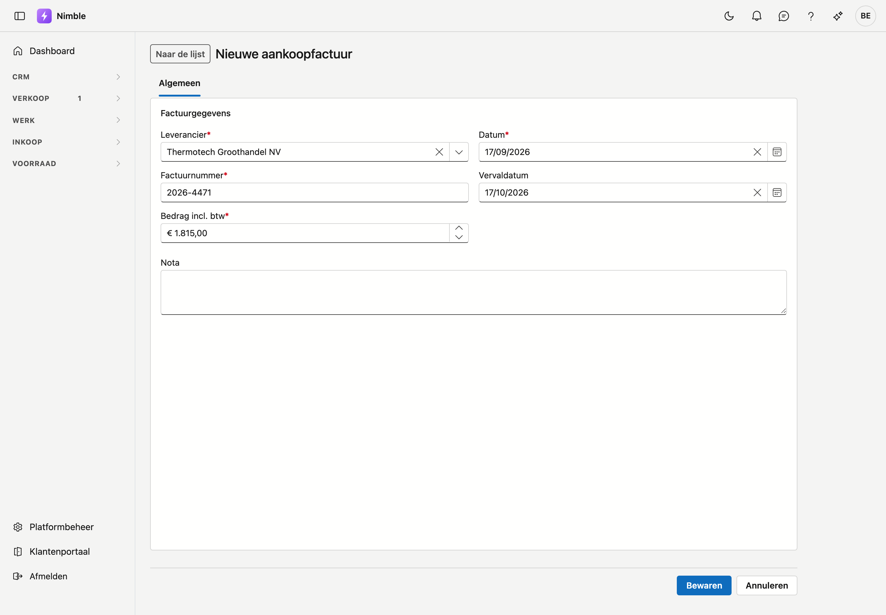

# Aankoopfacturen

Wat uw leveranciers u aanrekenen. Een factuur wordt pas betaalbaar nadat iemand ze goedkeurt.

## Het scherm openen

Klik in de zijbalk op **Inkoop → Aankoopfacturen**.

## De lijst

| Kolom | Wat het zegt |
|---|---|
| **Factuurnummer** | Het nummer dat de leverancier op zijn factuur zette |
| **Leverancier** | Van wie de factuur komt |
| **Datum** | De factuurdatum |
| **Vervaldatum** | Wanneer ze betaald moet zijn |
| **Bedrag** | Het totaal, btw inbegrepen |
| **Herkomst** | Waar de factuur vandaan komt — zie hieronder |
| **Status** | Waar de factuur staat in de goedkeuring |

Achteraan elke rij staat de knop **Goedkeuren** of **Intrekken**. Dubbelklik een rij om de factuur te
openen. U kunt zoeken, sorteren, filteren en exporteren zoals in de andere lijsten.

### Waar een factuur vandaan komt

| Herkomst | Wat het betekent |
|---|---|
| **Peppol** | Binnengekomen via het netwerk en verwerkt op het scherm [Binnengekomen documenten](peppol-inbox.md). Klik op het woord om het originele document te openen zoals de leverancier het stuurde |
| **Ingebracht** | Met de hand ingebracht, of overgezet uit uw vorige pakket |

### De drie statussen

| Status | Wat het betekent |
|---|---|
| **Wacht op goedkeuring** | Ze staat er, maar mag nog niet betaald worden |
| **Goedgekeurd om te betalen** | Iemand heeft ze nagekeken en vrijgegeven |
| **Betaald** | Het bedrag is voldaan |

Met **Goedkeuren** zet u een factuur vrij; **Intrekken** draait dat terug zolang ze niet betaald is. Een
betaalde factuur heeft geen knop.

!!! warning "Goedkeuren zegt niets over de inhoud"
    De vlag betekent alleen: *deze factuur mag betaald worden*. Ze zegt niet dat de prijzen kloppen of dat
    de levering in orde was. Dat verschil telt wanneer u achteraf een factuur betwist.

!!! warning "Uit Peppol komt nooit goedgekeurd binnen"
    Een factuur die uit de binnengekomen documenten ontstaat, staat altijd eerst op *Wacht op goedkeuring*.
    Dat is met opzet: het netwerk levert een document af, niet een beslissing.

### Het journaal naast de lijst

Klik rechts op de rail **Journaal** en kies een factuur in de lijst. Het paneel toont de tabbladen
**Taken**, **Notities**, **Bijlagen** en **Logboek** van die factuur, zonder dat u ze opent.

## Een factuur inbrengen

Krijgt u een factuur op papier of per e-mail, dan brengt u ze zelf in. Klik **Nieuwe aankoopfactuur**.

Vul in de kaart **Factuurgegevens** in:

| Veld | Opmerking |
|---|---|
| **Leverancier** | Verplicht — kies uit uw relaties die als leverancier gemarkeerd zijn |
| **Factuurnummer** | Verplicht — het nummer van de leverancier |
| **Bedrag incl. btw** | Verplicht — groter dan nul |
| **Datum** | Verplicht — staat standaard op vandaag |
| **Vervaldatum** | Neem ze over van de factuur |
| **Nota** | Vrije tekst |

Klik **Bewaren**. Ontbreekt er een verplicht veld, dan noemt de melding bovenaan het veld bij naam. Na het
bewaren blijft de fiche open, zodat u meteen de scan kunt toevoegen.

Een nieuwe factuur staat op *Wacht op goedkeuring* en heeft als herkomst *Ingebracht*.

!!! info "Hetzelfde nummer bij dezelfde leverancier kan niet"
    Een factuurnummer is uniek **per leverancier**. Twee leveranciers mogen elk een factuur *2026-001*
    hebben; dezelfde leverancier niet. Nimble weigert het tweede met een melding — anders stond dezelfde
    schuld twee keer open. Dat geldt ook wanneer de bestaande factuur in de prullenbak staat: herstel ze
    dan daar in plaats van ze opnieuw in te brengen.

!!! info "Nog geen leveranciers?"
    Dan toont het scherm geen formulier maar de melding dat u eerst een leverancier moet toevoegen bij
    **Relaties**. Een factuur hangt altijd aan een leverancier.

## De fiche

Dubbelklik een factuur in de lijst om haar fiche te openen. Bovenaan staan het factuurnummer en de
leverancier. Komt de factuur uit Peppol, dan staat er ook het label **Peppol**.

Links staat het tabblad **Algemeen**, met dezelfde velden als bij het inbrengen. Rechts staan **Taken**,
**Notities**, **Bijlagen** en **Logboek**. Zie [Werken met een fiche](../fiches.md).

Onderaan staan **Bewaren** en **Annuleren**, en rechts daarvan **Archiveren**.

De goedkeuring zet u niet op de fiche maar in de lijst, met **Goedkeuren** of **Intrekken**.

### De scan toevoegen

Een gescande factuur of de e-mail waarmee ze kwam, zet u onder het tabblad **Bijlagen**. Zie
[Bijlagen](../bijlagen.md).

## Een factuur archiveren

Is een factuur verkeerd ingebracht, klik dan op de fiche op **Archiveren** en bevestig. De factuur
verdwijnt uit de lijst en komt in de [prullenbak](../administration/recycle-bin.md). Van daaruit zet u ze
met **Herstellen** terug.

Een aankoopfactuur is een boekstuk en wordt dus nooit gewist. Zo blijft zichtbaar wat er ingebracht was.

Opent u een gearchiveerde factuur via een oude link, dan zegt de fiche dat ze in de prullenbak staat.

!!! warning "Een gearchiveerde Peppol-factuur komt niet opnieuw binnen"
    Nimble onthoudt uit welk document de factuur ontstond, ook in de prullenbak. Het document verschijnt dus
    niet opnieuw bij de binnengekomen documenten. Wilt u de factuur terug, herstel ze dan uit de prullenbak.

## Wat u hier niet doet

Betalen. Dit scherm houdt bij wat er openstaat en wat er vrijgegeven is.

## Zie ook

- [Binnengekomen documenten](peppol-inbox.md)
- [Bijlagen](../bijlagen.md)
- [Prullenbak](../administration/recycle-bin.md)
- [Lijsten filteren](../lijsten-filteren.md)
- [Werken met een fiche](../fiches.md)
