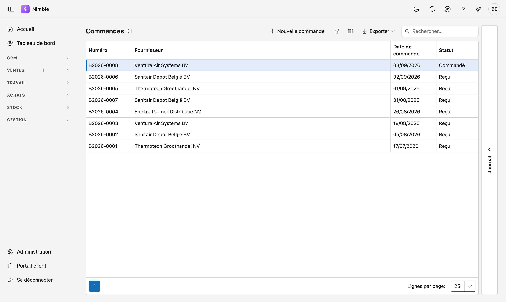
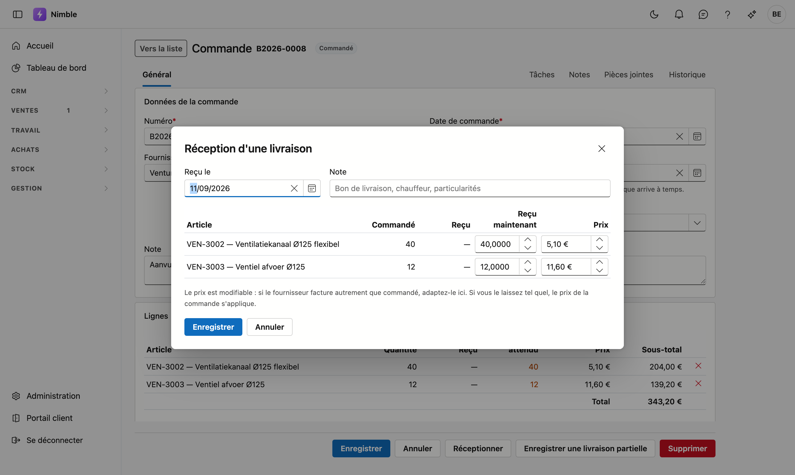

# Commandes

Une **commande** consigne ce que vous avez commandé chez un fournisseur et où en est la livraison. Lors de
la réception, Nimble comptabilise les marchandises dans votre stock — vous ne devez pas le suivre
séparément.

## Ouvrir l'écran

Cliquez dans la barre latérale sur **Achats** puis sur **Commandes**.

## Créer une commande

Cliquez sur **Nouvelle commande**. Complétez :

| Champ | Remarque |
|---|---|
| **Numéro** | Obligatoire et unique. Nimble propose le numéro suivant |
| **Date de commande** | Obligatoire |
| **Fournisseur** | Obligatoire — choisissez parmi vos relations |
| **Date de livraison prévue** | Facultatif, mais utile : vous voyez ainsi si le matériel critique arrive à temps |
| **Note** | Texte libre, par exemple une référence du fournisseur |

## Ajouter des lignes

En bas se trouve le **sélecteur d'articles**. Choisissez un article, indiquez la quantité et cliquez sur
**Ajouter une ligne**. Le prix provient du prix d'achat de l'article ; vous pouvez le remplacer ligne par
ligne si cette livraison a un autre tarif.

Chaque ligne affiche trois nombres :

| Colonne | Ce qu'elle indique |
|---|---|
| **Quantité** | Ce que vous avez commandé |
| **Reçu** | Ce qui est déjà arrivé |
| **Encore attendu** | Ce qui est encore en route pour cette ligne |

## Réceptionner des marchandises

En bas de la fiche se trouvent deux boutons, et la différence compte :

- **Réceptionner** comptabilise en une fois tout ce qui reste ouvert. Utilisez-le quand la livraison est
  complète.
- **Enregistrer une livraison partielle** ouvre une fenêtre où vous indiquez par ligne ce qui est arrivé.
  La commande reste ensuite ouverte pour le reste.

Dans la fenêtre, indiquez la **date de réception**, éventuellement une note (bon de livraison, chauffeur),
et par ligne combien est **reçu maintenant**. Cliquez sur **Enregistrer** pour terminer.

Le **prix** est modifiable : si le fournisseur facture autre chose que ce qui était commandé, adaptez-le
ici. Si vous le laissez tel quel, c'est le prix de la commande qui s'applique.

!!! warning "Ne mettez pas le statut sur Reçu à la main"
    C'est le bouton **Réceptionner** qui comptabilise les marchandises dans votre stock, pas le statut. Si
    vous changez le statut vous-même, il indiquera « Reçu » alors que rien n'est arrivé dans le stock — et
    vous ne le remarquerez que lorsque le stock ne correspondra plus.

## Le statut

| Statut | Signification |
|---|---|
| **Brouillon** | Pas encore envoyée au fournisseur |
| **Commandé** | Envoyée, rien encore reçu |
| **Partiellement livré** | Une partie est arrivée, il reste quelque chose d'ouvert |
| **Reçu** | Tout est arrivé et comptabilisé dans le stock |
| **Annulé** | N'aura pas lieu |

## Où le stock est visible

Après une réception, vous voyez le résultat sous **Stock → Articles** : ouvrez l'onglet **Stock** à droite
de la liste. Chaque mouvement y figure avec son origine, vous pouvez donc retrouver quelle commande a
ajouté quelle quantité.
