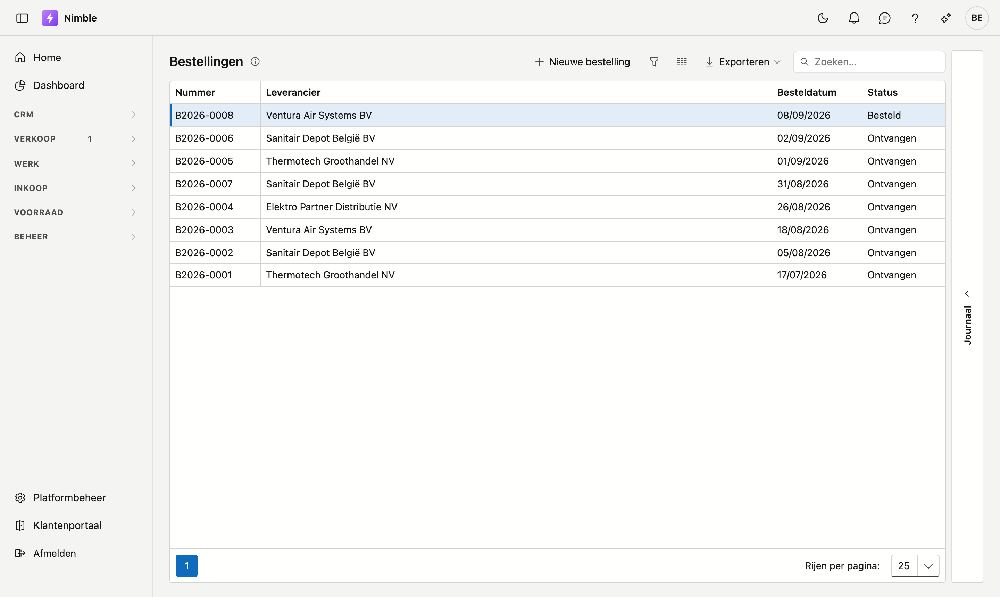
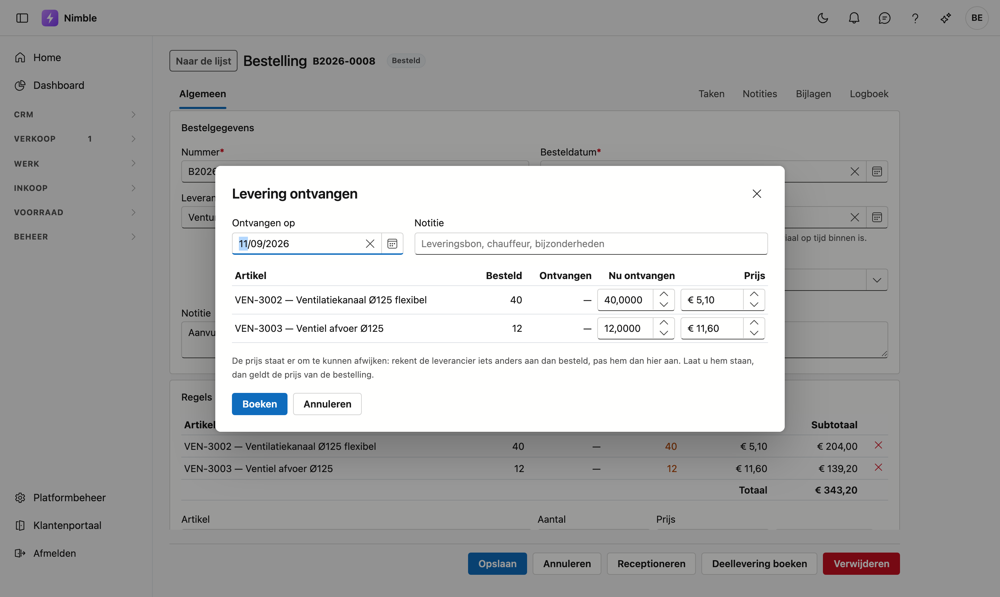

# Bestellingen

Een **bestelling** legt vast wat u bij een leverancier besteld hebt en hoever de levering staat. Bij het
ontvangen boekt Nimble de goederen in uw voorraad — u hoeft dat niet apart bij te houden.

## Het scherm openen

Klik in de zijbalk op **Inkoop** en daarna op **Bestellingen**.

## Een bestelling aanmaken

Klik **Nieuwe bestelling**. Vul in:

| Veld | Opmerking |
|---|---|
| **Nummer** | Verplicht en uniek. Nimble stelt het volgende nummer voor |
| **Besteldatum** | Verplicht |
| **Leverancier** | Verplicht — kies uit uw relaties |
| **Verwachte leverdatum** | Optioneel, maar handig: zo ziet u of kritiek materiaal op tijd binnen is |
| **Notitie** | Vrije tekst, bijvoorbeeld een referentie van de leverancier |

## Regels toevoegen

Onderaan staat de **artikelzoeker**. Kies een artikel, vul het aantal in en klik **Regel toevoegen**. De
prijs komt uit de aankoopprijs van het artikel; u kunt ze per regel overschrijven als deze levering anders
geprijsd is.

Elke regel toont drie getallen:

| Kolom | Wat het zegt |
|---|---|
| **Aantal** | Wat u besteld hebt |
| **Ontvangen** | Wat er al binnen is |
| **Nog te komen** | Wat er van deze regel nog onderweg is |

## Goederen ontvangen

Onderaan de fiche staan twee knoppen, en het verschil telt:

- **Receptioneren** boekt in één keer alles wat nog openstaat. Gebruik dit wanneer de levering volledig is.
- **Deellevering boeken** opent een venster waarin u per regel invult wat er binnengekomen is. De
  bestelling blijft daarna openstaan voor de rest.

In het venster vult u de **ontvangstdatum** in, eventueel een notitie (leveringsbon, chauffeur), en per
regel hoeveel er **nu ontvangen** is. Klik **Boeken** om af te sluiten.

De **prijs** staat er om te kunnen afwijken: rekent de leverancier iets anders aan dan besteld, pas hem dan
hier aan. Laat u hem staan, dan geldt de prijs van de bestelling.

!!! warning "Zet de status niet met de hand op Ontvangen"
    Het is de knop **Receptioneren** die de goederen in uw voorraad boekt, niet de status. Zet u de status
    zelf om, dan staat er wel "Ontvangen" maar is er niets in de stock terechtgekomen — en dat merkt u pas
    wanneer de voorraad niet klopt.

## De status

| Status | Betekenis |
|---|---|
| **Klad** | Nog niet verstuurd naar de leverancier |
| **Besteld** | Verstuurd, nog niets ontvangen |
| **Deels geleverd** | Een deel is binnen, er staat nog iets open |
| **Ontvangen** | Alles binnen en in de voorraad geboekt |
| **Geannuleerd** | Gaat niet door |

## Waar de voorraad zichtbaar is

Na een ontvangst ziet u het resultaat op **Voorraad → Artikelen**: open het tabblad **Stock** rechts op de
lijst. Daar staat elke mutatie met haar herkomst, dus u kunt terugzien welke bestelling welke hoeveelheid
bijgeboekt heeft.
