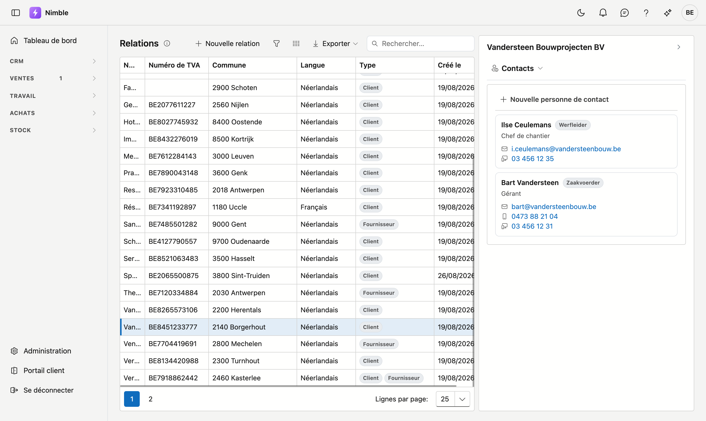
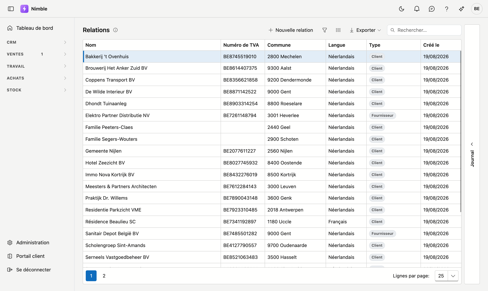
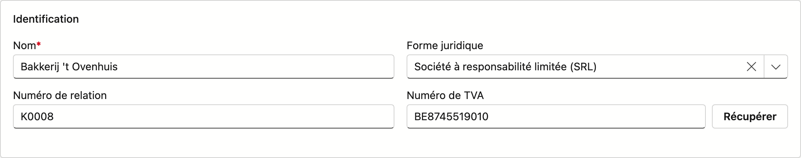
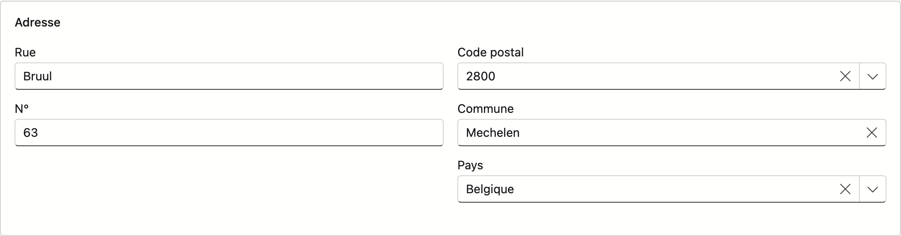
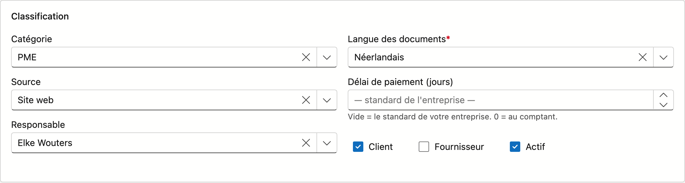
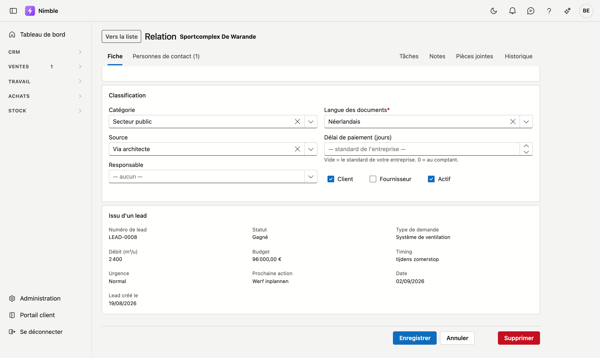
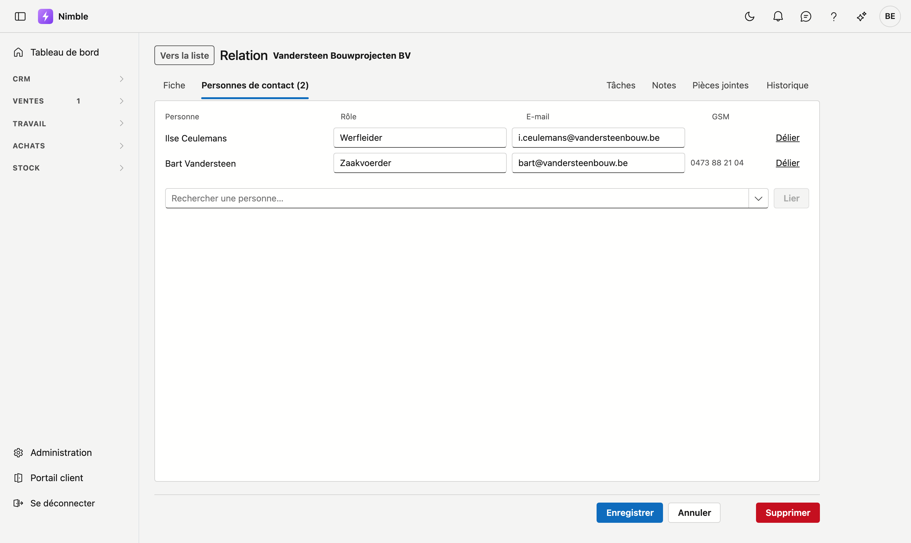

# Relations

Sur l'écran **Relations**, vous gérez les clients et fournisseurs de votre entreprise. Une relation peut être **client**, **fournisseur**, ou les deux à la fois.

## Ouvrir l'écran

Cliquez sur **CRM → Relations** dans la barre latérale.

## La liste

| Colonne | Signification |
|---|---|
| **Nom** | Nom d'entreprise ou nom d'affichage |
| **Numéro de TVA** | Numéro d'entreprise |
| **Commune** | Code postal et commune réunis |
| **Langue** | La langue des documents de cette relation |
| **Type** | Badges Client / Fournisseur |
| **Créé le** | Date de création de la fiche |

- **Rechercher et filtrer** — utilisez la recherche de la grille pour trouver rapidement une relation.
- **Exporter** — exportez la liste vers Excel ou CSV.
- **Nouveau** — cliquez sur **Nouvelle relation**.
- **Modifier** — **double-cliquez** une ligne pour ouvrir la fiche.
- **Journal** — cliquez à droite sur le rail **Journal** pour le côté de la relation sélectionnée. Il comporte cinq onglets :
    - **Contacts** — qui contacter chez ce client. Les adresses e-mail et les numéros sont cliquables, ce qui vous permet d'appeler ou d'écrire sans ouvrir la fiche. Cliquez une carte pour ouvrir la fiche de contact. Si vous pouvez modifier les relations, **Nouvelle personne de contact** en crée une directement liée à ce client.
    - **Tâches** — ce qui doit encore être fait.
    - **Notes** — ce que vous notez vous-même sur ce client. Voir [Notes](notities.fr.md).
    - **Pièces jointes** — documents et photos liés à ce client. Voir [Pièces jointes](bijlagen.fr.md).
    - **Historique** — qui a modifié quel champ de ce client, et quand. En lecture seule.

## La fiche de relation

À gauche figurent les onglets **Fiche** et **Personnes de contact**. À droite figure le journal de ce client : **Tâches**, **Notes**, **Pièces jointes** et **Historique** — voir [Travailler avec une fiche](fiches.fr.md).

Les boutons **Enregistrer**, **Annuler** et **Supprimer** se trouvent en bas et valent pour **Fiche** et **Personnes de contact** ensemble — vous pouvez donc enregistrer depuis l'un ou l'autre de ces onglets. Sur un onglet du journal, ils ne s'affichent pas.

L'onglet **Fiche** est divisé en blocs.

### Bloc Identification

| Champ | Explication |
|---|---|
| **Nom** | Obligatoire. Nom d'entreprise ou nom d'affichage. |
| **Numéro de relation** | Attribué automatiquement (`K0001`, `K0002`, …) si vous le laissez vide. Si vous saisissez vous-même une valeur, elle est conservée — les numéros existants de votre ancien logiciel ne sont pas écrasés. |
| **Forme juridique** | Liste de choix (SRL, SA, ASBL …). Recherchez en tapant. |
| **Numéro de TVA** | Numéro d'entreprise, avec le bouton **Récupérer** à côté. |

#### Récupérer les données de la BCE

Saisissez le numéro de TVA et cliquez sur **Récupérer**. Le nom, la rue, le numéro, le code postal, la commune et le pays sont remplis avec les données de la Banque-Carrefour des Entreprises. Si le numéro n'existe pas, un message s'affiche et la fiche reste inchangée.

### Bloc Adresse

| Champ | Explication |
|---|---|
| **Rue** et **N°** | Texte libre. |
| **Code postal** | Liste de recherche — tapez un code postal ou un nom de commune. La commune est remplie automatiquement. |
| **Commune** | Liste de recherche — fonctionne dans l'autre sens : choisissez une commune et le code postal suit. |
| **Pays** | Liste de recherche avec la liste des pays. |

!!! tip "Un seul suffit"
    Le code postal et la commune se complètent mutuellement. Choisissez-en un et l'autre champ suit tout seul.

### Bloc Contact

| Champ | Explication |
|---|---|
| **E-mail** | Optionnel, mais s'il est rempli, il doit être valide — le message apparaît pendant la saisie. Pour plusieurs adresses, séparez-les par `;` ou `,`. |
| **Téléphone** | Optionnel, mais s'il est rempli, il doit s'agir d'un numéro de téléphone valide. |

### Bloc Classification

| Champ | Explication |
|---|---|
| **Catégorie** | Catégorie de client issue de l'**Administration**. Recherchez en tapant. |
| **Source** | Comment cette relation vous a connu. La même liste que la **source du lead**, afin qu'un lead converti conserve son origine. |
| **Responsable** | L'interlocuteur fixe au sein de votre équipe. |
| **Langue des documents** | Obligatoire. Détermine la langue des devis, factures et e-mails pour ce client, indépendamment de la langue dans laquelle vous travaillez. |
| **Délai de paiement (jours)** | Le nombre de jours dont ce client dispose pour payer. Il détermine l'échéance proposée sur une nouvelle facture. Vide = le standard de votre entreprise, à régler sur la fiche d'entreprise. **0 signifie au comptant** — ce qui n'est pas la même chose que vide. |
| **Client** / **Fournisseur** | Cochez ce qui s'applique — les deux sont possibles. |
| **Actif** | Décocher ne masque pas automatiquement la relation dans toutes les listes ; utilisez-le comme marqueur de statut. |

### Bloc Issu d'un lead

Ce bloc n'apparaît que pour une relation née d'un **lead**, et uniquement si vous êtes autorisé à consulter les leads. Il affiche, en lecture seule : numéro de lead, statut, type de demande, ampleur, budget, timing, urgence, prochaine action avec sa date, et la date de création du lead. Les champs que le lead n'avait pas restent absents.

Si des documents étaient joints au lead, ils figurent en bas du bloc sous **Documents de la demande**. Cliquez sur un nom pour ouvrir le fichier. Les documents restent conservés sur le lead.

!!! note "Pourquoi pas simplement des champs sur le client ?"
    Le budget, le timing et l'urgence décrivent une demande, pas un client — après le premier devis, ils ne sont plus exacts. Ils restent donc rattachés au lead, mais vous les retrouvez ici sans devoir passer par l'écran des leads.

### Onglet Personnes de contact

Vous gérez ici qui répond chez ce client. Le nombre figure dans le titre de l'onglet, ce qui vous évite de l'ouvrir pour savoir si quelqu'un y est lié.

Pour une nouvelle relation, vous lisez ici : *Enregistrez d'abord la relation ; vous pourrez ensuite y lier des personnes de contact.*

| Colonne | Explication |
|---|---|
| **Personne** | Le nom. En lecture seule — la personne elle-même se modifie via [Personnes de contact](crm/contactpersonen.fr.md). |
| **Rôle** | Ce que cette personne fait dans **cette** entreprise. La même personne peut avoir un autre rôle ailleurs. |
| **E-mail** | Une adresse différente de celle de la personne. Laissez vide pour utiliser l'adresse personnelle — elle apparaît en gris dans le champ. |
| **GSM** | Celui de la personne, pour information. |

- **Lier** — choisissez une personne dans la liste de recherche en bas et cliquez sur **Lier**.
- **Délier** — supprime le lien. La personne elle-même subsiste ; elle peut travailler dans une autre entreprise.

!!! note "Tout est enregistré avec Enregistrer"
    Les liens, les rôles et les adresses e-mail ne sont écrits qu'au moment où vous cliquez sur **Enregistrer**. **Annuler** laisse tout en l'état.

## En bas de la fiche

- **Enregistrer** — conserve les modifications ; vous restez sur la fiche. S'il manque encore quelque chose — le nom, la langue des documents — ou si une adresse e-mail ou un numéro de téléphone n'est pas valide, un message en haut de la fiche indique ce qu'il faut faire. Si l'adresse non valide est celle d'une personne de contact, le message renvoie à l'onglet **Personnes de contact**.
- **Annuler** — revient à la liste sans conserver.
- **Supprimer** — uniquement pour une relation existante, voir ci-dessous.

## Supprimer

Sur la fiche, cliquez sur **Supprimer**. La question « Archiver ? » apparaît d'abord, avec le nom. Après confirmation, la relation est **archivée** et arrive dans la **Corbeille**, où vous pouvez la restaurer.

Enregistrer et Supprimer n'apparaissent que si vous disposez du **droit de modification** ; sans ce droit, vous pouvez lire la fiche mais pas la modifier, et le bouton en bas s'appelle **Vers la liste**.

## Erreurs fréquentes

!!! warning
    - **Laisser la catégorie ou la source vide** — les deux sont optionnelles, mais sans valeurs vous ne pourrez pas rapporter par type de client ni par canal.
    - **Modifier le code postal et la commune séparément** — utilisez les listes de recherche ; une saisie manuelle peut produire une combinaison inexistante.
    - **Confondre la langue des documents avec votre propre langue** — ce champ détermine la langue des documents que le client reçoit, pas celle de votre écran.
    - **Décocher Actif pour supprimer** — c'est **Supprimer** qui sert à cela ; **Actif** n'est qu'un marqueur.

## Voir aussi

- [Leads](crm/leads.fr.md) — du premier contact à la conversion en client
- [Personnes de contact](crm/contactpersonen.fr.md) — les personnes derrière ces entreprises
- [Filtrer les listes](lijsten-filteren.md) — le bouton entonnoir, le générateur de filtres et la barre de filtre
- [Travailler avec une fiche](fiches.md) — adresse propre, onglets, enregistrer et archiver
