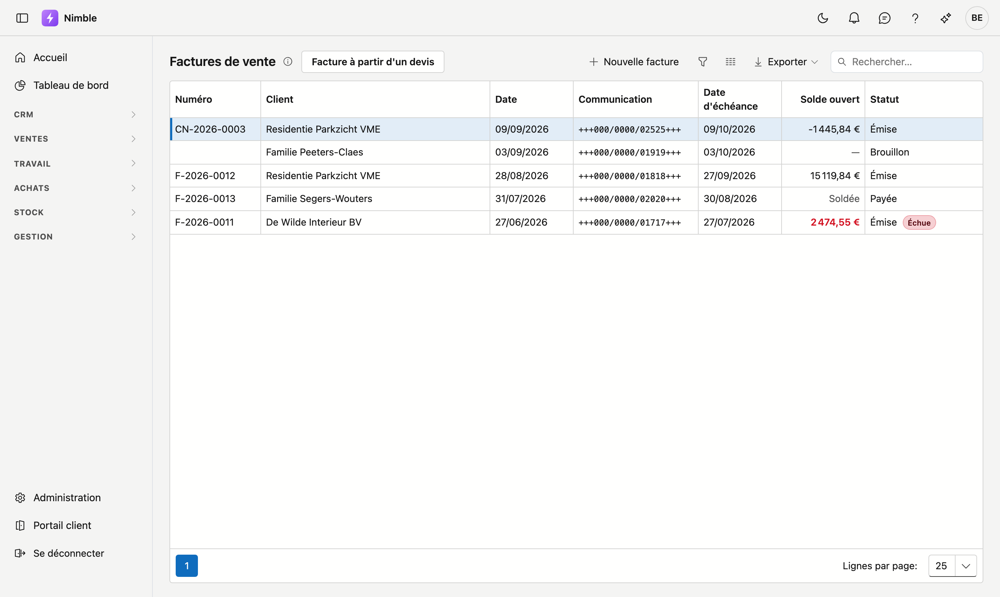
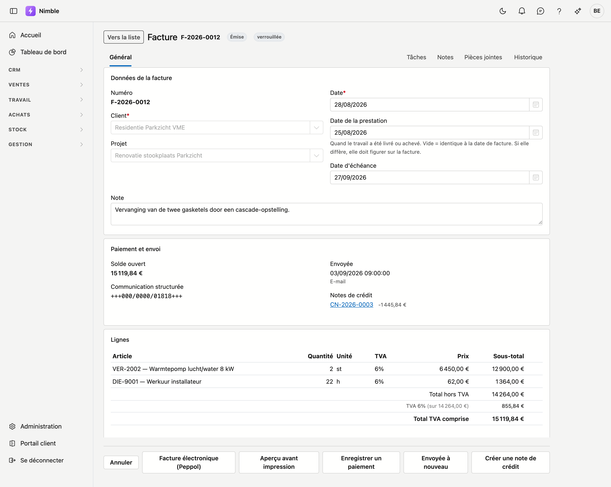
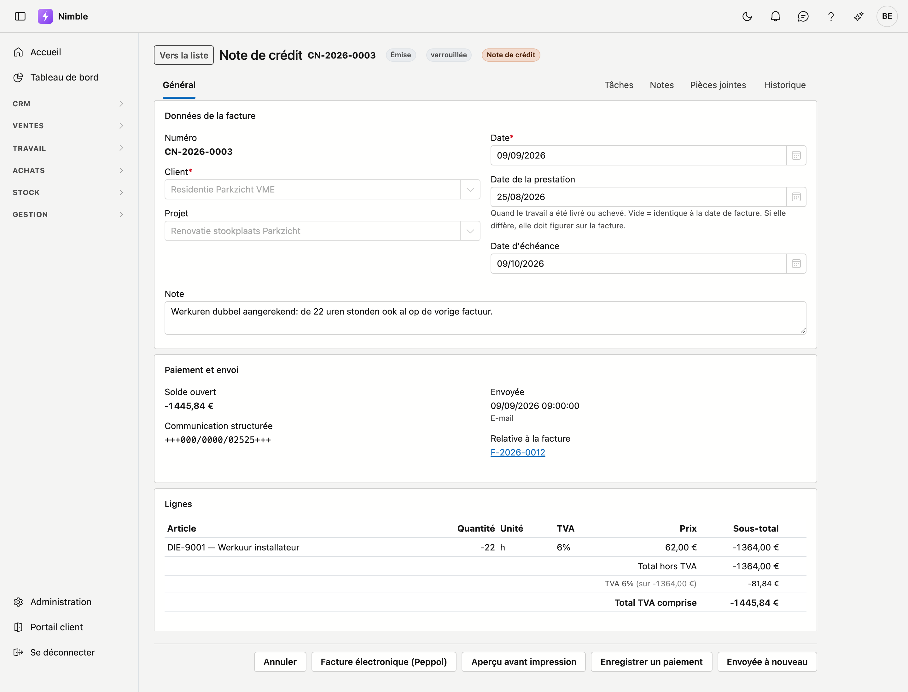

# Factures

Une facture de vente est ce que vous envoyez au client pour être payé. Nimble suit ce qui reste dû, quand
la facture est partie et avec quelle communication le client paie.

## Ouvrir l'écran

Dans la barre latérale, cliquez sur **Ventes → Factures**.

## La liste

La liste affiche sept colonnes. **Solde ouvert** est le montant que le client doit encore payer ; s'il
indique *Soldée*, tout est rentré.

- **Nouvelle facture** ouvre une fiche vide.
- **Facture à partir d'un devis** crée la facture sur la base d'un devis accepté — cela évite de
  retaper toutes les lignes.
- Les trois boutons à côté de Rechercher sont l'entonnoir, le sélecteur de colonnes et **Exporter**.

### Les statuts

| Statut | Ce qu'il signifie |
|---|---|
| **Brouillon** | Pas encore émise. La facture n'a pas encore de numéro et vous pouvez tout modifier |
| **Émise** | Elle a reçu un numéro et compte dans votre comptabilité |
| **Payée** | Le montant complet a été reçu |

Si une facture émise dépasse sa date d'échéance, une étiquette rouge **Échue** s'ajoute et le solde
ouvert passe en rouge.

!!! warning "Un brouillon n'a volontairement pas encore de numéro"
    Le numéro de facture n'est attribué qu'au moment où vous finalisez la facture. Ainsi la série ne
    présente aucun trou : un brouillon que vous jetez n'a jamais eu de numéro. Un trou dans une série de
    factures est, sur le plan comptable, une facture que quelqu'un doit justifier.

## La fiche de facture

Vous ouvrez une fiche en cliquant sur une ligne.

### Le bloc Données de la facture

| Champ | Remarque |
|---|---|
| **Numéro** | Attribué lors de la finalisation ; sur un brouillon, il est indiqué qu'il viendra encore |
| **Client** | Obligatoire. Pour qui est la facture |
| **Projet** | Facultatif. Si la facture se rattache à un chantier, elle compte dans le bloc financier de ce projet |
| **Date** | Obligatoire. La date de facture |
| **Date de la prestation** | Quand le travail a été livré ou achevé. Vide = identique à la date de facture |
| **Date d'échéance** | Quand vous attendez le paiement. Nimble la propose selon le délai de paiement du client |
| **Note** | De la place pour ce qui accompagne cette facture |

!!! warning "La date de la prestation n'est pas un champ ordinaire"
    Si la date à laquelle vous avez livré diffère de la date de facture, cette date **doit** figurer sur
    la facture. Chez un entrepreneur qui pose en mars et facture en avril, c'est la règle et non
    l'exception — et cette date détermine dans quelle déclaration TVA l'opération se range.

### Le bloc Paiement et envoi

| Champ | Ce que c'est |
|---|---|
| **Solde ouvert** | Ce que le client doit encore payer. Si tout est rentré, il indique *Soldée* avec le montant payé en dessous |
| **Communication structurée** | Le numéro avec lequel le client paie. Nimble l'attribue automatiquement et il n'est pas modifiable |
| **Envoyée** | Quand et comment la facture est partie. S'il n'y a rien, elle n'a pas encore été envoyée |
| **Notes de crédit** | Les notes de crédit rattachées à cette facture, avec leur montant |

### Le bloc Lignes

Par ligne, vous voyez l'article, la quantité, l'unité, le pourcentage de TVA, le prix unitaire et le
sous-total. En bas figurent le total hors TVA, la TVA par pourcentage et le total TVA comprise.

## Envoyer et suivre une facture

En bas de la fiche se trouvent les boutons qui servent à traiter la facture.

- **Aperçu avant impression** affiche la facture en PDF, telle que le client la reçoit.
- **Facture électronique (Peppol)** construit le fichier électronique destiné à la comptabilité de votre
  client.
- **Enregistrer un paiement** comptabilise une recette. Vous pouvez enregistrer plusieurs paiements ; le
  solde ouvert s'adapte.
- **Envoyée à nouveau** note que vous avez transmis la facture une fois de plus.

!!! tip "La facture électronique refuse un régime de TVA deviné"
    S'il manque le code TVA sur une ligne, le fichier n'est pas construit et vous lisez combien de lignes
    sont concernées. C'est voulu : un régime de TVA deviné sur une facture électronique est une erreur
    qui n'apparaît que chez votre comptable.

## Notes de crédit

Une note de crédit corrige une facture déjà émise. Le bouton **Créer une note de crédit**, en bas de la
fiche, en crée une.

Une note de crédit utilise le même écran qu'une facture, avec trois différences :

- Elle porte une série de numéros *propre*, qui commence par `CN-`.
- Ses lignes sont *négatives*, et son total l'est donc aussi.
- Sous **Relative à la facture** figure la facture à laquelle elle renvoie — cette mention est
  légalement obligatoire.

La note de crédit commence comme brouillon, afin que vous puissiez supprimer des lignes lorsque vous ne
créditez qu'une **partie**. Sur l'image ci-dessus, seules les heures de travail sont créditées ; le
reste de la facture demeure.

!!! warning "Une note de crédit n'annule pas la facture"
    La facture d'origine reste telle quelle et conserve son statut. Ensemble, elles déterminent ce que le
    client doit encore payer. Si vous ne créditez qu'une partie, vous pouvez créer plus tard une seconde
    note de crédit pour le reste — jusqu'au total de la facture.

## Voir aussi

- [Devis](quotes.md) — ce dont une facture découle le plus souvent
- [Projets](../work/projects.md) — le chantier auquel une facture peut se rattacher
- [Travailler avec une fiche](../fiches.md) — le fonctionnement des onglets, des tiroirs et des boutons
