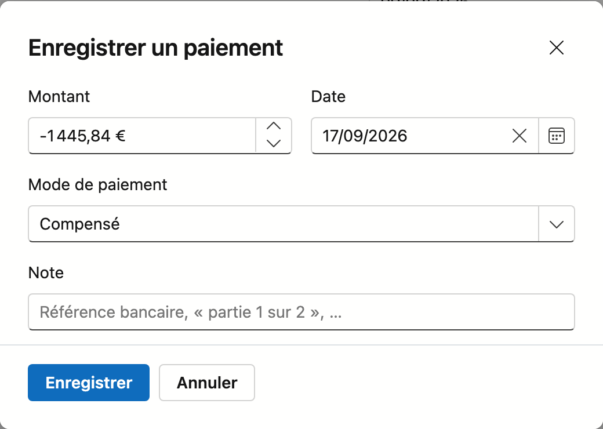

# Factures

Une facture de vente est ce que vous envoyez au client pour être payé. Nimble suit ce qui reste dû, quand la
facture est partie et avec quelle communication le client paie. Une note de crédit se traite sur le même
écran.

## Ouvrir l'écran

Dans la barre latérale, cliquez sur **Ventes → Factures**.

## La liste

| Colonne | Ce que vous voyez |
|---|---|
| **Numéro** | Le numéro de facture. Un brouillon n'en a pas encore ; une note de crédit commence par `CN-` |
| **Client** | Pour qui est la facture |
| **Date** | La date de facture |
| **Communication** | La communication structurée avec laquelle le client paie |
| **Date d'échéance** | Quand vous attendez le paiement |
| **Solde ouvert** | Ce qui reste à payer, après déduction des paiements enregistrés |
| **Statut** | Brouillon, Émise ou Payée, avec une étiquette lorsque quelque chose demande votre attention |

Dans la colonne **Solde ouvert**, vous pouvez rencontrer :

- **—** pour un brouillon : il n'a pas encore été remis au client, rien n'est donc dû.
- **Soldée** : tout est rentré.
- Un montant en **rouge** : la facture a dépassé sa date d'échéance.
- Un montant **négatif** pour une note de crédit : ce qui reste à compenser ou à rembourser.
- L'étiquette **Montant inconnu** pour une facture émise de 0,00 €. Survolez-la pour lire l'explication.

Dans la colonne **Statut**, l'étiquette **Échue** s'ajoute à une facture émise dont la date d'échéance est
dépassée, et **Sans échéance** lorsqu'aucune date d'échéance n'est complétée.

Au-dessus de la liste figurent :

- **Facture à partir d'un devis** — crée une facture sur la base d'un devis accepté.
- **Nouvelle facture** — ouvre une fiche vide.
- **Exporter**, les boutons de filtre et le champ de recherche.

**Double-cliquez** une ligne pour ouvrir la facture. À droite de la liste se trouve la barre étroite
**Journal** : dépliez-la pour voir les tâches, notes, pièces jointes et l'historique de la facture
sélectionnée dans la liste.

### Les statuts

| Statut | Ce qu'il signifie |
|---|---|
| **Brouillon** | Pas encore émise. La facture n'a pas encore de numéro et vous pouvez tout modifier |
| **Émise** | Elle a reçu un numéro et est verrouillée |
| **Payée** | Le montant complet a été reçu |

Vous définissez vous-même le texte des statuts dans [Statuts de facture](../administration/invoice-status.md).

!!! warning "Un brouillon n'a volontairement pas encore de numéro"
    Le numéro de facture n'est attribué qu'au moment où vous finalisez la facture. Ainsi la série ne
    présente aucun trou : un brouillon que vous jetez n'a jamais eu de numéro. Un trou dans une série de
    factures est, sur le plan comptable, une facture que quelqu'un doit justifier.

## Facture à partir d'un devis

Cliquez sur **Facture à partir d'un devis**. Dans la fenêtre, choisissez sous **Devis** un devis accepté qui
n'a pas encore été facturé, puis cliquez sur **Créer**. Nimble crée un brouillon de facture avec les lignes
du devis et l'ouvre.

Si aucun devis n'est prêt, la fenêtre l'indique : seul un devis accepté qui n'a pas encore été facturé
figure dans la liste.

Vous pouvez aussi facturer un devis accepté depuis le devis lui-même, avec **Facturer** — voir
[Devis](quotes.md).

## La fiche de facture

En haut figurent le numéro et le statut. Une facture émise porte en plus la mention **verrouillée** ; une
note de crédit l'étiquette **Note de crédit**.

La fiche comporte les onglets **Général**, **Tâches**, **Notes**, **Pièces jointes** et **Historique**. Le
fonctionnement des quatre derniers est décrit dans [Travailler avec une fiche](../fiches.md).

### Le bloc Données de la facture

| Champ | Remarque |
|---|---|
| **Numéro** | Sur un brouillon figure *— recevra un numéro lors de la finalisation* |
| **Client** | Obligatoire. Pour qui est la facture |
| **Projet** | Facultatif. Si la facture se rattache à un projet, elle compte dans la situation financière de ce projet |
| **Date** | Obligatoire. La date de facture ; aujourd'hui pour une nouvelle facture |
| **Date de la prestation** | Quand le travail a été livré ou achevé. Vide = identique à la date de facture |
| **Date d'échéance** | Quand vous attendez le paiement. Lorsque vous choisissez un client, Nimble la propose |
| **Note** | Une note interne. Elle n'apparaît pas sur la facture |

!!! info "Comment la date d'échéance est proposée"
    Nimble compte à partir de la date de facture avec le délai de paiement du client. Si le client n'a pas
    de délai propre, celui de la [fiche d'entreprise](../settings/company-profile.md) s'applique. S'il n'y a
    de délai nulle part, le champ reste vide et un texte indique que vous devez compléter l'échéance
    vous-même. Sans échéance, la facture ne peut pas être finalisée.

!!! warning "La date de la prestation n'est pas un champ ordinaire"
    Si la date à laquelle vous avez livré diffère de la date de facture, cette date **doit** figurer sur
    la facture. Chez un entrepreneur qui pose en mars et facture en avril, c'est la règle et non
    l'exception — et cette date détermine dans quelle déclaration TVA l'opération se range.

### Le bloc Paiement et envoi

| Champ | Ce que c'est |
|---|---|
| **Solde ouvert** | Ce que le client doit encore payer, en rouge avec **Échue** si l'échéance est dépassée. Si tout est rentré, il indique **Soldée**. S'il y a des paiements, *Déjà payé* et le montant figurent en dessous |
| **Communication structurée** | Le numéro avec lequel le client paie. Nimble l'attribue automatiquement à l'enregistrement ; il n'est pas modifiable |
| **Envoyée** | Quand, par quelle voie et à qui la facture est partie. Si le champ n'apparaît pas, elle n'a pas encore été marquée comme envoyée |
| **Notes de crédit** | Les notes de crédit rattachées à cette facture, avec leur montant. Cliquez un numéro pour l'ouvrir |
| **Relative à la facture** | Uniquement sur une note de crédit : la facture à laquelle elle renvoie |

Le solde ouvert n'apparaît que sur une facture numérotée.

### Le bloc Lignes

Par ligne, vous voyez l'article ou la description, la quantité, l'unité, le code TVA, le prix unitaire et le
sous-total. Les lignes de titre reprises d'un devis n'ont pas de montant. En bas figurent le total hors TVA,
la TVA par taux et le total TVA comprise, avec la mention légale du code TVA en dessous.

Sur un brouillon, vous pouvez encore adapter les lignes :

- Choisissez un autre code **TVA** par ligne, ou supprimez la ligne avec le ✕ rouge.
- Ajoutez une ligne avec la rangée de saisie en bas : **Article**, **Description**, **Quantité**, **Prix** et
  **TVA**, puis cliquez sur **Ajouter une ligne**.

Lors de l'ajout :

- Un article n'est pas obligatoire. Un poste comme « Acompte » ou « Installation de chantier » se saisit
  simplement sous Description.
- Si vous laissez Description vide, le nom de l'article est repris.
- Si vous laissez Prix vide, le prix de vente de l'article s'applique. L'unité est aussi reprise de
  l'article.
- Si vous ne choisissez pas de code TVA, la ligne reçoit celui de la dernière ligne de la facture.
- Le bouton ne fonctionne que si la quantité est supérieure à zéro.

Si un code TVA applique 0 % sans mention légale, un avertissement s'affiche sous les totaux.

### Le bloc Paiements

Dès qu'un paiement est enregistré, le bloc **Paiements** apparaît en bas : date, mode de paiement, note et
montant, avec le solde ouvert en dessous. Le ✕ rouge supprime un paiement, après confirmation.

## Les boutons du bas

Les boutons affichés dépendent du statut et de vos droits. De gauche à droite :

| Bouton | Quand | Ce qu'il fait |
|---|---|---|
| **Enregistrer** | Brouillon | Enregistre vos modifications |
| **Aperçu avant impression** | Toujours, même sur un brouillon | Affiche la facture en PDF, telle que le client la reçoit |
| **Facture électronique (Peppol)** | Dès que la facture a un numéro | Construit le fichier électronique |
| **Finaliser** | Brouillon | Attribue le numéro et met la facture sur Émise |
| **Enregistrer un paiement** | Émise | Comptabilise une recette |
| **Marquer comme envoyée** | Émise | Note que la facture est partie, et comment. Ensuite, le bouton s'appelle **Envoyée à nouveau** |
| **Créer une note de crédit** | Facture numérotée | Crée une note de crédit pour cette facture |
| **Remettre en ouverte** | Payée | Remet la facture sur Émise |
| **Annuler** | Brouillon | Abandonne vos modifications |
| **Vers la liste** | Émise et Payée | Vous ramène à la liste ; il n'y a rien à enregistrer |
| **Supprimer** | Brouillon sans numéro | Supprime le brouillon, après confirmation |

Toute personne autorisée à consulter les factures peut utiliser l'aperçu avant impression. Les autres
boutons demandent le droit de modifier les factures.

!!! info "Un brouillon porte la marque BROUILLON"
    L'aperçu fonctionne aussi avant la finalisation. Vous contrôlez ainsi le document tant que vous pouvez
    encore le modifier. L'aperçu porte alors une marque de brouillon.

## Finaliser

**Finaliser** tire le numéro suivant de la série et met la facture sur **Émise**. Elle est alors
**verrouillée** : les champs et les lignes ne sont pas modifiables. Cette étape est irréversible. Une erreur
sur une facture émise se corrige par une note de crédit.

Comme c'est irréversible, Nimble demande d'abord **Finaliser la facture ?**, avec le client et le montant.
La facture ne reçoit son numéro que lorsque vous cliquez à nouveau sur **Finaliser**. **Annuler** la laisse
en brouillon.

Nimble refuse, en indiquant pourquoi, lorsque :

- la facture n'a aucune ligne, ou seulement des lignes de titre et des lignes vides ;
- une ligne n'a pas de prix unitaire — indiquez un prix, ou 0 si la ligne est réellement gratuite ;
- aucune date d'échéance n'est complétée ;
- la date de facture tombe dans une autre année qu'aujourd'hui — le numéro provient de la série de l'année
  en cours ;
- une note de crédit créditerait plus que ce qui reste à créditer sur la facture.

## Envoyer une facture

Nimble n'envoie pas lui-même une facture, ni par e-mail ni par Peppol. Vous la transmettez via l'aperçu avant
impression ou la facture électronique, puis vous notez qu'elle est partie.

### Marquer comme envoyée

Cliquez sur **Marquer comme envoyée**. Dans la fenêtre, complétez :

| Champ | Contenu |
|---|---|
| **Par quelle voie** | **E-mail**, **Peppol** ou **Imprimée et postée** |
| **À** | L'adresse e-mail ou le nom du destinataire. Peut rester vide |

Cliquez sur **Enregistrer**. La fiche affiche **Envoyée** avec la date, la voie et le destinataire. C'est un
enregistrement, pas une preuve de réception.

Si vous transmettez la facture une nouvelle fois, utilisez **Envoyée à nouveau**.

### La facture électronique

**Facture électronique (Peppol)** construit la version électronique de la facture, au format exigé par Peppol
et les autorités. La fenêtre affiche le fichier, avec le bouton **Télécharger le fichier**. Déposez-le via
votre logiciel comptable ou un portail.

Le fichier n'est pas construit, et vous lisez pourquoi, lorsque :

- votre numéro d'entreprise manque dans la [fiche d'entreprise](../settings/company-profile.md) ;
- le client n'a pas de numéro d'entreprise — Peppol s'adresse aux entreprises ;
- des lignes n'ont pas de code TVA. Vous lisez alors de quel montant il s'agit.

!!! tip "La facture électronique refuse un régime de TVA deviné"
    Un régime de TVA deviné sur une facture électronique est une erreur qui n'apparaît que chez votre
    comptable. Complétez donc le code TVA sur la facture elle-même.

## Enregistrer des paiements

Cliquez sur **Enregistrer un paiement**. La fenêtre demande :

| Champ | Contenu |
|---|---|
| **Montant** | Déjà rempli avec le solde ouvert. Adaptez-le pour un paiement partiel |
| **Date** | Le jour où l'argent est arrivé, pas celui où vous le saisissez |
| **Mode de paiement** | **Virement**, **Espèces**, **Carte / Bancontact** ou **Compensé** |
| **Note** | Par exemple une référence bancaire ou « partie 1 sur 2 » |

Cliquez sur **Enregistrer**. Vous pouvez enregistrer plusieurs paiements ; le solde ouvert s'adapte. Lorsque
tout est payé, la facture passe d'elle-même à **Payée**.

Les paiements arrivés par la banque s'enregistrent le plus facilement sur l'écran
[Lettrage](../finance/reconciliation.md).

!!! tip "Paiement erroné ?"
    Supprimez le paiement dans le bloc Paiements ; le statut s'adapte au solde ouvert. Si une facture est
    malgré tout à tort sur Payée, **Remettre en ouverte** la remet sur Émise.

## Notes de crédit

Une note de crédit corrige une facture qui a déjà un numéro. Cliquez sur **Créer une note de crédit** en bas
de la facture. Nimble crée une note de crédit en brouillon et l'ouvre.

Une note de crédit utilise le même écran qu'une facture, avec ces différences :

- En haut figure l'étiquette **Note de crédit**.
- À la finalisation, elle reçoit une série de numéros *propre*, qui commence par `CN-`.
- Ses lignes sont *négatives*, et son total l'est donc aussi.
- Sous **Relative à la facture** figure la facture à laquelle elle renvoie — cette mention est
  légalement obligatoire.
- Le bouton **Créer une note de crédit** n'y figure pas : on ne crédite pas une note de crédit.

La note de crédit commence comme brouillon, afin que vous puissiez supprimer des lignes lorsque vous ne
créditez qu'une **partie**. Sur l'image ci-dessus, seules les heures de travail sont créditées. Si vous ne
créditez qu'une partie, vous pouvez créer plus tard une seconde note de crédit pour le reste — jusqu'au
total de la facture.

Nimble refuse une note de crédit sur un brouillon (modifiez-le simplement) et sur une facture déjà
entièrement créditée.

## Compenser une note de crédit

Une note de crédit n'annule pas la facture et n'est **pas déduite automatiquement** de son solde ouvert. La
facture continue d'afficher son montant complet, et la note de crédit un solde ouvert négatif. Vous voyez
ainsi qu'il reste quelque chose à régler.

Pour déduire la note de crédit de ce que le client doit payer, enregistrez deux paiements avec le mode
**Compensé** :

1. Sur la **facture** : un paiement du montant de la note de crédit. Le solde ouvert de la facture diminue
   d'autant.
2. Sur la **note de crédit** : un paiement Compensé. Le montant est déjà rempli avec le solde ouvert
   négatif. La note de crédit indique ensuite **Soldée**.

Si vous remboursez au contraire le montant de la note de crédit au client, enregistrez sur la note de crédit
un paiement avec le mode par lequel vous avez remboursé.

!!! warning "Une note de crédit non compensée bloque le rappel"
    Tant qu'une note de crédit n'est pas compensée, vous ne pouvez ni envoyer ni enregistrer de rappel pour
    cette facture. Sinon, le rappel réclamerait de l'argent que le client ne doit plus. Voir
    [Rappels](reminders.md).

## Voir aussi

- [Devis](quotes.md) — ce dont une facture découle le plus souvent
- [Rappels](reminders.md) — le suivi des factures ouvertes
- [Lettrage](../finance/reconciliation.md) — enregistrer les paiements bancaires sur les factures
- [Projets](../work/projects.md) — le projet auquel une facture peut se rattacher
- [Statuts de facture](../administration/invoice-status.md) — modifier le texte des statuts
- [Travailler avec une fiche](../fiches.md) — le fonctionnement des onglets et des boutons
