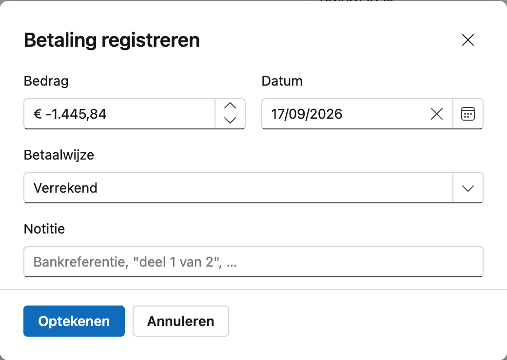

# Facturen

Een verkoopfactuur is wat u naar de klant stuurt om betaald te worden. Nimble houdt bij wat er nog
openstaat, wanneer de factuur vertrokken is en met welke mededeling de klant betaalt. Een creditnota werkt op
hetzelfde scherm.

## Het scherm openen

Klik in de zijbalk op **Verkoop → Facturen**.

## De lijst

| Kolom | Wat u ziet |
|---|---|
| **Nummer** | Het factuurnummer. Een klad heeft er nog geen; een creditnota begint met `CN-` |
| **Klant** | Voor wie de factuur is |
| **Datum** | De factuurdatum |
| **Mededeling** | De gestructureerde mededeling waarmee de klant betaalt |
| **Vervaldatum** | Wanneer u het geld verwacht |
| **Openstaand** | Wat er nog betaald moet worden, na aftrek van de geregistreerde betalingen |
| **Status** | Klad, Uitgereikt of Betaald, met een label wanneer er iets aandacht vraagt |

In de kolom **Openstaand** kunt u dit tegenkomen:

- **—** bij een klad: die is nog niet bij de klant geweest, dus er staat niets open.
- **Voldaan**: alles is binnen.
- Een bedrag in het **rood**: de factuur is over haar vervaldatum.
- Een **negatief** bedrag bij een creditnota: wat er nog verrekend of terugbetaald moet worden.
- Het label **Bedrag onbekend** bij een uitgereikte factuur van € 0,00. Beweeg de muis erover voor de uitleg.

In de kolom **Status** komt het label **Vervallen** bij een uitgereikte factuur die over haar vervaldatum
is, en **Geen vervaldag** wanneer er geen vervaldatum ingevuld is.

Boven de lijst staan:

- **Factuur uit offerte** — maakt een factuur op basis van een aanvaarde offerte.
- **Nieuwe factuur** — opent een lege fiche.
- **Exporteren**, de filterknoppen en het zoekveld.

**Dubbelklik** een rij om de factuur te openen. Rechts van de lijst staat de smalle balk **Journaal**: klap
ze open voor de taken, notities, bijlagen en het logboek van de factuur die u in de lijst aangeklikt hebt.

### De statussen

| Status | Wat het betekent |
|---|---|
| **Klad** | Nog niet uitgereikt. De factuur heeft nog géén nummer en u kunt alles nog wijzigen |
| **Uitgereikt** | Ze heeft een nummer gekregen en staat op slot |
| **Betaald** | Het volledige bedrag is ontvangen |

De tekst van de statussen stelt u zelf in onder [Factuurstatus](../administration/invoice-status.md).

!!! warning "Een klad heeft met opzet nog geen nummer"
    Het factuurnummer wordt pas toegekend wanneer u de factuur definitief maakt. Zo houdt de reeks geen
    gaten: een klad die u weggooit, heeft nooit een nummer gehad. Een gat in een factuurreeks is
    boekhoudkundig een factuur die iemand moet verantwoorden.

## Factuur uit offerte

Klik op **Factuur uit offerte**. In het venster kiest u bij **Offerte** een aanvaarde offerte die nog niet
gefactureerd is, en klikt u op **Aanmaken**. Nimble maakt een kladfactuur met de regels van de offerte en
opent ze.

Staat er geen enkele offerte klaar, dan leest u dat in het venster: alleen een aanvaarde offerte die nog
niet gefactureerd is, komt in de lijst.

U kunt een aanvaarde offerte ook factureren vanaf de offerte zelf, met **Factureren** — zie
[Offertes](quotes.md).

## De factuurfiche

Bovenaan staan het nummer en de status. Bij een uitgereikte factuur staat er **op slot** naast; bij een
creditnota het label **Creditnota**.

De fiche heeft de tabbladen **Algemeen**, **Taken**, **Notities**, **Bijlagen** en **Logboek**. Hoe die
laatste vier werken, leest u in [Werken met een fiche](../fiches.md).

### Het blok Factuurgegevens

| Veld | Opmerking |
|---|---|
| **Nummer** | Op een klad staat *— krijgt een nummer bij Definitief maken* |
| **Klant** | Verplicht. Voor wie de factuur is |
| **Project** | Optioneel. Hangt de factuur aan een project, dan telt ze mee in het financiële overzicht van dat project |
| **Datum** | Verplicht. De factuurdatum; bij een nieuwe factuur staat ze op vandaag |
| **Datum van levering** | Wanneer het werk geleverd of voltooid is. Leeg = gelijk aan de factuurdatum |
| **Vervaldatum** | Wanneer u het geld verwacht. Kiest u een klant, dan stelt Nimble ze voor |
| **Notitie** | Een interne notitie. Ze komt niet op de factuur |

!!! info "Hoe de vervaldatum voorgesteld wordt"
    Nimble rekent vanaf de factuurdatum met de betalingstermijn van de klant. Heeft de klant geen eigen
    termijn, dan geldt die van de [bedrijfsfiche](../settings/company-profile.md). Is er nergens een termijn,
    dan blijft het veld leeg en staat eronder dat u de vervaldag zelf moet invullen. Zonder vervaldag kan de
    factuur niet definitief gemaakt worden.

!!! warning "De datum van levering is niet zomaar een veld"
    Verschilt de datum waarop u geleverd hebt van de factuurdatum, dan **moet** die datum op de factuur
    staan. Bij een aannemer die in maart legt en in april factureert is dat regel, geen uitzondering — en
    die datum bepaalt in welke btw-aangifte de handeling thuishoort.

### Het blok Betaling en verzending

| Veld | Wat het is |
|---|---|
| **Openstaand** | Wat de klant nog moet betalen, in het rood met **Vervallen** erbij als de vervaldatum voorbij is. Is alles binnen, dan staat er **Voldaan**. Zijn er betalingen, dan staat eronder *Al betaald* met het bedrag |
| **Gestructureerde mededeling** | Het nummer waarmee de klant betaalt. Nimble kent het automatisch toe bij het bewaren; het is niet te wijzigen |
| **Verstuurd** | Wanneer, langs welke weg en naar wie de factuur vertrokken is. Staat het veld er niet, dan is ze nog niet als verstuurd gemarkeerd |
| **Creditnota's** | De creditnota's die bij deze factuur horen, met hun bedrag. Klik een nummer om ze te openen |
| **Bij factuur** | Alleen op een creditnota: naar welke factuur ze verwijst |

Het openstaande bedrag komt pas bij een factuur met een nummer.

### Het blok Regels

Per regel ziet u het artikel of de omschrijving, het aantal, de eenheid, de btw-code, de eenheidsprijs en
het subtotaal. Kopregels uit een offerte staan er zonder bedrag. Onderaan staan het totaal exclusief btw, de
btw per tarief en het totaal inclusief btw, met de wettelijke vermelding van de btw-code eronder.

Op een klad kunt u de regels nog aanpassen:

- Kies per regel een andere **Btw**-code, of verwijder de regel met het rode ✕.
- Voeg een regel toe met de invoerrij onderaan: **Artikel**, **Omschrijving**, **Aantal**, **Prijs** en
  **Btw**, en klik op **Regel toevoegen**.

Bij het toevoegen geldt:

- Een artikel is niet verplicht. Een post als "Voorschot" of "Werfinrichting" typt u gewoon bij Omschrijving.
- Laat u Omschrijving leeg, dan wordt het de naam van het artikel.
- Laat u Prijs leeg, dan geldt de verkoopprijs van het artikel. De eenheid komt ook mee uit het artikel.
- Kiest u geen btw-code, dan krijgt de regel de code van de laatste regel op de factuur.
- De knop werkt pas wanneer het aantal groter is dan nul.

Rekent een btw-code 0 % zonder wettelijke vermelding, dan staat er een waarschuwing onder de totalen.

### Het blok Betalingen

Zodra er een betaling geregistreerd is, staat onderaan het blok **Betalingen**: datum, betaalwijze, notitie
en bedrag, met onderaan wat er nog openstaat. Met het rode ✕ verwijdert u een betaling, na bevestiging.

## De knoppen onderaan

Welke knoppen er staan, hangt af van de status en van uw rechten. Van links naar rechts:

| Knop | Wanneer | Wat ze doet |
|---|---|---|
| **Bewaren** | Klad | Bewaart uw wijzigingen |
| **Afdrukvoorbeeld** | Altijd, ook op een klad | Toont de factuur als PDF, zoals de klant ze krijgt |
| **E-factuur (Peppol)** | Zodra de factuur een nummer heeft | Bouwt het elektronische bestand |
| **Definitief maken** | Klad | Kent het nummer toe en zet de factuur op Uitgereikt |
| **Betaling registreren** | Uitgereikt | Boekt een ontvangst |
| **Markeren als verstuurd** | Uitgereikt | Schrijft op dát en hoe de factuur vertrokken is. Daarna heet de knop **Opnieuw verstuurd** |
| **Creditnota maken** | Factuur met een nummer | Maakt een creditnota bij deze factuur |
| **Terug naar openstaand** | Betaald | Zet de factuur terug op Uitgereikt |
| **Annuleren** | Klad | Laat uw wijzigingen vallen |
| **Naar de lijst** | Uitgereikt en Betaald | Brengt u terug naar de lijst; er valt niets te bewaren |
| **Verwijderen** | Klad zonder nummer | Zet de klad in de Prullenbak, na bevestiging. Daar kunt u ze terugzetten |

Afdrukvoorbeeld kan iedereen die facturen mag bekijken. Alle andere knoppen vragen het recht om facturen te
bewerken.

!!! info "Op een klad staat een KLAD-merk"
    Het afdrukvoorbeeld werkt ook vóór u de factuur definitief maakt. Zo controleert u het blad terwijl u nog
    kunt wijzigen. Het voorbeeld draagt dan een KLAD-merk.

## Definitief maken

**Definitief maken** trekt het volgende nummer uit de reeks en zet de factuur op **Uitgereikt**. Daarna staat
ze **op slot**: velden en regels zijn niet aan te passen. Dat is niet ongedaan te maken. Een fout op een
uitgereikte factuur corrigeert u met een creditnota.

Omdat het niet terug te draaien is, vraagt Nimble eerst om bevestiging. De vraag noemt de klant en het
bedrag, zegt wat er vastligt en dat het daarna niet meer ongedaan te maken is. Pas wanneer u daar opnieuw op
**Definitief maken** klikt, krijgt de factuur haar nummer.
**Annuleren** laat ze in klad.

Nimble weigert en zegt waarom, wanneer:

- de factuur geen enkele regel heeft, of alleen kop- en witregels;
- er een regel zonder eenheidsprijs op staat — vul een prijs in, of 0 als de regel echt gratis is;
- er geen vervaldag ingevuld is;
- de factuurdatum in een ander jaar valt dan vandaag — het nummer komt uit de reeks van het huidige jaar;
- een creditnota meer zou crediteren dan er op de factuur nog te crediteren valt.

## Een factuur versturen

Nimble mailt of verstuurt een factuur niet zelf. U bezorgt ze via het afdrukvoorbeeld of de e-factuur, en
schrijft daarna op dát ze vertrokken is.

### Markeren als verstuurd

Klik op **Markeren als verstuurd**. In het venster vult u in:

| Veld | Inhoud |
|---|---|
| **Langs welke weg** | **E-mail**, **Peppol** of **Afgedrukt en gepost** |
| **Naar** | Het e-mailadres of de naam van de ontvanger. Mag leeg blijven |

Klik op **Opschrijven**. Op de fiche verschijnt **Verstuurd** met datum, weg en ontvanger. Dat is een
registratie, geen bewijs van ontvangst.

Bezorgt u de factuur later nog eens, gebruik dan **Opnieuw verstuurd**.

### De e-factuur

**E-factuur (Peppol)** bouwt de elektronische versie van de factuur, in het formaat dat Peppol en de overheid
vragen. Het venster toont het bestand, met de knop **Bestand downloaden**. Dien het in via uw
boekhoudpakket of een portaal.

Het bestand wordt niet gebouwd, en u leest waarom, wanneer:

- uw ondernemingsnummer ontbreekt in de [bedrijfsfiche](../settings/company-profile.md);
- de klant geen ondernemingsnummer heeft — Peppol is voor bedrijven onderling;
- er regels zonder btw-code op staan. U leest dan over welk bedrag het gaat.

!!! tip "De e-factuur weigert een geraden btw-regime"
    Een geraden btw-regime op een elektronische factuur is een fout die pas bij uw boekhouder opvalt. Vul de
    btw-code dus in op de factuur zelf.

## Betalingen registreren

Klik op **Betaling registreren**. Het venster vraagt:

| Veld | Inhoud |
|---|---|
| **Bedrag** | Staat al op wat er openstaat, min een creditnota die nog niet verrekend is. Pas het aan bij een deelbetaling |
| **Datum** | De dag waarop het geld binnenkwam, niet de dag waarop u het intikt |
| **Betaalwijze** | **Overschrijving**, **Contant**, **Kaart / Bancontact** of **Verrekend** |
| **Notitie** | Bijvoorbeeld een bankreferentie of "deel 1 van 2" |

Klik op **Optekenen**. U kunt meerdere betalingen registreren; het openstaande bedrag past zich aan. Is alles
betaald, dan gaat de factuur vanzelf naar **Betaald**.

Betalingen die via de bank binnenkomen, boekt u het makkelijkst op het scherm
[Afpunten](../finance/reconciliation.md).

!!! tip "Verkeerd geboekt?"
    Verwijder de betaling in het blok Betalingen; de status past zich aan het openstaande bedrag aan. Staat
    een factuur toch ten onrechte op Betaald, dan zet **Terug naar openstaand** ze terug op Uitgereikt.

## Creditnota's

Een creditnota corrigeert een factuur die al een nummer heeft. Klik op **Creditnota maken** onderaan de
factuur. Nimble maakt een creditnota in klad en opent ze.

Een creditnota is hetzelfde scherm als een factuur, met deze verschillen:

- Bovenaan staat het label **Creditnota**.
- Ze krijgt bij Definitief maken een *eigen* nummerreeks, die met `CN-` begint.
- Haar regels staan *negatief*, en haar totaal dus ook.
- Bij **Bij factuur** staat naar welke factuur ze verwijst — die verwijzing is wettelijk verplicht.
- Er staat geen knop **Creditnota maken**: een creditnota crediteert u niet.

De creditnota begint als klad, zodat u regels kunt schrappen wanneer u maar een **deel** crediteert. In het
beeld hierboven zijn alleen de werkuren gecrediteerd. Crediteert u maar een deel, dan kunt u later een
tweede creditnota maken voor de rest — tot het totaal van de factuur.

Nimble weigert een creditnota op een klad (pas die gewoon aan) en op een factuur die al volledig
gecrediteerd is.

## Een creditnota verrekenen

Een creditnota heft de factuur niet op en wordt **niet vanzelf** van haar openstaand bedrag afgetrokken. De
factuur blijft haar volle bedrag tonen, en de creditnota toont een negatief openstaand bedrag. Zo ziet u dat
er nog iets te regelen valt.

Zolang een creditnota niet verrekend is, staat ze onder het openstaande bedrag van de factuur, bijvoorbeeld
*Creditnota CN-2026-0003 van € 1.445,84 is nog niet verrekend.* Klikt u **Betaling registreren**, dan stelt
Nimble het openstaande bedrag **min** die creditnota voor: wat de klant nog werkelijk moet betalen.

Trekt u de creditnota af van wat de klant moet betalen, klik dan naast die melding op **Verrekenen**. Nimble
registreert dan in één keer de twee betalingen met betaalwijze **Verrekend**, één op de factuur en één op
de creditnota, voor het kleinste van de twee openstaande bedragen. Verrekenen is terug te draaien: verwijder
dan de twee betalingen.

Dezelfde twee betalingen kunt u ook zelf registreren:

1. Op de **factuur**: een betaling ter waarde van de creditnota. Het openstaande bedrag van de factuur daalt
   met dat bedrag.
2. Op de **creditnota**: een betaling Verrekend. Het bedrag staat al op het negatieve openstaande bedrag.
   Daarna staat de creditnota op **Voldaan**.

Betaalt u het bedrag van de creditnota integendeel terug aan de klant, registreer dan op de creditnota een
betaling met de betaalwijze waarmee u terugbetaalde.

!!! warning "Een onverrekende creditnota houdt de aanmaning tegen"
    Zolang een creditnota niet verrekend is, kunt u voor die factuur geen aanmaning versturen of optekenen.
    Anders vraagt de aanmaning geld dat de klant niet meer verschuldigd is. Zie
    [Aanmaningen](reminders.md).

## Zie ook

- [Offertes](quotes.md) — waar een factuur meestal uit voortkomt
- [Aanmaningen](reminders.md) — openstaande facturen opvolgen
- [Afpunten](../finance/reconciliation.md) — betalingen van de bank op facturen boeken
- [Projecten](../work/projects.md) — het project waaraan een factuur kan hangen
- [Factuurstatus](../administration/invoice-status.md) — de tekst van de statussen aanpassen
- [Werken met een fiche](../fiches.md) — hoe de tabbladen en knoppen op elke fiche werken
