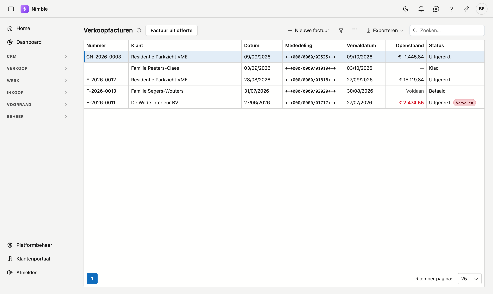
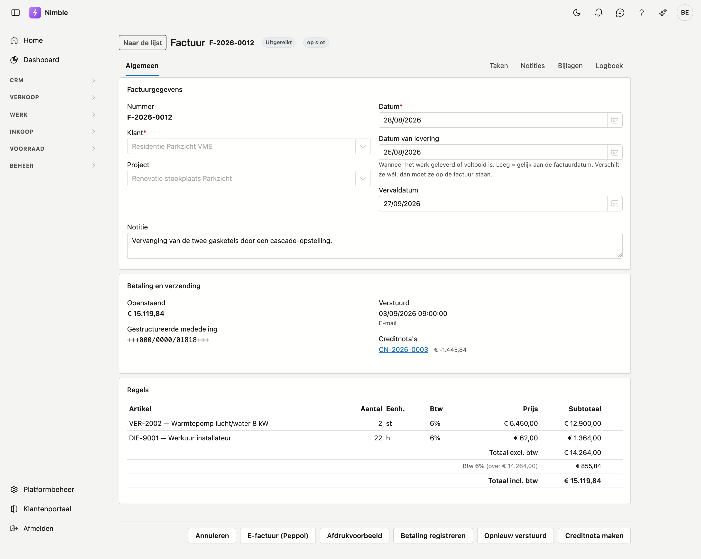
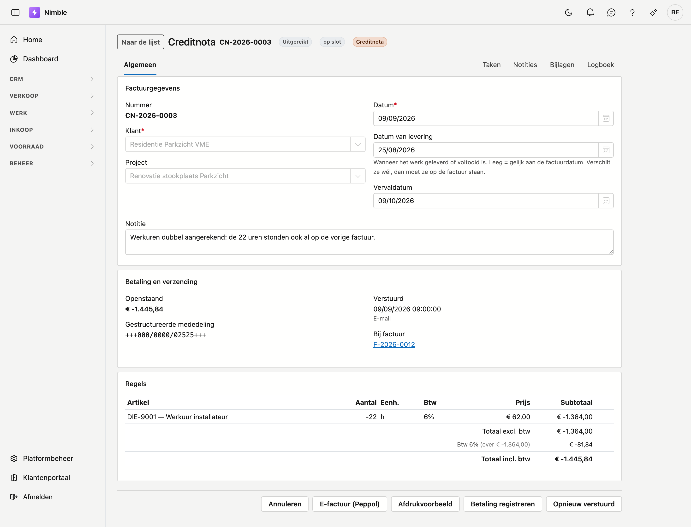

# Facturen

Een verkoopfactuur is wat u naar de klant stuurt om betaald te worden. Nimble houdt bij wat er nog
openstaat, wanneer de factuur vertrokken is en met welke mededeling de klant betaalt.

## Het scherm openen

Klik in de zijbalk op **Verkoop → Facturen**.

## De lijst

De lijst toont zeven kolommen. **Openstaand** is het bedrag dat de klant nog moet betalen; staat er
*Voldaan*, dan is alles binnen.

- **Nieuwe factuur** opent een lege fiche.
- **Factuur uit offerte** maakt de factuur op basis van een aanvaarde offerte — dat scheelt het overtypen
  van alle regels.
- De drie knoppen naast Zoeken zijn de filter, de kolomkiezer en **Exporteren**.

### De statussen

| Status | Wat het betekent |
|---|---|
| **Klad** | Nog niet uitgereikt. De factuur heeft nog géén nummer en u kunt alles nog wijzigen |
| **Uitgereikt** | Ze heeft een nummer gekregen en telt mee in uw boekhouding |
| **Betaald** | Het volledige bedrag is ontvangen |

Staat een uitgereikte factuur over haar vervaldatum, dan komt er een rood label **Vervallen** bij en
kleurt het openstaande bedrag rood.

!!! warning "Een klad heeft met opzet nog geen nummer"
    Het factuurnummer wordt pas toegekend wanneer u de factuur definitief maakt. Zo houdt de reeks geen
    gaten: een klad die u weggooit heeft nooit een nummer gehad. Een gat in een factuurreeks is
    boekhoudkundig een factuur die iemand moet verantwoorden.

## De factuurfiche

U opent een fiche door op een rij te klikken.

### Het blok Factuurgegevens

| Veld | Opmerking |
|---|---|
| **Nummer** | Wordt toegekend bij het definitief maken; op een klad staat hier dat het nog komt |
| **Klant** | Verplicht. Voor wie de factuur is |
| **Project** | Optioneel. Hangt de factuur aan een werf, dan telt ze mee in het financiële blok van dat project |
| **Datum** | Verplicht. De factuurdatum |
| **Datum van levering** | Wanneer het werk geleverd of voltooid is. Leeg = gelijk aan de factuurdatum |
| **Vervaldatum** | Wanneer u het geld verwacht. Nimble stelt ze voor op basis van de betaaltermijn van de klant |
| **Notitie** | Ruimte voor wat er bij deze factuur hoort |

!!! warning "De datum van levering is niet zomaar een veld"
    Verschilt de datum waarop u geleverd hebt van de factuurdatum, dan **moet** die datum op de factuur
    staan. Bij een aannemer die in maart legt en in april factureert is dat regel, geen uitzondering — en
    die datum bepaalt in welke btw-aangifte de handeling thuishoort.

### Het blok Betaling en verzending

| Veld | Wat het is |
|---|---|
| **Openstaand** | Wat de klant nog moet betalen. Is alles binnen, dan staat er *Voldaan* met het betaalde bedrag eronder |
| **Gestructureerde mededeling** | Het nummer waarmee de klant betaalt. Nimble kent het automatisch toe en het is niet te wijzigen |
| **Verstuurd** | Wanneer en hoe de factuur vertrokken is. Staat er niets, dan is ze nog niet verzonden |
| **Creditnota's** | De creditnota's die bij deze factuur horen, met hun bedrag |

### Het blok Regels

Per regel ziet u het artikel, het aantal, de eenheid, het btw-percentage, de eenheidsprijs en het
subtotaal. Onderaan staan het totaal exclusief btw, de btw per percentage en het totaal inclusief btw.

## Een factuur versturen en opvolgen

Onderaan de fiche staan de knoppen waarmee u de factuur afhandelt.

- **Afdrukvoorbeeld** toont de factuur als PDF, zoals de klant ze krijgt.
- **E-factuur (Peppol)** bouwt het elektronische bestand voor de boekhouding van uw klant.
- **Betaling registreren** boekt een ontvangst. U kunt meerdere betalingen registreren; het openstaande
  bedrag past zich aan.
- **Opnieuw verstuurd** noteert dat u de factuur nog eens hebt bezorgd.

!!! tip "De e-factuur weigert een geraden btw-regime"
    Ontbreekt op een regel de btw-code, dan wordt het bestand niet gebouwd en leest u om hoeveel regels
    het gaat. Dat is met opzet: een geraden btw-regime op een elektronische factuur is een fout die pas
    bij uw boekhouder opvalt.

## Creditnota's

Een creditnota corrigeert een factuur die al uitgereikt is. Met **Creditnota maken** onderaan de fiche
maakt u er een.

Een creditnota is hetzelfde scherm als een factuur, met drie verschillen:

- Ze draagt een *eigen* nummerreeks, die met `CN-` begint.
- Haar regels staan *negatief*, en haar totaal dus ook.
- Bij **Bij factuur** staat naar welke factuur ze verwijst — die verwijzing is wettelijk verplicht.

De creditnota begint als klad, zodat u regels kunt schrappen wanneer u maar een **deel** crediteert. In
het beeld hierboven zijn alleen de werkuren gecrediteerd; de rest van de factuur blijft staan.

!!! warning "Een creditnota heft de factuur niet op"
    De oorspronkelijke factuur blijft staan zoals ze was en houdt haar status. Samen bepalen ze wat de
    klant nog moet betalen. Crediteert u maar een deel, dan kunt u later een tweede creditnota maken voor
    de rest — tot het totaal van de factuur.

## Zie ook

- [Offertes](quotes.md) — waar een factuur meestal uit voortkomt
- [Projecten](../work/projects.md) — de werf waaraan een factuur kan hangen
- [Werken met een fiche](../fiches.md) — hoe de tabbladen, lades en knoppen op elke fiche werken
