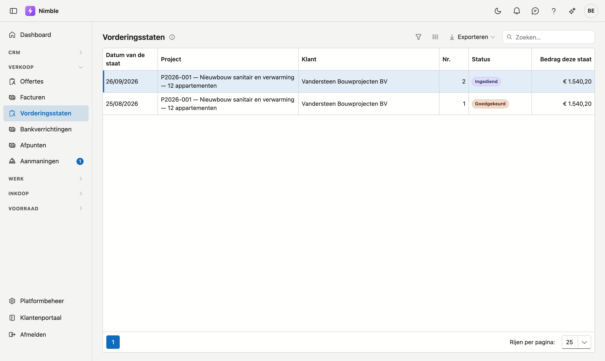
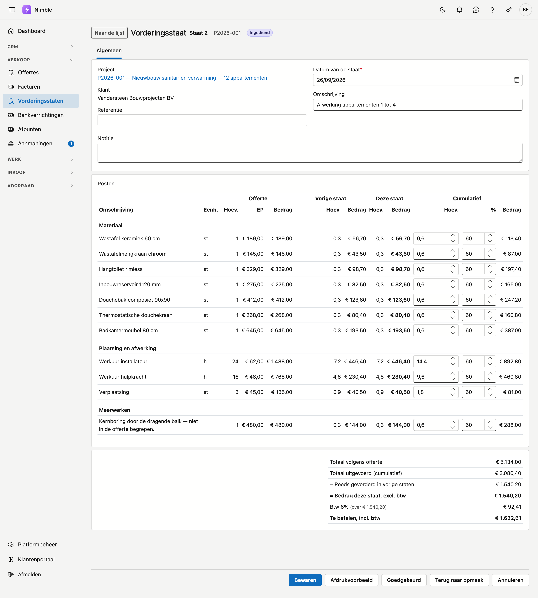

# Vorderingsstaten

Met een **vorderingsstaat** factureert u een werf naar gelang van de uitvoering. Per staat legt u vast hoeveel
er tot nu toe gedaan is, de bouwheer of zijn architect keurt ze goed, en daarna wordt ze gefactureerd.

## Het scherm openen

Klik in de zijbalk op **Verkoop → Vorderingsstaten** voor alle staten over de projecten heen. De staten van één
project staan op de projectfiche, op het tabblad **Vorderingsstaten**. Dat tabblad verschijnt bij een project
met een aanvaarde offerte.

## Een nieuwe staat

Op de projectfiche, tabblad **Vorderingsstaten**, klikt u op **Nieuwe vorderingsstaat**. De staat krijgt:

- de regels van de **aanvaarde offerte** van het project, met hun titels — elke regel is een **post**;
- het **goedgekeurde meerwerk** van het project, elk als eigen post onder de kop **Meerwerken**.

Optieregels en lege regels van de offerte komen er niet op. Een volgende staat neemt de posten van de vorige
over, plus meerwerk dat intussen goedgekeurd is.

Een nieuwe staat kan pas als de vorige **goedgekeurd** is: ze rekent verder op wat die vorige staat vastlegde.
Anders zegt het tabblad welke staat nog openstaat.

## De posten invullen

Per post vult u in hoeveel er **in totaal** uitgevoerd is, tot en met deze staat — niet enkel deze periode:

- in de kolom **Hoev.** onder **Cumulatief**, als hoeveelheid (m², lm, stuks …);
- of in de kolom **%**, als percentage van de offerte. Nimble rekent de hoeveelheid dan zelf uit. Dat is
  handig voor een forfaitaire post.

Nimble rekent de rest per post:

| Kolom | Wat het zegt |
|---|---|
| **Offerte** | Hoeveelheid, eenheidsprijs en bedrag volgens de offerte |
| **Vorige staat** | Wat er tot en met de vorige staat uitgevoerd was |
| **Deze staat** | Het verschil: wat deze staat bijvordert |
| **Cumulatief** | Wat er in totaal uitgevoerd is, met het percentage van de offerte |

Wie de vorige keer te veel vorderde, vult nu gewoon het juiste totaal in: **Deze staat** wordt dan negatief
en de post draagt het label *Minder dan vorige staat: een correctie*. Meer uitvoeren dan geofferd mag ook —
bij een vermeten post is dat gewoon — en de post draagt dan het label *Meer uitgevoerd dan geofferd*.

### De eerste staat van een project

Werd er voor dit project al gevorderd vóór u in Nimble begon, vul dan op de **eerste** staat bij **Vorige
staat** per post in hoeveel er al gefactureerd was. Op een volgende staat is die kolom vast: ze komt van de
vorige staat.

## Het totaal

Onder de posten staat:

- **Totaal volgens offerte** en **Totaal uitgevoerd (cumulatief)**;
- **Reeds gevorderd in vorige staten**;
- **Bedrag deze staat, excl. btw** — wat er gefactureerd wordt;
- de btw per tarief, zoals op de offerte, met de wettelijke vermelding bij verlegde btw;
- **Te betalen, incl. btw**.

## Van opmaak tot factuur

| Stap | Knop | Wat er gebeurt |
|---|---|---|
| **In opmaak** | **Bewaren** | U vult de posten in. Een staat in opmaak kan nog verwijderd worden |
| **Ingediend** | **Indienen** | De staat is naar de bouwheer of de architect. Aanpassen kan nog |
| **Goedgekeurd** | **Goedgekeurd** | De staat ligt vast. **Goedkeuring intrekken** zet ze terug op Ingediend |
| **Gefactureerd** | **Factureren** | Er bestaat een factuur voor deze staat |

**Terug naar opmaak** brengt een ingediende staat terug in opmaak. Tekent de bouwheer op de werf, dan mag u
van **In opmaak** meteen naar **Goedgekeurd**.

Klikt u op een stap terwijl er nog iets ingetikt staat dat niet bewaard is, dan bewaart Nimble het eerst.

## Afdrukken

**Afdrukvoorbeeld** maakt de staat als PDF voor de bouwheer: uw briefhoofd, de klant, alle posten met de
kolommen offerte, vorige staat, deze staat en cumulatief, het totaal met de btw, en een vak *voor akkoord*
om te ondertekenen. Het document volgt de taal van de klant. Een staat in opmaak draagt het merkteken
**ONTWERP**.

## Factureren

Op een goedgekeurde staat maakt **Factureren** een **kladfactuur**: één regel per btw-tarief met het bedrag van
deze staat, bijvoorbeeld *Vorderingsstaat 3 — uitgevoerde werken t.e.m. 30/09/2026*. De PDF van de staat hangt
als bijlage aan de factuur. Het factuurnummer komt wanneer u de factuur definitief maakt — zie
[Facturen](invoices.md).

Gooit u de kladfactuur weg, dan staat de staat weer op **Goedgekeurd** en kan ze opnieuw gefactureerd worden.

!!! note "Per staat of in één keer"
    Een project dat per vorderingsstaat gefactureerd wordt, factureert zijn offerte niet nog eens in één keer:
    op de offerte staat **Factureren** dan grijs, met de reden ernaast. Het resterende werk factureert u via
    een volgende staat.

## Staten met de status Oude toepassing

Een staat met de status **Oude toepassing** is alleen-lezen. U ziet er de datum, de referentie en het bedrag
van; posten staan er niet bij, en ze telt niet mee als vorige staat.

## Zie ook

- [Projecten](../work/projects.md) — het tabblad Vorderingsstaten op de projectfiche
- [Offertes](quotes.md) — de posten van een staat komen uit de aanvaarde offerte
- [Meerwerken](../work/extra-work.md) — goedgekeurd meerwerk komt als post op de staat
- [Facturen](invoices.md) — de factuur uit een staat definitief maken
