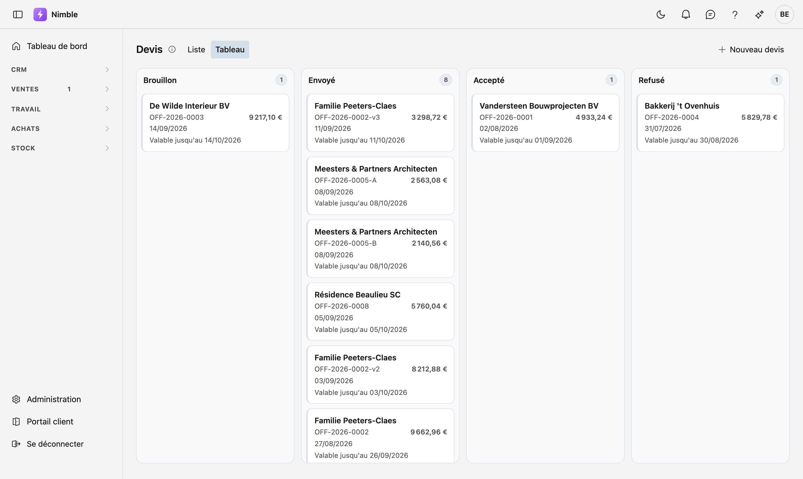
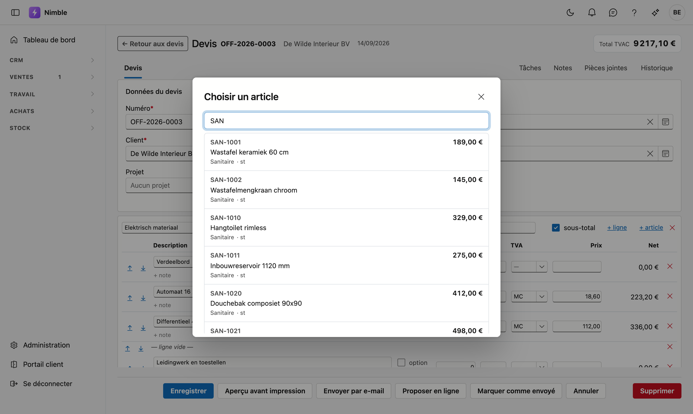
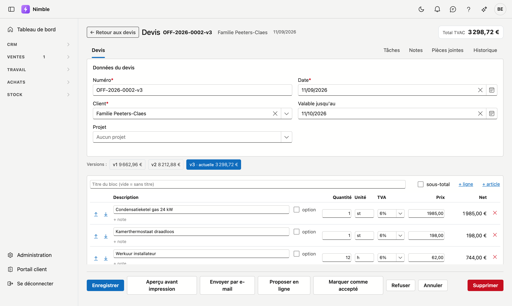

# Devis

Un devis est votre proposition de prix à un client. Vous le composez à partir de **blocs** contenant des
lignes — travaux, matériaux et heures — puis vous suivez si le client l'accepte.

## Ouvrir l'écran

**Ventes → Devis**. En haut à gauche, vous choisissez entre deux vues :

- **Liste** — les devis dans un tableau, avec recherche, filtres et export. À côté de **Valable jusqu'au**,
  un devis envoyé dont la validité est dépassée indique en rouge depuis combien de temps — *10 jours*,
  *2 mois*. Vous voyez ainsi d'un coup d'œil ce qui traîne.
- **Tableau** — les mêmes devis répartis en quatre colonnes : Brouillon, Envoyé, Accepté, Refusé. Chaque
  carte affiche le client, le numéro, le montant et la date. Vous pouvez glisser une carte vers une autre
  colonne pour changer le statut.

Votre choix est conservé : si vous rouvrez l'écran demain, il se présente dans la vue que vous avez utilisée
en dernier.

Au-dessus de la liste, une liste déroulante permet de restreindre rapidement l'affichage : **Brouillon**,
**Envoyé**, **Accepté**, **Refusé** ou **Expiré**, chaque fois suivi du nombre. Un type absent de la liste
n'apparaît pas.

Double-cliquez une ligne ou cliquez une carte pour ouvrir le devis.

## Un nouveau devis

Cliquez sur **Nouveau devis**. Vous complétez d'abord l'en-tête :

| Champ | Signification |
|---|---|
| **Numéro** | Obligatoire. Attribué automatiquement (`OFF-2026-0001`) ; vous pouvez le modifier |
| **Client** | Obligatoire. À choisir parmi vos [relations](../relations.md) |
| **Date** | La date de la proposition |
| **Valable jusqu'au** | Jusqu'à quand votre prix s'applique. Trente jours plus tard par défaut |

!!! info "D'abord enregistrer, ensuite ajouter des lignes"
    Cliquez sur **Enregistrer** avant de saisir des lignes. Les lignes appartiennent à un devis enregistré ;
    tant qu'il ne l'est pas, vous voyez le message *Enregistrez d'abord le devis*.

## Blocs et lignes

Un devis est un **document**, pas une liste de courses. Vous répartissez le travail en blocs avec un titre
— « Travaux préparatoires », « Couverture », « Finitions » — pour que le client lise ce qu'il achète.

- **+ Ajouter un bloc** (en bas) crée un nouveau bloc.
- Le **nom** du bloc se saisit en haut. Si vous le laissez vide, le devis n'affiche pas de titre.
- Cocher **sous-total** affiche le total de ce bloc sous les lignes.

Chaque bloc offre deux façons d'ajouter une ligne :

- **+ ligne** — une ligne vide que vous décrivez vous-même.
- **+ article** — choisissez un article dans votre [catalogue](../inventory/articles.md). La description,
  l'unité et le prix de vente suivent.

!!! tip "Recherchez par numéro ou par description"
    Dans la fenêtre de recherche, saisissez un numéro d'article, une partie de la description, ou les deux.
    « DIE weekend » trouve l'article `DIE-9002 — Heure installateur — week-end`.

### Les champs d'une ligne

| Champ | Signification |
|---|---|
| **Description** | Ce que le client lit. Librement modifiable, même pour un article du catalogue |
| **+ note** | Une ligne de texte supplémentaire sous la description, par exemple une marque ou une condition |
| **option** | La ligne figure au devis **avec** son prix mais ne compte **pas** dans le total |
| **Quantité** | Peut contenir des décimales (0,25 heure). La virgule comme le point fonctionnent |
| **Unité** | Pièces, heures, mètres — reprise de l'article |
| **TVA** | Le [code TVA](../administration/vat-codes.md) de cette ligne |
| **Prix** | Le prix unitaire |
| **Net** | Quantité × prix, calculé |

Les flèches ↑ et ↓ déplacent une ligne dans son bloc. Le ✕ rouge la supprime.

!!! tip "La TVA de la ligne précédente est reprise"
    Une nouvelle ligne reçoit le code TVA de la ligne au-dessus. Si vous travaillez en cocontractant, vous
    ne devez donc pas le choisir sur chaque ligne.

## Les totaux

En haut à droite figure le **total TVA comprise**, y compris lorsque vous faites défiler la page. En bas,
vous trouvez le détail : hors TVA, le montant de TVA et le total.

Si le devis comporte des lignes en option, **Options (TVA comprise, hors total)** s'affiche en dessous. Deux
choses à savoir sur ce montant :

- Il n'entre **pas** dans le total ci-dessus. Si le client retient l'option, le montant vient s'y ajouter.
- Il est **TVA comprise**, alors que la ligne en option affiche son montant hors TVA — comme toute autre
  ligne. Les deux chiffres diffèrent donc, et c'est normal.

## Imprimer le devis

Cliquez sur **Aperçu avant impression** en bas d'un devis enregistré. Vous voyez le document tel que le
client le recevra, et vous pouvez le télécharger de là.

<!-- AFBEELDING: la fenêtre Aperçu avant impression avec le devis — PAS automatisable : un navigateur
     headless n'a pas de visionneuse PDF et affiche « Couldn't load plugin » à la place du document.
     Cette image doit être prise à la main dans un vrai navigateur. -->

En haut figurent vos propres coordonnées — nom, adresse, téléphone, numéro de TVA et votre logo. Elles
proviennent de la [fiche d'entreprise](../settings/company-profile.md) dans l'administration ; si
aucun logo n'y est encore chargé, ajoutez-le à cet endroit et il apparaîtra sur chaque devis.

!!! info "Le devis suit la langue du client"
    Le document est établi dans la langue indiquée sur la fiche client sous **Langue des documents**, et non
    dans celle où vous travaillez. Si elle est sur le français, vous obtenez un document français même si
    vous travaillez en néerlandais. Si le champ est vide, le devis suit votre propre langue.

Les lignes de titre et les lignes vides apparaissent sur le document comme intertitre et comme espace, sans
quantité ni montant. Le sous-total figure sous chaque bloc, et le détail en bas de page.

## Envoyer le devis par e-mail

Cliquez sur **Envoyer par e-mail**. La fenêtre est déjà remplie : l'adresse du client, un objet reprenant
votre numéro de devis, et un texte d'accompagnement. Le devis y est joint en PDF, avec sa taille.

Tout reste modifiable avant l'envoi. L'e-mail part dans la langue du client, comme le devis lui-même.

!!! info "Brouillon devient automatiquement Envoyé"
    Si le devis était encore au statut **Brouillon**, il passe automatiquement à **Envoyé** après l'envoi.
    Vous ne devez donc pas cliquer une seconde fois pour signaler ce que vous venez de faire.

!!! tip "Déjà remis vous-même ? Utilisez Marquer comme envoyé"
    Si vous avez remis le devis par courrier ou depuis votre propre messagerie, utilisez **Marquer comme
    envoyé**. Ce bouton ne fait que changer le statut ; il n'envoie rien.

Chaque envoi est repris dans le **journal des actions** : qui a envoyé quel devis à quelle adresse.

!!! warning "Devis trop volumineux"
    Au-delà de 10 Mo, Nimble refuse d'envoyer. Ce n'est pas une limite arbitraire : au-dessus, le moteur de
    messagerie écarte la pièce jointe et l'e-mail part sans le devis. Mieux vaut un devis qui ne part pas
    qu'un devis qui arrive vide.

## Le suivi du devis

Les boutons du bas suivent le statut du devis :

| Statut | Ce que vous pouvez faire |
|---|---|
| **Brouillon** | **Envoyer** — le devis passe à *Envoyé* |
| **Envoyé** | **Accepté** ou **Refuser**, selon la réponse du client |
| **Accepté** ou **Refusé** | Le devis est clôturé et ne peut plus être modifié |

!!! warning "Un devis clôturé ne se modifie pas"
    Dès que le client a répondu, le document est figé : champs et boutons ne sont plus disponibles. C'est
    volontaire — le client a reçu un prix, et celui-ci ne doit pas changer en silence.

    Si une modification s'impose malgré tout, cliquez sur **Nouvelle version**. Vous obtenez une copie avec
    les lignes actuelles, en Brouillon, et un numéro de version de plus. L'ancienne version subsiste, ce qui
    vous permet de vérifier ce que le client a reçu.

## Versions et variantes

En haut d'un devis appartenant à une série figurent des boutons avec les montants côte à côte :

- Les **versions** (v1, v2, v3) sont des propositions successives pour la même demande. La plus élevée fait
  foi et porte la mention *actuelle*.
- Les **variantes** sont des réponses différentes à la même demande — par exemple « A — douche à l'italienne »
  à côté de « B — baignoire ». Chaque variante a ses propres numéros de version.

## Erreurs fréquentes

!!! warning
    - **Un devis sans codes TVA** calcule 0 % de TVA sur chaque ligne, sans avertissement. Vérifiez que les
      [codes TVA](../administration/vat-codes.md) sont complétés dans l'administration.
    - **Vouloir qu'une ligne en option compte dans le total** — ce n'est pas le cas, et c'est voulu. Si vous
      souhaitez inclure le montant, décochez **option**.
    - **Vouloir modifier un devis accepté** — créez une nouvelle version plutôt que de retoucher l'ancienne.
    - **Deux fois le même numéro** — le numéro est attribué automatiquement et doit rester unique. Si vous le
      modifiez à la main, choisissez-en un qui n'existe pas encore.

## Voir aussi

- [Articles](../inventory/articles.md) — le catalogue d'où proviennent vos lignes
- [Relations](../relations.md) — vos clients
- [Codes TVA](../administration/vat-codes.md) — les taux et leur signification sur une facture
- [Statuts de devis](../administration/quote-status.md) — modifier le texte des quatre statuts
- [Travailler avec une fiche](../fiches.md) — onglets, enregistrement et archivage
- [Filtrer les listes](../lijsten-filteren.md) — l'entonnoir et le générateur de filtres
