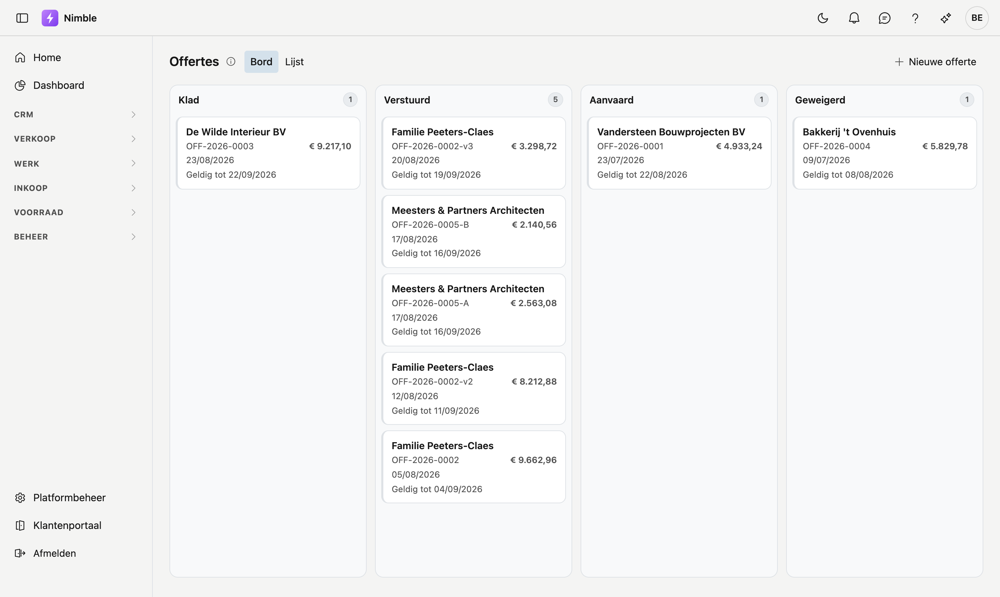
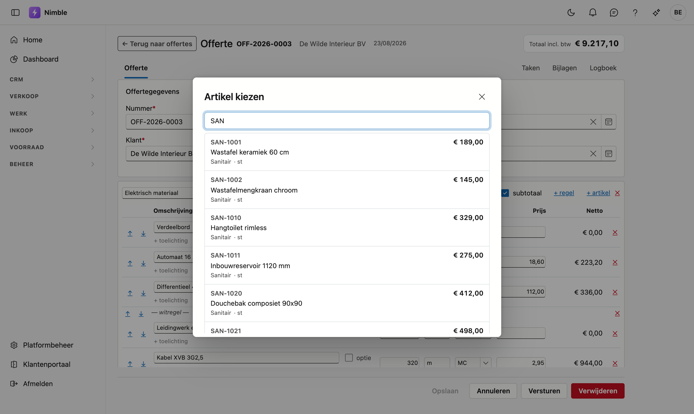
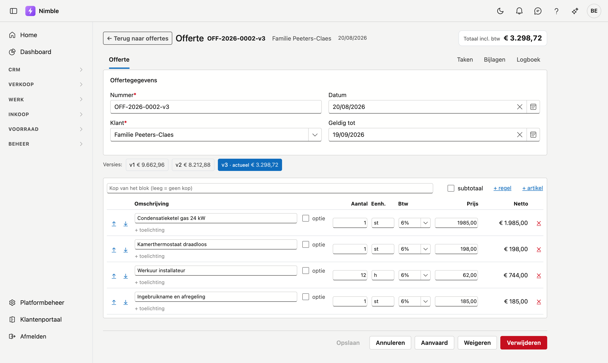

# Offertes

Een offerte is uw prijsvoorstel aan een klant. U bouwt ze op uit **blokken** met daarin regels — werken,
materialen en uren — en volgt daarna op of de klant ze aanvaardt.

## Het scherm openen

**Verkoop → Offertes**. U kiest links bovenaan tussen twee weergaven:

- **Bord** — de offertes verdeeld over vier kolommen: Klad, Verstuurd, Aanvaard, Geweigerd. Elke kaart
  toont de klant, het nummer, het bedrag en de datum. U kunt een kaart naar een andere kolom slepen om de
  status te wijzigen.
- **Lijst** — dezelfde offertes in een tabel, met zoeken, filteren en exporteren.

Dubbelklik een rij of klik een kaart om de offerte te openen.

## Een nieuwe offerte

Klik op **Nieuwe offerte**. U vult eerst de kop in:

| Veld | Betekenis |
|---|---|
| **Nummer** | Verplicht. Wordt automatisch toegekend (`OFF-2026-0001`); u mag het aanpassen |
| **Klant** | Verplicht. Kies uit uw [relaties](../relations.md) |
| **Datum** | De datum van het voorstel |
| **Geldig tot** | Tot wanneer uw prijs geldt. Staat standaard op dertig dagen later |

!!! info "Eerst bewaren, dan regels toevoegen"
    Klik op **Opslaan** voordat u regels invoert. Regels horen bij een bewaarde offerte; zolang die er niet
    is, ziet u de melding *Bewaar eerst de offerte*.

## Blokken en regels

Een offerte is een **document**, geen boodschappenlijstje. U verdeelt het werk in blokken met een kop
erboven — "Voorbereidende werken", "Dakbedekking", "Afwerking" — zodat de klant leest wat hij koopt.

- **+ Blok toevoegen** (onderaan) maakt een nieuw blok.
- De **naam** van het blok typt u bovenin. Laat u die leeg, dan toont de offerte geen kop.
- **Subtotaal** aanvinken toont het totaal van dat blok onder de regels.

Per blok hebt u twee manieren om een regel toe te voegen:

- **+ regel** — een lege regel die u zelf beschrijft.
- **+ artikel** — kies een artikel uit uw [catalogus](../inventory/articles.md). Omschrijving, eenheid en
  verkoopprijs komen mee.

!!! tip "Zoek op nummer of op omschrijving"
    In het zoekvenster typt u een artikelnummer, een deel van de omschrijving, of allebei. "DIE weekend"
    vindt het artikel `DIE-9002 — Werkuur installateur — weekend`.

### De regelvelden

| Veld | Betekenis |
|---|---|
| **Omschrijving** | Wat de klant leest. Vrij aanpasbaar, ook bij een artikel uit de catalogus |
| **+ toelichting** | Een extra regel tekst onder de omschrijving, bijvoorbeeld een merk of een voorwaarde |
| **optie** | De regel staat mét prijs op de offerte maar telt **niet** mee in het totaal |
| **Aantal** | Mag decimalen bevatten (0,25 uur). Zowel de komma als de punt werkt |
| **Eenh.** | Stuks, uren, meter — komt mee met het artikel |
| **Btw** | De [btw-code](../administration/vat-codes.md) van deze regel |
| **Prijs** | De eenheidsprijs |
| **Netto** | Aantal × prijs, berekend |

Met de pijltjes ↑ en ↓ verplaatst u een regel binnen zijn blok. Het rode ✕ verwijdert ze.

!!! tip "De btw van de vorige regel wordt overgenomen"
    Een nieuwe regel krijgt de btw-code van de regel erboven. Werkt u met medecontractant, dan hoeft u dat
    dus niet op elke regel opnieuw te kiezen.

## De totalen

Rechtsboven staat het **totaal inclusief btw**, ook wanneer u naar beneden scrolt. Onderaan vindt u de
opsplitsing: exclusief btw, het btw-bedrag, het totaal, en apart **waarvan opties** — dat laatste bedrag
zit *niet* in het totaal.

## De offerte opvolgen

De knoppen onderaan volgen de status van de offerte:

| Status | Wat u kunt doen |
|---|---|
| **Klad** | **Versturen** — de offerte gaat naar *Verstuurd* |
| **Verstuurd** | **Aanvaard** of **Weigeren**, naargelang het antwoord van de klant |
| **Aanvaard** of **Geweigerd** | De offerte is afgesloten en niet meer te wijzigen |

!!! warning "Een afgesloten offerte wijzigt u niet"
    Zodra de klant geantwoord heeft, staat het document vast: velden en knoppen zijn niet meer beschikbaar.
    Dat is met opzet — de klant heeft een prijs gekregen en die hoort niet stilzwijgend te veranderen.

    Moet er toch iets wijzigen, klik dan op **Nieuwe versie**. U krijgt een kopie met de regels van nu, in
    Klad, en één versienummer hoger. De oude versie blijft bestaan zodat u kunt nakijken wat de klant
    gekregen heeft.

## Versies en varianten

Bovenaan een offerte die deel uitmaakt van een reeks staan knoppen met de bedragen naast elkaar:

- **Versies** (v1, v2, v3) zijn opeenvolgende voorstellen voor dezelfde vraag. De hoogste is de geldige en
  draagt de vermelding *actueel*.
- **Varianten** zijn verschillende antwoorden op dezelfde vraag — bijvoorbeeld "A — inloopdouche" naast
  "B — ligbad". Elke variant heeft haar eigen versienummers.

## Veelgemaakte fouten

!!! warning
    - **Een offerte zonder btw-codes** rekent 0% btw op elke regel, zonder waarschuwing. Controleer dat de
      [btw-codes](../administration/vat-codes.md) in Platformbeheer ingevuld zijn.
    - **Een optieregel meetellen in het totaal** — dat gebeurt niet, en dat is de bedoeling. Wilt u het
      bedrag wél in het totaal, haal dan het vinkje **optie** weg.
    - **Een aanvaarde offerte willen aanpassen** — maak een nieuwe versie in plaats van de oude te
      wijzigen.
    - **Twee keer hetzelfde nummer** — het nummer wordt automatisch toegekend en moet uniek blijven. Past u
      het met de hand aan, kies dan iets dat nog niet bestaat.

## Zie ook

- [Artikelen](../inventory/articles.md) — de catalogus waaruit u regels kiest
- [Relaties](../relations.md) — uw klanten
- [Btw-codes](../administration/vat-codes.md) — de tarieven en hun betekenis op een factuur
- [Offertestatus](../administration/quote-status.md) — de tekst van de vier statussen aanpassen
- [Werken met een fiche](../fiches.md) — tabbladen, opslaan en archiveren
- [Lijsten filteren](../lijsten-filteren.md) — de trechterknop en de filterbouwer
