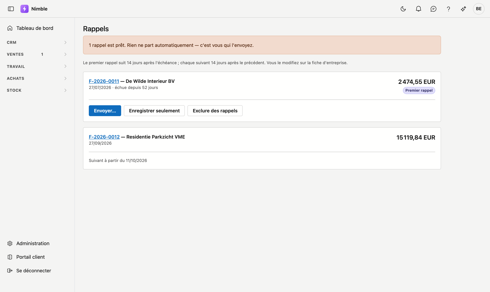

# Rappels

Quelles factures ouvertes méritent un rappel. Trois rappels, puis l'annonce d'un recouvrement.

## Ouvrir l'écran

Cliquez dans la barre latérale sur **Ventes → Rappels**.

!!! warning "Rien ne part automatiquement"
    Nimble n'envoie **aucun** rappel automatiquement. En haut de l'écran figure le nombre de rappels prêts,
    et ce même chiffre apparaît dans le menu à côté de **Ventes**. Vous le voyez donc sans ouvrir cet écran —
    car ce que personne ne voit ne se fait pas.

## Les quatre étapes

| Étape | Ton |
|---|---|
| **Premier rappel** | Aimable : la facture vous a sans doute échappé |
| **Deuxième rappel** | Avec le nombre de jours, et la question de savoir si quelque chose pose problème |
| **Dernier rappel** | Annonce que le dossier sera sinon transmis pour recouvrement |
| **Mise en demeure** | La transmission elle-même, avec les frais à charge du débiteur |

Il n'y en a jamais qu'**un seul** de prêt. Le suivant n'est dû qu'après l'écoulement de l'intervalle, compté
à partir du rappel précédent — pas de la date d'échéance. Un client qui n'a pas payé depuis trois mois ne
reçoit donc pas trois courriels le même jour.

## Régler les deux intervalles

Sur la **Fiche d'entreprise** figurent deux nombres côte à côte :

| Champ | Ce qu'il détermine |
|---|---|
| **Jours après l'échéance avant le premier rappel** | Combien de temps vous laissez le client tranquille après l'échéance |
| **Jours entre deux rappels** | Le rythme ensuite : entre le premier et le deuxième, et entre chacun des suivants |

Ce sont deux décisions distinctes. Avec un seul nombre, il faudrait arbitrer entre la tolérance et le
rythme : court signifierait aussitôt presser, long signifierait que le deuxième rappel se fait attendre des
semaines.

Si vous laissez un champ vide, quatorze jours s'y appliquent. Vide ne signifie donc pas : pas de rappels.

## Envoyer

**Envoyer** ouvre une fenêtre avec le destinataire, l'objet et une proposition de texte. Vous adaptez ce
texte avant l'envoi — qui connaît son client rédige autrement son premier rappel.

Après l'envoi, Nimble enregistre que le rappel est parti, avec la date. C'est ce qui décale l'étape
suivante.

!!! warning "La facture n'est pas jointe"
    Faites référence au numéro de facture dans votre texte. Il figure déjà par défaut dans la proposition.

**Enregistrer seulement** s'utilise lorsque vous avez contacté le client en dehors de Nimble — par téléphone
ou par courrier. La chaîne avance alors normalement.

## Exclure une facture des rappels

En cas de contestation ou de plan de paiement, **Exclure des rappels** met cette facture de côté. Elle ne
compte plus et n'apparaît plus dans le compteur. **Réintégrer dans les rappels** annule cette mise à l'écart.

!!! warning "Une facture sans date d'échéance ne reçoit jamais de rappel"
    Il n'y a alors rien à partir de quoi compter, et Nimble n'invente pas de délai. Une telle facture figure
    malgré tout dans la liste, avec cette raison — pour que vous puissiez compléter l'échéance sur la facture
    elle-même.
