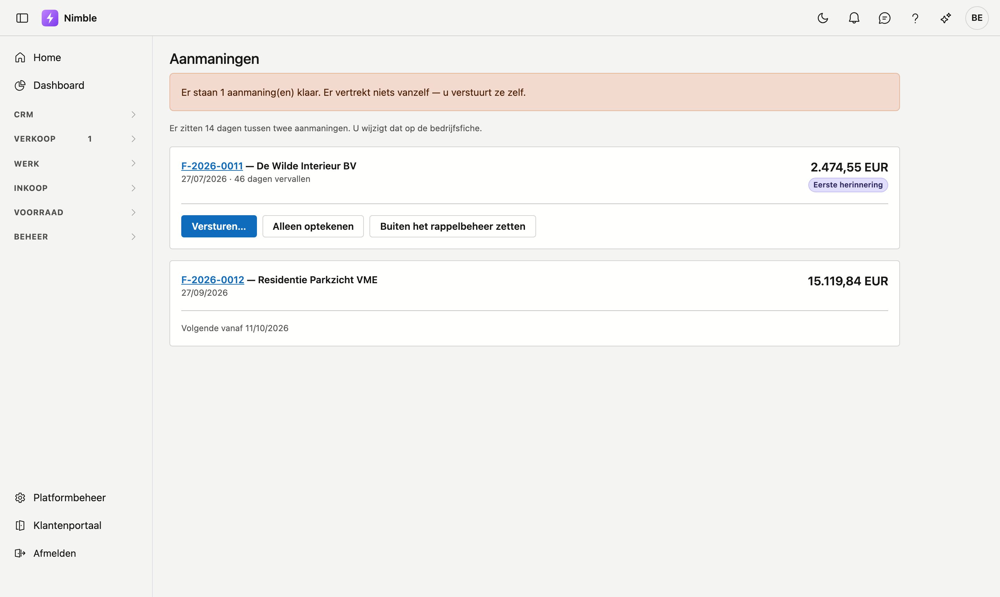

# Aanmaningen

Welke openstaande facturen een herinnering verdienen. Drie herinneringen, en daarna de aankondiging van een
incasso.

## Het scherm openen

Klik in de zijbalk op **Verkoop → Aanmaningen**.

!!! warning "Er vertrekt niets vanzelf"
    Nimble verstuurt **geen enkele** aanmaning automatisch. Bovenaan het scherm staat hoeveel er klaarstaan,
    en datzelfde getal staat in het menu naast **Verkoop**. Zo ziet u het ook zonder dit scherm te openen —
    want wat niemand ziet, gebeurt niet.

## De vier stappen

| Stap | Toon |
|---|---|
| **Eerste herinnering** | Vriendelijk: wellicht is de factuur aan uw aandacht ontsnapt |
| **Tweede herinnering** | Met het aantal dagen erbij, en de vraag of er iets niet in orde is |
| **Laatste herinnering** | Kondigt aan dat het dossier anders voor invordering overgaat |
| **Ingebrekestelling** | De overdracht zelf, met de kosten ten laste van de schuldenaar |

Er staat er altijd maar **één** klaar. De volgende wordt pas verschuldigd nadat het interval verstreken is,
en dat interval telt vanaf de vorige aanmaning — niet vanaf de vervaldag. Een klant die drie maanden niet
betaalde, krijgt dus geen drie mails op één dag.

## Het interval instellen

Op de **Bedrijfsfiche** staat *Dagen tussen twee aanmaningen*. Hetzelfde getal bepaalt ook wanneer de
**eerste** aanmaning na de vervaldag klaarstaat.

Laat u het leeg, dan geldt veertien dagen. Leeg betekent dus niet: geen aanmaningen.

## Versturen

**Versturen** opent een venster met de ontvanger, het onderwerp en een voorstel van tekst. Die tekst past u
aan voor u verstuurt — wie zijn klant kent, schrijft de eerste herinnering anders.

Na het versturen tekent Nimble op dát de aanmaning vertrokken is, met de datum. Dat is wat de volgende stap
uitstelt.

!!! warning "De factuur gaat niet mee als bijlage"
    Verwijs in uw tekst naar het factuurnummer. Het staat standaard al in het voorstel.

**Alleen optekenen** gebruikt u wanneer u de klant buiten Nimble aansprak — per telefoon of per post. De
keten schuift dan gewoon door.

## Een factuur buiten het rappelbeheer zetten

Loopt er een betwisting of een afbetalingsplan, dan zet **Buiten het rappelbeheer zetten** die factuur
opzij. Ze telt niet meer mee en verschijnt niet in de teller. **Terug opnemen** draait dat om.

!!! warning "Een factuur zonder vervaldag krijgt nooit een aanmaning"
    Er is dan niets om vanaf te tellen, en Nimble verzint geen termijn. Zo'n factuur staat wél in de lijst,
    met die reden erbij — zodat u de vervaldag kunt aanvullen op de factuur zelf.
