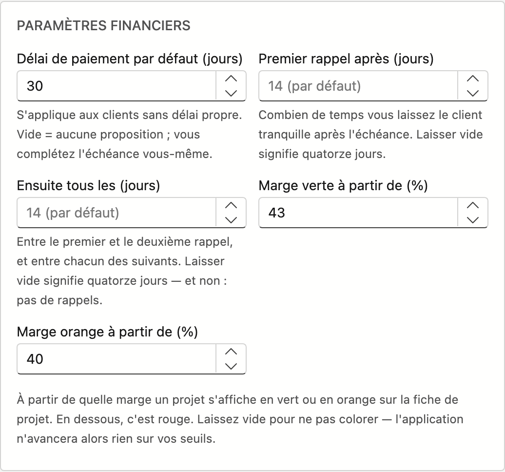

# Fiche d'entreprise

La **fiche d'entreprise** contient les données de votre entreprise : identité, contact, paramètres financiers, adresse, comptes bancaires et logo. Ces données sont utilisées sur les documents comme les devis et les factures.

## Ouvrir l'écran

1. Cliquez sur **Administration** en bas de la barre latérale.
2. Dans le groupe **Entreprise**, cliquez sur la tuile **Fiche d'entreprise**.

!!! info "Le nom est géré par ADM One"
    Le **nom** de votre entreprise provient du registre central ADM One et ne peut pas être modifié ici. Si le nom doit changer, contactez ADM.

Si l'écran affiche **Aucune fiche d'entreprise pour ce tenant.**, cliquez sur **Créer la fiche d'entreprise**. Les cartes apparaissent ensuite et vous pouvez les remplir.

## Les cartes

| Carte | Champs |
|---|---|
| **Identité** | Nom (lecture seule), TVA / n° d'entreprise avec le bouton **Récupérer**, Numéro FSMA |
| **Contact** | Téléphone, Fax, E-mail, Site web, **Leads du site web vers** |
| **Paramètres financiers** | Délai de paiement par défaut (jours), Premier rappel après (jours), Ensuite tous les (jours), Marge verte à partir de (%), Marge orange à partir de (%) |
| **Adresse** | Rue, N°, Boîte, Code postal, Commune, Pays |
| **Banque** | IBAN, BIC, Compte — et un second compte : IBAN (2), BIC (2), Compte (2) |
| **Documents et charte graphique** | Logo |

## Leads du site web vers

Lorsqu'une personne remplit le formulaire de contact de votre site web, Nimble en crée automatiquement un
lead et vous en avertit par e-mail. Le champ **Leads du site web vers** détermine qui reçoit cet
avertissement.

- Indiquez l'adresse de la personne ou de l'équipe qui suit les demandes — une adresse de groupe comme
  `ventes@votreentreprise.be` convient également.
- Si vous laissez le champ **vide**, l'avertissement part vers l'**e-mail** indiqué plus haut sur cette
  carte.
- Si les deux sont vides, vous ne recevez pas de mail. Le lead est bien créé et une tâche vous attend,
  donc rien ne se perd — mais vous ne le voyez qu'en consultant Nimble.

Voir [Leads](../crm/leads.md) pour ce qu'il advient d'une telle demande.

## Paramètres financiers

Cette carte contient les seuils que vous choisissez vous-même pour la facturation et pour la marge des projets.

| Champ | Ce qu'il fait |
|---|---|
| **Délai de paiement par défaut (jours)** | S'applique aux clients sans délai propre. Si vous le laissez vide, Nimble ne propose pas d'échéance et vous la complétez vous-même sur la facture. |
| **Premier rappel après (jours)** | Combien de temps vous laissez le client tranquille après l'échéance. Vide signifie quatorze jours. |
| **Ensuite tous les (jours)** | Le délai entre le premier et le deuxième rappel, et entre chacun des suivants. Vide signifie quatorze jours — et non : pas de rappels. |
| **Marge verte à partir de (%)** | À partir de cette marge, un projet s'affiche en vert sur la fiche de projet. |
| **Marge orange à partir de (%)** | À partir de cette marge, un projet s'affiche en orange. En dessous, c'est rouge. |

Si vous laissez les deux champs de marge vides, la fiche de projet ne se colore pas. Nimble n'avance alors
rien sur vos seuils.

L'écran refuse deux combinaisons à l'enregistrement :

- **Le seuil orange est supérieur au seuil vert.** Le vert est le seuil supérieur : placez l'orange plus bas.
- **Un seuil orange est défini sans seuil vert.** Sans seuil vert, rien ne se colore — remplissez les deux, ou laissez-les vides tous les deux.

Voir [Rappels](../sales/reminders.md) pour ce qu'il advient des délais de rappel.

## Récupérer les données depuis la BCE

1. Saisissez votre **TVA / n° d'entreprise**.
2. Cliquez sur **Récupérer**.
3. Nimble remplit l'adresse depuis la Banque-Carrefour des Entreprises (BCE/KBO) et met le numéro dans la bonne forme.

Si la BCE ne trouve aucune entreprise pour ce numéro, l'écran affiche **Aucune entreprise trouvée pour ce numéro.**

## Remplir l'adresse

- Tapez dans le champ **Code postal** — choisissez dans la liste ; la commune se remplit automatiquement.
- Ou cherchez dans le champ **Commune** par nom ; le code postal suit.
- Choisissez le **Pays** dans la liste.

## Définir le logo

1. Glissez une image dans la zone de dépôt, ou cliquez dessus pour choisir un fichier.
2. Formats autorisés : PNG, JPG, GIF ou WebP — 4 Mo maximum.
3. Cliquez sur **Supprimer** à côté du logo pour l'effacer.

## Enregistrer

Cliquez sur **Enregistrer** en bas à droite. Le logo est sauvegardé à part, dès le téléversement.

Cette fiche n'a pas de bouton Annuler. Si vous ne voulez pas garder vos modifications, cliquez en haut sur **← Retour à l'administration**. Si vous fermez ou rechargez l'onglet avec des modifications non enregistrées, votre navigateur vous demande d'abord confirmation.

Si votre numéro de téléphone ou l'une des deux adresses e-mail n'est pas correct, le message apparaît aussitôt sous le champ — inutile de cliquer d'abord. Si vous cliquez malgré tout, une barre en haut énumère en une ligne tous les champs qui bloquent encore l'enregistrement.

## Erreurs fréquentes

!!! warning
    - **Oubli d'enregistrer** — les modifications des champs ne sont sauvegardées qu'après un clic sur **Enregistrer** (le logo, lui, l'est immédiatement).
    - **Adresse e-mail ou numéro de téléphone invalide** — le champ peut rester vide, mais ce que vous saisissez doit être correct ; sinon l'écran refuse d'enregistrer.
    - **Mauvaise adresse pour les leads du site web** — une faute de frappe dans ce champ ne se remarque nulle part : les demandes venant de votre site n'arrivent alors jamais.
    - **Lire un champ de rappel vide comme « pas de rappels »** — vide signifie quatorze jours.
    - **Ne remplir que le seuil orange** — sans seuil vert, rien ne se colore, et l'écran refuse d'enregistrer.
    - **Logo trop grand** — 4 Mo maximum ; réduisez d'abord l'image.

## Voir aussi

- [Administration](../administration/platform-management.md)
- [Modèles de documents](document-templates.md) — votre en-tête sur le devis
- [Rappels](../sales/reminders.md)
