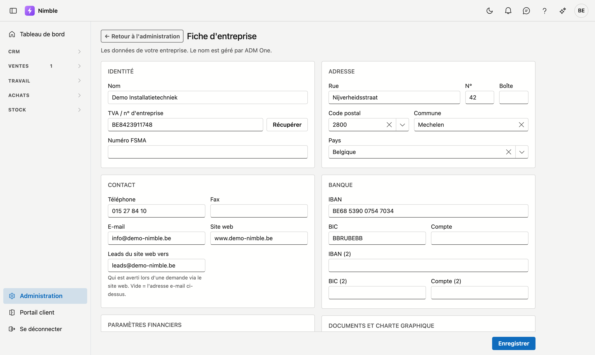
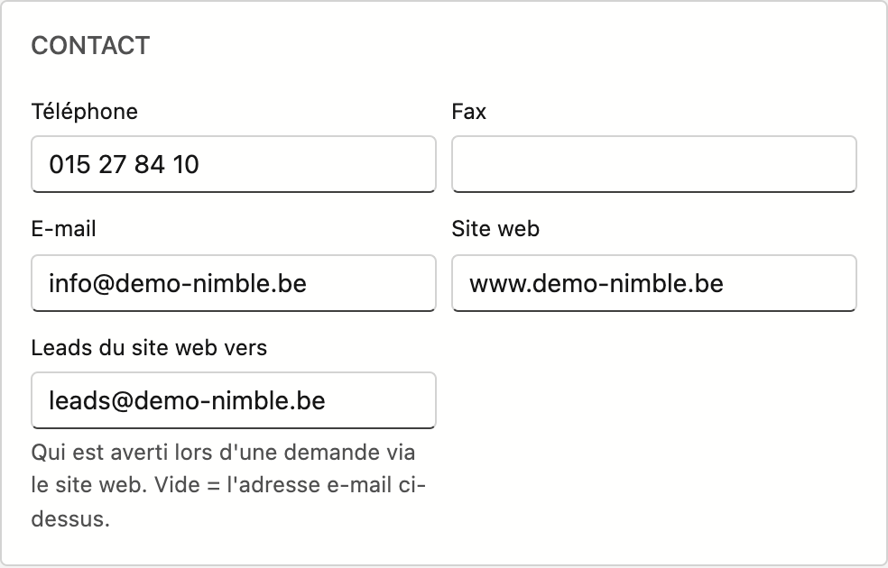
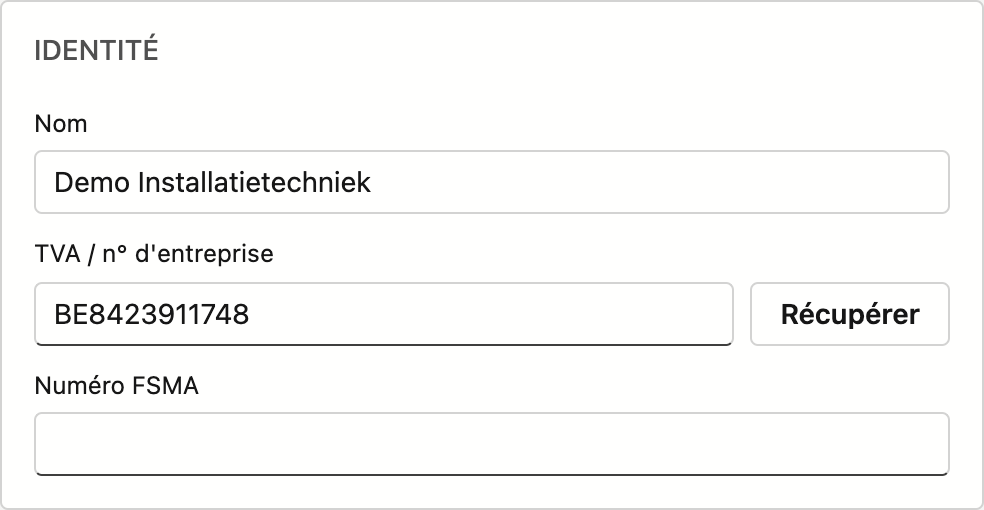

# Fiche d'entreprise

La **fiche d'entreprise** contient les données de votre entreprise : identité, contact, adresse, comptes bancaires et logo. Ces données sont utilisées sur les documents comme les devis et les factures.

## Ouvrir l'écran

1. Cliquez sur **Administration** en bas de la barre latérale.
2. Dans le groupe **Entreprise**, cliquez sur la tuile **Fiche d'entreprise**.

!!! info "Le nom est géré par ADM One"
    Le **nom** de votre entreprise provient du registre central ADM One et ne peut pas être modifié ici. Si le nom doit changer, contactez ADM.

## Les cartes

| Carte | Champs |
|---|---|
| **Identité** | Nom (lecture seule), numéro de TVA/d'entreprise avec bouton **Récupérer**, numéro FSMA |
| **Contact** | Téléphone, fax, e-mail, site web, **Leads du site web vers** |
| **Adresse** | Rue, n°, boîte, code postal, commune, pays |
| **Banque** | IBAN, BIC et compte — deux fois, pour deux comptes bancaires |
| **Documents et charte graphique** | Logo |

## Leads du site web vers

Lorsqu'une personne remplit le formulaire de contact de votre site web, Nimble en crée automatiquement un
lead et vous en avertit par e-mail. Le champ **Leads du site web vers** détermine qui reçoit cet
avertissement.

- Indiquez l'adresse de la personne ou de l'équipe qui suit les demandes — une adresse de groupe comme
  `ventes@votreentreprise.be` convient également.
- Si vous laissez le champ **vide**, l'avertissement part vers l'**e-mail** indiqué plus haut sur cette
  carte.
- Si les deux sont vides, vous ne recevez pas de mail. Le lead est bien créé et une tâche vous attend,
  donc rien ne se perd — mais vous ne le voyez qu'en consultant Nimble.

Voir [Leads](../crm/leads.md) pour ce qu'il advient d'une telle demande.

## Récupérer les données depuis la BCE

1. Saisissez votre **numéro de TVA/d'entreprise**.
2. Cliquez sur **Récupérer**.
3. Nimble remplit automatiquement l'adresse et les données officielles depuis la Banque-Carrefour des Entreprises (BCE/KBO).

## Remplir l'adresse

- Tapez dans le champ **Code postal** — choisissez dans la liste ; la commune se remplit automatiquement.
- Ou cherchez dans le champ **Commune** par nom ; le code postal suit.
- Choisissez le **Pays** dans la liste.

## Définir le logo

1. Glissez une image dans la zone de dépôt, ou cliquez dessus pour choisir un fichier.
2. Formats autorisés : PNG, JPG, GIF ou WebP — 4 Mo maximum.
3. Cliquez sur **Supprimer** à côté du logo pour l'effacer.

## Enregistrer

Cliquez sur **Enregistrer** en haut à droite. Le logo est sauvegardé à part, dès le téléversement.

## Erreurs fréquentes

!!! warning
    - **Oubli d'enregistrer** — les modifications des champs ne sont sauvegardées qu'après un clic sur **Enregistrer** (le logo, lui, l'est immédiatement).
    - **Adresse e-mail invalide** — une adresse e-mail modifiée doit être valide, sinon l'écran refuse d'enregistrer.
    - **Logo trop grand** — 4 Mo maximum ; réduisez d'abord l'image.

## Voir aussi

- [Administration](../administration/platform-management.md)
