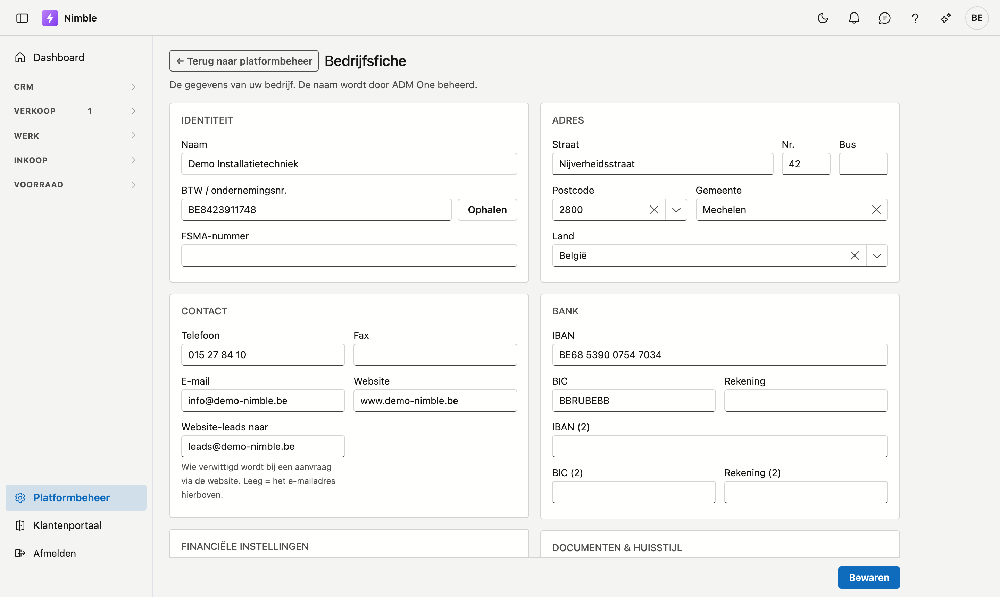
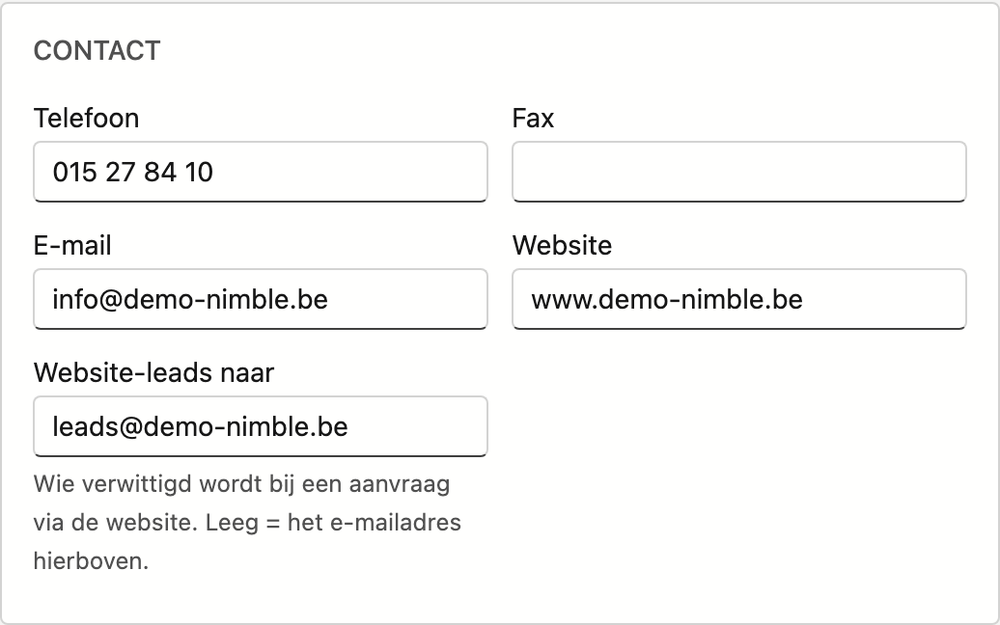
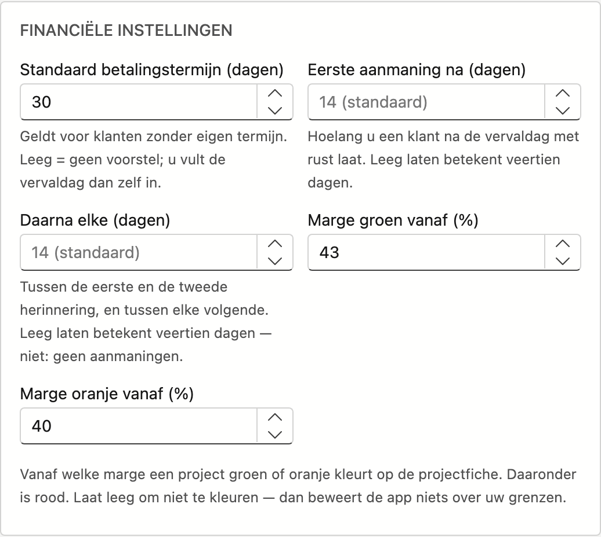
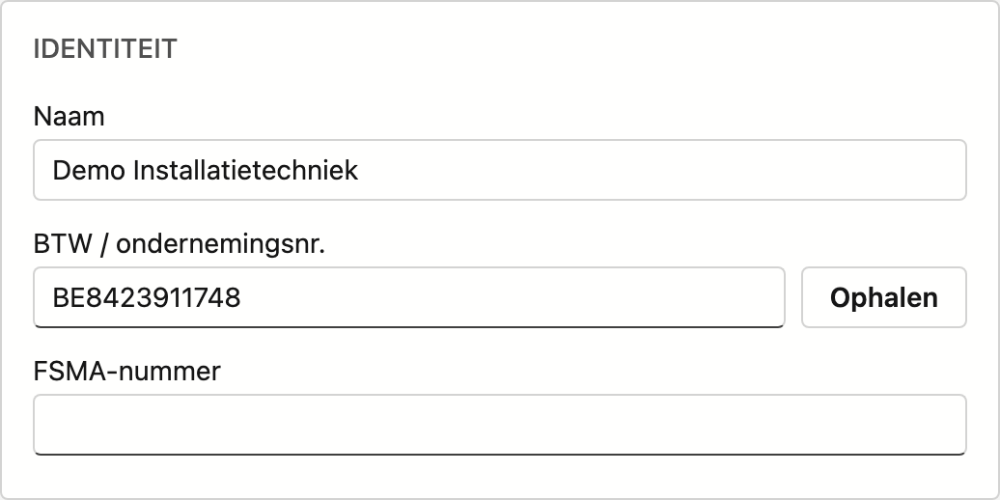

# Bedrijfsfiche

Op de **Bedrijfsfiche** beheert u de eigen gegevens van uw bedrijf: identiteit, contact, financiële instellingen, adres, bankrekeningen en logo. Deze gegevens worden gebruikt op documenten zoals offertes en facturen.

## Het scherm openen

1. Klik onderaan in de zijbalk op **Platformbeheer**.
2. Klik in de groep **Bedrijf** op de tegel **Bedrijfsfiche**.

!!! info "Naam wordt door ADM One beheerd"
    De **naam** van uw bedrijf komt uit het centrale ADM One-register en kunt u hier niet wijzigen. Moet de naam aangepast worden, neem dan contact op met ADM.

Staat er **Nog geen bedrijfsfiche voor deze tenant.**, klik dan op **Bedrijfsfiche aanmaken**. De kaarten verschijnen daarna en u kunt ze invullen.

## De kaarten

| Kaart | Velden |
|---|---|
| **Identiteit** | Naam (alleen-lezen), BTW / ondernemingsnr. met de knop **Ophalen**, FSMA-nummer |
| **Contact** | Telefoon, Fax, E-mail, Website, **Website-leads naar** |
| **Financiële instellingen** | Standaard betalingstermijn (dagen), Eerste aanmaning na (dagen), Daarna elke (dagen), Marge groen vanaf (%), Marge oranje vanaf (%) |
| **Adres** | Straat, Nr., Bus, Postcode, Gemeente, Land |
| **Bank** | IBAN, BIC, Rekening — en een tweede rekening: IBAN (2), BIC (2), Rekening (2) |
| **Documenten & huisstijl** | Logo |

## Website-leads naar

Vult iemand het contactformulier op uw website in, dan maakt Nimble daar automatisch een lead van en
verwittigt u per e-mail. In het veld **Website-leads naar** bepaalt u wie die melding krijgt.

- Vul een adres in van de persoon of de ploeg die aanvragen opvolgt — een groepsadres zoals
  `verkoop@uwbedrijf.be` mag ook.
- Laat u het veld **leeg**, dan gaat de melding naar het **e-mailadres** hierboven op deze kaart.
- Staan beide leeg, dan krijgt u geen mail. De lead wordt wél aangemaakt en er staat een taak klaar, dus
  er gaat niets verloren — maar u ziet ze pas wanneer u in Nimble kijkt.

Zie [Leads](../crm/leads.md) voor wat er met zo'n aanvraag gebeurt.

## Financiële instellingen

Deze kaart bevat de grenzen die u zelf kiest voor facturatie en voor de marge van projecten.

| Veld | Wat het doet |
|---|---|
| **Standaard betalingstermijn (dagen)** | Geldt voor klanten zonder eigen termijn. Laat u het leeg, dan stelt Nimble geen vervaldag voor en vult u die zelf in op de factuur. |
| **Eerste aanmaning na (dagen)** | Hoelang u een klant na de vervaldag met rust laat. Leeg betekent veertien dagen. |
| **Daarna elke (dagen)** | De tijd tussen de eerste en de tweede herinnering, en tussen elke volgende. Leeg betekent veertien dagen — niet: geen aanmaningen. |
| **Marge groen vanaf (%)** | Vanaf deze marge kleurt een project groen op de projectfiche. |
| **Marge oranje vanaf (%)** | Vanaf deze marge kleurt een project oranje. Daaronder is het rood. |

Laat u beide margevelden leeg, dan kleurt de projectfiche niet. Nimble zegt dan niets over uw grenzen.

Twee combinaties weigert het scherm bij het bewaren:

- **De oranjegrens ligt boven de groengrens.** Groen is de bovenste grens: zet oranje lager.
- **Er staat een oranjegrens zonder groengrens.** Zonder groengrens kleurt er niets — vul ze allebei in, of laat ze allebei leeg.

Zie [Aanmaningen](../sales/reminders.md) voor wat er met de aanmaningstermijnen gebeurt.

## Gegevens ophalen uit de KBO

1. Vul uw **BTW / ondernemingsnr.** in.
2. Klik op **Ophalen**.
3. Nimble vult het adres in vanuit de Kruispuntbank van Ondernemingen (KBO/BCE) en zet het nummer in de juiste vorm.

Vindt de KBO geen onderneming voor dat nummer, dan meldt het scherm **Geen onderneming gevonden voor dat nummer.**

## Adres invullen

- Typ in het veld **Postcode** — kies uit de lijst; de gemeente wordt automatisch ingevuld.
- Of zoek in het veld **Gemeente** op naam; de postcode volgt vanzelf.
- Kies het **Land** uit de lijst.

## Logo instellen

1. Sleep een afbeelding naar het sleepvak, of klik erop om een bestand te kiezen.
2. Toegestaan: PNG, JPG, GIF of WebP — maximaal 4 MB.
3. Klik op **Verwijderen** naast het logo om het te wissen.

## Bewaren

Klik rechtsonder op **Bewaren**. Het logo wordt apart bewaard, meteen bij het uploaden.

Deze fiche heeft geen knop Annuleren. Wilt u uw wijzigingen niet bewaren, klik dan bovenaan op **← Terug naar platformbeheer**. Sluit of herlaadt u het tabblad met onbewaarde wijzigingen, dan vraagt uw browser eerst of u dat zeker wilt.

Klopt er iets niet aan uw telefoonnummer of aan een van de twee e-mailadressen, dan staat dat er meteen onder het veld — u hoeft niet eerst te klikken. Klikt u toch, dan noemt een balk bovenaan in één regel álle velden die het bewaren nog tegenhouden.

## Veelgemaakte fouten

!!! warning
    - **Bewaren vergeten** — wijzigingen aan de velden worden pas bewaard na een klik op **Bewaren** (het logo wél meteen).
    - **Ongeldig e-mailadres of telefoonnummer** — leeg laten mag, maar wat u invult moet kloppen; anders weigert het scherm te bewaren.
    - **Verkeerd adres voor website-leads** — een typfout in dit veld valt nergens op: de aanvragen via uw website komen dan gewoon nooit aan.
    - **Een leeg aanmaningsveld lezen als "geen aanmaningen"** — leeg betekent veertien dagen.
    - **Enkel een oranjegrens invullen** — zonder groengrens kleurt er niets, en het scherm weigert te bewaren.
    - **Logo te groot** — maximaal 4 MB; verklein de afbeelding eerst.

## Zie ook

- [Platformbeheer](../administration/platform-management.md)
- [Documentsjablonen](document-templates.md) — uw briefhoofd op de offerte
- [Aanmaningen](../sales/reminders.md)
