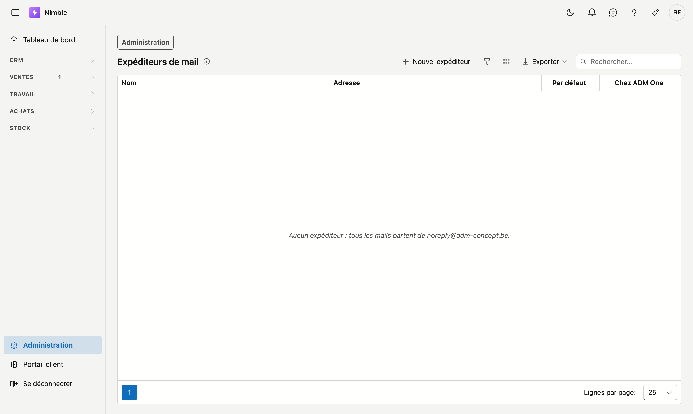

# Expéditeurs de mail

Les adresses depuis lesquelles Nimble envoie vos mails — par exemple une pour les devis et une pour la
comptabilité. Chaque [modèle de mail](mail-templates.md) en choisit une.

## Ouvrir l'écran

1. Cliquez sur **Administration** en bas de la barre latérale.
2. Dans le groupe **Ventes**, cliquez sur la tuile **Expéditeurs de mail**.

Vous y accédez aussi par le lien **Gérer les expéditeurs** sur l'écran Modèles de mail. Le droit *Gérer les
modèles de documents* est nécessaire.

## La liste

| Colonne | Ce qu'elle montre |
|---|---|
| **Nom** | Ce que le destinataire voit comme expéditeur |
| **Adresse** | L'adresse e-mail |
| **Par défaut** | L'expéditeur de chaque modèle sans expéditeur propre |
| **Chez ADM One** | **Autorisée** ou **Non enregistrée** — voir ci-dessous |

Si vous n'avez pas encore d'expéditeur, l'écran indique : *Aucun expéditeur : tous les mails partent de
noreply@adm-concept.be.*

## Depuis quelle adresse un mail part-il ?

1. De l'expéditeur choisi par le modèle de mail.
2. Si le modèle n'en choisit pas, de l'expéditeur **par défaut**.
3. S'il n'y a pas d'expéditeur par défaut, de noreply@adm-concept.be.

## Ajouter ou modifier un expéditeur

Cliquez sur **Nouvel expéditeur**, ou cliquez sur une ligne pour la modifier. La fenêtre demande :

| Champ | Explication |
|---|---|
| **Nom** | Obligatoire. Ce que le destinataire voit comme expéditeur, par exemple *Thomadak — devis* |
| **Adresse** | Obligatoire. Une adresse e-mail valide. Deux expéditeurs ne peuvent pas avoir la même adresse |
| **Par défaut** | Pour chaque modèle sans expéditeur propre. Un seul expéditeur peut être celui par défaut ; si vous cochez cette case, l'expéditeur par défaut précédent la perd |

Votre premier expéditeur est déjà coché comme expéditeur par défaut.

Pendant que vous tapez l'adresse, la fenêtre indique l'avis d'ADM One — c'est ADM One qui envoie vos mails :

- *ADM One autorise … comme expéditeur.* — en ordre.
- *… n'est pas enregistré chez ADM One. Vous pouvez enregistrer l'expéditeur, mais demandez à ADM
  d'enregistrer le domaine : d'ici là, le mail peut être refusé.*

Le même résultat figure dans la colonne **Chez ADM One**. Si cette colonne reste vide, ADM One n'a pas répondu
à ce moment-là ; l'écran ne dit alors rien.

## Supprimer un expéditeur

Ouvrez l'expéditeur et cliquez sur **Supprimer**. L'expéditeur va dans la Corbeille, d'où vous pouvez le
restaurer. Les modèles qui avaient choisi cet expéditeur partent ensuite de l'adresse par défaut. S'il
s'agissait de l'expéditeur par défaut lui-même, il n'y a ensuite plus d'expéditeur par défaut.

## Erreurs fréquentes

!!! warning
    - **Choisir une adresse sans boîte de réception.** Le client répond à l'adresse depuis laquelle le mail
      est parti. Choisissez une adresse dont quelqu'un lit les réponses.
    - **Un domaine non enregistré chez ADM One.** Le mail peut être refusé. Demandez à ADM d'enregistrer le
      domaine avant de choisir l'expéditeur dans un modèle.

## Voir aussi

- [Modèles de mail](mail-templates.md) — quel modèle utilise quel expéditeur
- [Corbeille](../administration/recycle-bin.md) — restaurer un expéditeur supprimé
