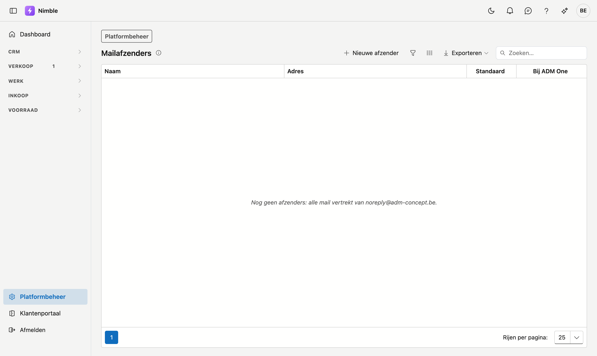

# Mailafzenders

De adressen waarvan Nimble uw mails verstuurt — bijvoorbeeld één voor de offertes en één voor de
boekhouding. Elk [mailsjabloon](mail-templates.md) kiest er één.

## Het scherm openen

1. Klik onderaan in de zijbalk op **Platformbeheer**.
2. Klik in de groep **Verkoop** op de tegel **Mailafzenders**.

U komt er ook via de link **Afzenders beheren** op het scherm Mailsjablonen. U hebt er het recht
*Documentsjablonen beheren* voor nodig.

## De lijst

| Kolom | Wat ze toont |
|---|---|
| **Naam** | Wat de ontvanger als afzender ziet |
| **Adres** | Het mailadres |
| **Standaard** | De afzender voor elk sjabloon zonder eigen afzender |
| **Bij ADM One** | **Toegelaten** of **Niet geregistreerd** — zie hieronder |

Hebt u nog geen afzenders, dan staat er: *Nog geen afzenders: alle mail vertrekt van noreply@adm-concept.be.*

## Van welk adres vertrekt een mail?

1. Van de afzender die het mailsjabloon kiest.
2. Kiest het sjabloon er geen, van de **standaard**.
3. Is er geen standaard, van noreply@adm-concept.be.

## Een afzender toevoegen of wijzigen

Klik op **Nieuwe afzender**, of klik op een rij om ze te wijzigen. Het venster vraagt:

| Veld | Uitleg |
|---|---|
| **Naam** | Verplicht. Wat de ontvanger als afzender ziet, bijvoorbeeld *Thomadak — offertes* |
| **Adres** | Verplicht. Een geldig mailadres. Twee afzenders kunnen niet hetzelfde adres hebben |
| **Standaard** | Voor elk sjabloon zonder eigen afzender. Hoogstens één afzender is de standaard; vinkt u het aan, dan verliest de vorige standaard dat vinkje |

Uw eerste afzender staat al aangevinkt als standaard.

Terwijl u het adres typt, zegt het venster wat ADM One ervan vindt — ADM One verstuurt uw mails:

- *ADM One laat … toe als afzender.* — in orde.
- *… is niet geregistreerd bij ADM One. U kunt de afzender bewaren, maar vraag ADM het domein te registreren:
  tot dan kan de mail geweigerd worden.*

Dezelfde uitkomst staat in de kolom **Bij ADM One**. Blijft die kolom leeg, dan gaf ADM One op dat moment geen
antwoord; het scherm zegt dan niets.

## Een afzender verwijderen

Open de afzender en klik op **Verwijderen**. De afzender gaat naar de Prullenbak, waar u ze terug kunt zetten.
Sjablonen die deze afzender kozen, vertrekken daarna van de standaard. Was het de standaard zelf, dan is er
daarna geen standaard meer.

## Veelgemaakte fouten

!!! warning
    - **Een adres zonder brievenbus kiezen.** De klant antwoordt naar het adres waarvan de mail vertrok.
      Kies een adres waar iemand de antwoorden leest.
    - **Een domein dat niet bij ADM One geregistreerd is.** De mail kan geweigerd worden. Vraag ADM het
      domein te registreren vóór u de afzender in een sjabloon kiest.

## Zie ook

- [Mailsjablonen](mail-templates.md) — welk sjabloon welke afzender gebruikt
- [Prullenbak](../administration/recycle-bin.md) — een verwijderde afzender terugzetten
