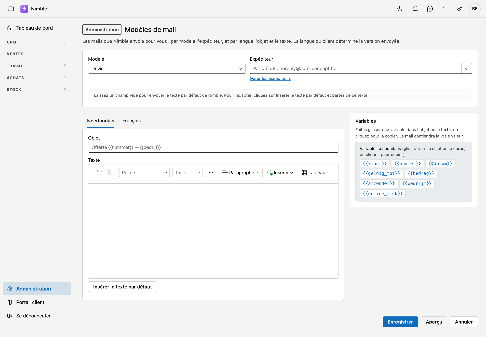

# Modèles de mail

Nimble envoie pour vous le mail d'un devis, les rappels et le bon de travail signé. C'est ici que vous
déterminez l'adresse depuis laquelle ces mails partent, et pour chaque langue l'objet et le texte.

## Ouvrir l'écran

1. Cliquez sur **Administration** en bas de la barre latérale.
2. Dans le groupe **Ventes**, cliquez sur la tuile **Modèles de mail**.

Le droit *Gérer les modèles de documents* est nécessaire.

## Modèle et expéditeur

En haut, vous choisissez le **Modèle** :

| Modèle | Quand il part |
|---|---|
| **Devis** | Avec **Envoyer par e-mail** sur un devis |
| **Rappel — premier rappel** | Avec **Envoyer…** sur l'écran Rappels, pour la première étape |
| **Rappel — deuxième rappel** | Idem, pour la deuxième étape |
| **Rappel — dernier rappel** | Idem, pour la troisième étape |
| **Rappel — mise en demeure (recouvrement)** | Idem, pour l'annonce du recouvrement |
| **Bon de travail signé** | Quand le chef d'équipe envoie le bon de travail signé au client depuis l'application |

Chaque étape des rappels a son propre modèle : un premier rappel ne s'écrit pas comme une mise en demeure.

Vous choisissez ensuite l'**Expéditeur** parmi vos [expéditeurs de mail](mail-senders.md). Si vous laissez le
champ vide, il affiche *Par défaut :* avec l'adresse qui s'applique alors : votre expéditeur par défaut, ou
noreply@adm-concept.be si vous n'en avez pas. **Gérer les expéditeurs** ouvre la liste des expéditeurs.

Si l'expéditeur choisi se trouve dans la Corbeille, l'écran indique que le mail part de l'adresse par défaut.
Choisissez alors un autre expéditeur, ou restaurez-le depuis la Corbeille.

## Objet et texte par langue

Sous les listes figurent deux onglets : **Néerlandais** et **Français**. Chaque onglet comporte un champ
**Objet** et un champ **Texte**. La langue du client détermine la version qui part.

!!! info "Un champ vide signifie : le texte par défaut"
    Laissez un champ vide pour envoyer le texte par défaut de Nimble. Dans un objet vide, ce texte par
    défaut apparaît en gris. Cela vaut par langue et par champ : si vous adaptez uniquement l'objet en
    néerlandais, le mail en français part encore entièrement avec le texte par défaut.

Pour adapter le texte, cliquez sur **Insérer le texte par défaut**. Le texte de Nimble arrive dans le champ, et
vous partez de ce texte. Si l'objet était vide lui aussi, il reçoit l'objet par défaut. Si le champ contient
déjà du texte, le bouton ne change rien — votre travail reste en place.

Le texte se modifie avec mise en forme, comme dans un traitement de texte.

## Variables

À droite se trouve la liste **Variables**. Faites-en glisser une dans l'objet ou le texte ; le mail contiendra
la vraie valeur. En cliquant sur une variable, vous la copiez ; collez-la ensuite où vous voulez. La liste ne
montre que les variables qui fonctionnent dans le modèle choisi.

| Variable | Ce qui figure dans le mail | Modèles |
|---|---|---|
| `{{klant}}` | Nom du client | Tous |
| `{{nummer}}` | Numéro du devis ou de la facture | Devis, rappels |
| `{{datum}}` | Date du document | Tous |
| `{{geldig_tot}}` | Valable jusqu'au | Devis |
| `{{bedrag}}` | Montant | Devis, rappels |
| `{{vervaldag}}` | Échéance | Rappels |
| `{{dagen_te_laat}}` | Jours de retard | Rappels |
| `{{werkorder}}` | Ordre de travail | Bon de travail signé |
| `{{project}}` | Projet | Bon de travail signé |
| `{{getekend_door}}` | Signataire | Bon de travail signé |
| `{{afzender}}` | Nom de la personne qui envoie | Tous |
| `{{bedrijf}}` | Nom de votre entreprise | Tous |
| `{{online_link}}` | Un lien vers le devis en ligne | Devis |

### Le lien vers le devis en ligne

Avec `{{online_link}}` dans le texte, le client reçoit un lien *Consultez et répondez au devis en ligne*. Il y
consulte le devis et peut l'accepter ou le refuser — voir [Proposer le devis en ligne](../sales/quotes.md#proposer-le-devis-en-ligne).

Si le devis n'est pas encore en ligne au moment où vous l'envoyez, Nimble le met en ligne quand vous cliquez
sur **Envoyer** — et uniquement si le lien figure encore dans le mail. Si vous annulez la fenêtre, le devis
reste tel qu'il était.

Dans l'objet, `{{online_link}}` reste vide : un lien a sa place dans le texte.

### Un nom qui n'existe pas

Si un nom entre accolades n'est pas connu de ce modèle, l'écran affiche au-dessus des onglets *Ce modèle ne
connaît pas ces noms ; ils resteront vides dans le mail :* avec ces noms. Ce message apparaît lorsque vous
enregistrez, ouvrez l'aperçu ou rouvrez l'écran — pas pendant la saisie.

## Les boutons

| Bouton | Ce qu'il fait |
|---|---|
| **Enregistrer** | Enregistre l'expéditeur et les deux langues du modèle choisi |
| **Aperçu** | Montre le mail dans les deux langues avec des données fictives — voir ci-dessous |
| **Annuler** | Retour à l'administration |
| **Rétablir le modèle par défaut** | Supprime votre version de ce modèle, après confirmation. Le texte par défaut de Nimble et l'expéditeur par défaut s'appliquent ensuite à nouveau. Visible uniquement lorsqu'une version propre est enregistrée |

Si vous choisissez un autre modèle alors que des modifications ne sont pas enregistrées, l'écran vous demande
d'abord si vous voulez les abandonner.

### Vérifier votre travail

**Aperçu** montre le mail en néerlandais et en français, chaque fois avec **De** et **Objet**, tel qu'il
partirait avec le contenu actuel des champs — même si vous n'avez pas encore enregistré. Les données sont
fictives, pour que vous voyiez quel texte provient d'une variable.

## Au moment de l'envoi

Un modèle est un point de départ. Dans la fenêtre d'envoi d'un devis ou d'un rappel, vous voyez le mail tel
qu'il partira, avec les vraies données. **Modifier le texte** vous permet encore de l'adapter pour ce seul mail
— le modèle lui-même ne change pas. Voir [Envoyer le devis par e-mail](../sales/quotes.md#envoyer-le-devis-par-e-mail)
et [Rappels](../sales/reminders.md#envoyer).

Le bon de travail signé part de l'application, sans fenêtre : le modèle s'applique tel quel.

## Erreurs fréquentes

!!! warning
    - **Taper une variable au lieu de la faire glisser.** `{{dagen te laat}}` avec des espaces ne fonctionne
      pas. Faites-la glisser depuis la liste, elle sera correcte.
    - **Choisir un expéditeur dont le domaine n'est pas enregistré chez ADM One.** Le mail peut alors être
      refusé. L'écran [Expéditeurs de mail](mail-senders.md) indique quelles adresses sont en ordre.
    - **Penser que l'aperçu enregistre.** Seul **Enregistrer** applique votre texte aux mails qui partent.
    - **Oublier qu'il y a deux langues.** Si vous adaptez uniquement le néerlandais, un client francophone
      reçoit encore le texte par défaut. Vérifiez aussi l'onglet **Français**.

## Voir aussi

- [Expéditeurs de mail](mail-senders.md) — les adresses depuis lesquelles vos mails partent
- [Devis](../sales/quotes.md) — envoyer le devis par e-mail et le proposer en ligne
- [Rappels](../sales/reminders.md) — les quatre étapes d'un rappel
- [Bons de travail](../work/work-sheets.md) — la signature du client
- [Modèles de documents](document-templates.md) — l'en-tête et les conditions sur le devis lui-même
