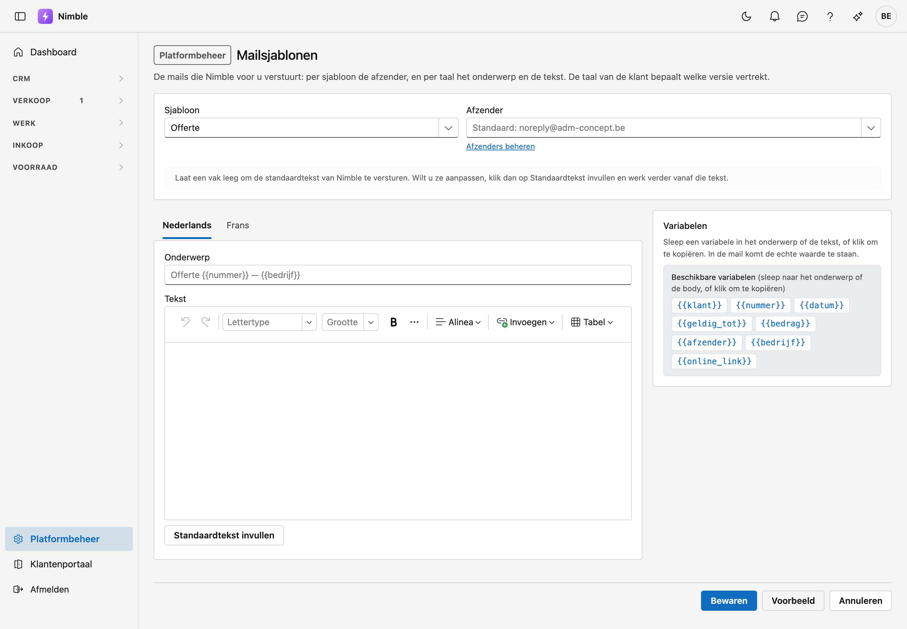

# Mailsjablonen

Nimble verstuurt voor u de mail bij een offerte, de aanmaningen, de getekende werkbon en de melding van een toegewezen
taak. Hier bepaalt u
van welk adres die mails vertrekken, en per taal het onderwerp en de tekst.

## Het scherm openen

1. Klik onderaan in de zijbalk op **Platformbeheer**.
2. Klik in de groep **Verkoop** op de tegel **Mailsjablonen**.

U hebt er het recht *Documentsjablonen beheren* voor nodig.

## Sjabloon en afzender

Bovenaan kiest u het **Sjabloon**:

| Sjabloon | Waar het vertrekt |
|---|---|
| **Offerte** | Bij **Mailen** op een offerte |
| **Aanmaning — eerste herinnering** | Bij **Versturen…** op het scherm Aanmaningen, voor de eerste stap |
| **Aanmaning — tweede herinnering** | Idem, voor de tweede stap |
| **Aanmaning — laatste herinnering** | Idem, voor de derde stap |
| **Aanmaning — ingebrekestelling (incasso)** | Idem, voor de aankondiging van de incasso |
| **Getekende werkbon** | Wanneer de ploegbaas de getekende werkbon vanuit de app naar de klant mailt |
| **Taak toegewezen** | Wanneer iemand een taak toegewezen krijgt — enkel als dat aanstaat op de [Bedrijfsfiche](company-profile.md#mail-bij-het-toewijzen-van-een-taak) |

Elke stap van de aanmaningen heeft een eigen sjabloon: een eerste herinnering schrijft u anders dan een
ingebrekestelling.

Daarnaast kiest u de **Afzender** uit uw [mailafzenders](mail-senders.md). Laat u het veld leeg, dan staat er
*Standaard:* met het adres dat dan geldt: uw standaardafzender, of noreply@adm-concept.be als u er geen hebt.
Met **Afzenders beheren** opent u de lijst van afzenders.

Staat de gekozen afzender in de Prullenbak, dan meldt het scherm dat de mail van de standaard vertrekt. Kies
dan een andere afzender, of zet de afzender terug uit de Prullenbak.

## Onderwerp en tekst per taal

Onder de keuzelijsten staan twee tabbladen: **Nederlands** en **Frans**. Elk tabblad heeft een vak
**Onderwerp** en een vak **Tekst**. De taal van de klant bepaalt welke versie vertrekt.

!!! info "Een leeg vak betekent: de standaardtekst"
    Laat een vak leeg om de standaardtekst van Nimble te versturen. In een leeg onderwerp ziet u die
    standaard in het grijs staan. Dat geldt per taal en per vak: past u enkel het Nederlandse onderwerp
    aan, dan vertrekt de Franse mail nog volledig met de standaardtekst.

Wilt u de tekst aanpassen, klik dan op **Standaardtekst invullen**. De tekst van Nimble komt dan in het vak,
en u werkt verder vanaf die tekst. Was ook het onderwerp leeg, dan krijgt dat het standaardonderwerp. Staat er
al tekst in het vak, dan verandert de knop niets — uw werk blijft staan.

De tekst bewerkt u met opmaak, zoals in een tekstverwerker.

## Variabelen

Rechts staat de lijst **Variabelen**. Sleep er een in het onderwerp of de tekst; in de mail komt de echte
waarde te staan. Klikt u op een variabele, dan kopieert u ze; plak ze daarna waar u wilt. De lijst toont
enkel de variabelen die in het gekozen sjabloon werken.

| Variabele | Wat er in de mail komt | Sjablonen |
|---|---|---|
| `{{klant}}` | Naam van de klant | Offerte, aanmaningen, getekende werkbon |
| `{{nummer}}` | Nummer van de offerte of factuur | Offerte, aanmaningen |
| `{{datum}}` | Datum van het document | Offerte, aanmaningen, getekende werkbon |
| `{{geldig_tot}}` | Geldig tot | Offerte |
| `{{bedrag}}` | Bedrag | Offerte, aanmaningen |
| `{{vervaldag}}` | Vervaldag | Aanmaningen |
| `{{dagen_te_laat}}` | Dagen te laat | Aanmaningen |
| `{{werkorder}}` | Werkorder | Getekende werkbon |
| `{{project}}` | Project | Getekende werkbon |
| `{{getekend_door}}` | Wie tekende | Getekende werkbon |
| `{{afzender}}` | Naam van wie verstuurt | Offerte, aanmaningen, getekende werkbon |
| `{{bedrijf}}` | Uw bedrijfsnaam | Alle |
| `{{online_link}}` | Een link naar de online offerte | Offerte |
| `{{ontvanger}}` | Wie de taak krijgt | Taak toegewezen |
| `{{taak}}` | Het onderwerp van de taak | Taak toegewezen |
| `{{taak_omschrijving}}` | De omschrijving van de taak | Taak toegewezen |
| `{{taak_begin}}` | De begindatum van de taak | Taak toegewezen |
| `{{taak_vervaldag}}` | De vervaldag van de taak | Taak toegewezen |
| `{{taak_bij}}` | Waar de taak bij hoort (project, relatie, lead) | Taak toegewezen |
| `{{toegewezen_door}}` | Wie de taak toewees, of Nimble bij een automatische taak | Taak toegewezen |
| `{{taak_link}}` | Een link naar de takenlijst in Nimble | Taak toegewezen |

### De link naar de online offerte

Met `{{online_link}}` in de tekst krijgt de klant een link *Bekijk en beantwoord de offerte online*. Daar kan
hij de offerte bekijken en aanvaarden of weigeren — zie [De offerte online voorleggen](../sales/quotes.md#de-offerte-online-voorleggen).

Staat de offerte nog niet online wanneer u ze mailt, dan zet Nimble ze online op het moment dat u op
**Versturen** klikt — en enkel als de link dan nog in de mail staat. Annuleert u het venster, dan blijft de
offerte zoals ze was.

In het onderwerp blijft `{{online_link}}` leeg: een link hoort in de tekst.

### Een naam die niet bestaat

Staat er een naam tussen accolades die dit sjabloon niet kent, dan toont het scherm boven de tabbladen
*Deze namen kent dit sjabloon niet; ze blijven leeg in de mail:* met die namen. Die melding verschijnt
wanneer u bewaart, het voorbeeld opent of het scherm opnieuw opent — niet terwijl u typt.

## De knoppen

| Knop | Wat hij doet |
|---|---|
| **Bewaren** | Bewaart de afzender en beide talen van het gekozen sjabloon |
| **Voorbeeld** | Toont de mail in beide talen met verzonnen gegevens — zie hieronder |
| **Annuleren** | Terug naar Platformbeheer |
| **Standaard herstellen** | Verwijdert uw eigen versie van dit sjabloon, na bevestiging. De standaardtekst van Nimble en de standaardafzender gelden daarna weer. Enkel zichtbaar wanneer er een eigen versie bewaard is |

Kiest u een ander sjabloon terwijl er nog onbewaarde wijzigingen zijn, dan vraagt het scherm eerst of u die
wilt laten vallen.

### Uw werk nakijken

**Voorbeeld** toont de mail in het Nederlands en in het Frans, telkens met **Van** en **Onderwerp** erbij,
zoals ze zou vertrekken met wat er nú in de vakken staat — ook als u nog niet bewaard hebt. De gegevens zijn
verzonnen, zodat u ziet welke tekst uit een variabele komt.

## Bij het versturen

Een sjabloon is het vertrekpunt. In het venster waarmee u een offerte of een aanmaning verstuurt, ziet u de
mail zoals ze vertrekt, met de echte gegevens. Met **Tekst aanpassen** past u ze voor die ene mail nog aan —
het sjabloon zelf verandert daar niet door. Zie [De offerte mailen](../sales/quotes.md#de-offerte-mailen) en
[Aanmaningen](../sales/reminders.md#versturen).

De getekende werkbon vertrekt vanuit de app, zonder venster: daar geldt het sjabloon zoals het is. Ook de melding van een
toegewezen taak vertrekt zonder venster, in de taal van wie de taak krijgt — niet die van een klant.

## Veelgemaakte fouten

!!! warning
    - **Een variabele overtypen in plaats van slepen.** `{{dagen te laat}}` met spaties werkt niet. Sleep
      ze uit de lijst, dan staat ze juist.
    - **Een afzender kiezen waarvan het domein niet bij ADM One geregistreerd is.** De mail kan dan
      geweigerd worden. Op het scherm [Mailafzenders](mail-senders.md) ziet u welke adressen in orde zijn.
    - **Denken dat het voorbeeld bewaart.** Pas **Bewaren** zet uw tekst op de mails die vertrekken.
    - **Vergeten dat er twee talen zijn.** Past u enkel het Nederlands aan, dan krijgt een Franstalige
      klant nog de standaardtekst. Kijk ook het tabblad **Frans** na.

## Zie ook

- [Mailafzenders](mail-senders.md) — de adressen waarvan uw mails vertrekken
- [Offertes](../sales/quotes.md) — de offerte mailen en online voorleggen
- [Aanmaningen](../sales/reminders.md) — de vier stappen van een aanmaning
- [Werkbonnen](../work/work-sheets.md) — de handtekening van de klant
- [Documentsjablonen](document-templates.md) — het briefhoofd en de voorwaarden op de offerte zelf
