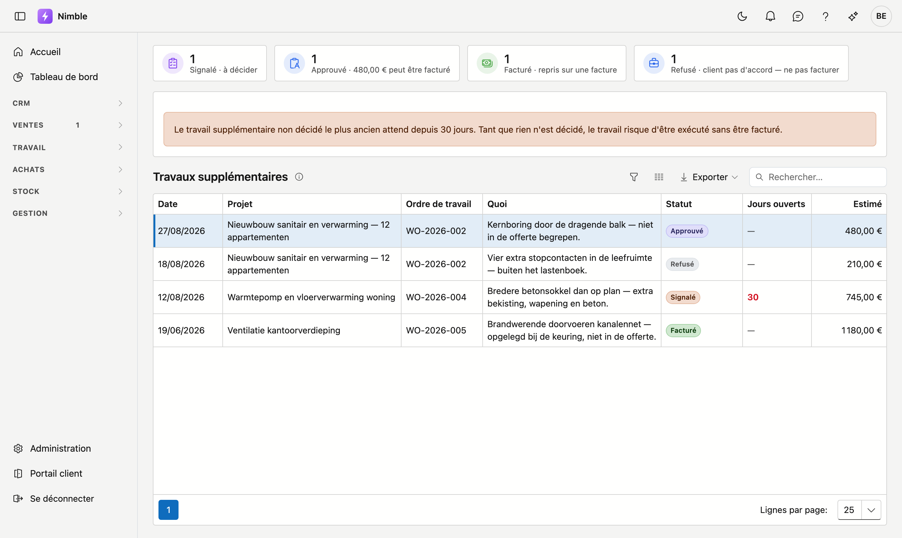

# Travaux supplémentaires

Un **travail supplémentaire** est du travail qui ne figurait pas dans le devis et qui s'avère malgré tout
nécessaire sur le chantier. Votre équipe le signale sur un bon de travail ; cet écran rassemble tout ce qui
a été signalé ainsi, tous projets confondus.

Il existe pour une seule raison : **un travail supplémentaire qui traîne est exécuté sans être facturé.**

## Ouvrir l'écran

Cliquez dans la barre latérale sur **Travail** puis sur **Travaux supplémentaires**.

## Les quatre statuts

| Statut | Signification |
|---|---|
| **Signalé** | L'équipe l'a constaté. Rien n'est encore décidé — c'est le cas qui demande de l'attention |
| **Approuvé** | Le client est d'accord. Cela peut être exécuté et facturé |
| **Refusé** | Le client n'est pas d'accord. Le travail n'est pas facturé |
| **Facturé** | Repris sur une facture. La boucle est bouclée |

Chaque statut a sa propre tuile en haut, même lorsqu'elle est à zéro. Vous voyez ainsi d'un coup d'œil
combien attendent et pour quel montant.

## L'avertissement en haut

Si un travail signalé traîne suffisamment longtemps, une bande apparaît avec la durée. Ce n'est pas un
message d'erreur mais un pense-bête : tant que rien n'est décidé, le travail se poursuit peut-être sans que
personne ne le facture.

La colonne **Jours ouverts** ne compte que pour **Signalé**. Dès qu'une décision est prise — approuvé,
refusé ou facturé — le compteur s'arrête et un tiret apparaît.

## Les colonnes

| Colonne | Ce qu'elle indique |
|---|---|
| **Date** | Quand cela a été signalé sur le bon de travail |
| **Projet** et **Ordre de travail** | D'où cela provient |
| **Quoi** | La description donnée par l'équipe |
| **Jours ouverts** | Depuis combien de temps c'est sans décision |
| **Estimé** | Le montant évalué par l'équipe ou le chef de chantier |

!!! warning "Estimé n'est pas un montant de facture"
    Le montant dans cette liste est une estimation du chantier. Ce que vous facturez réellement, vous le
    déterminez lors de l'établissement de la facture. Les deux peuvent différer, et c'est normal.

## La décision se prend sur le bon de travail

Cet écran est un **aperçu** : il montre ce qui attend et depuis combien de temps. L'approbation ou le refus
se fait sur le bon de travail lui-même, où figurent aussi la description et le montant.

Il reste ainsi un seul endroit où un travail supplémentaire est décrit et décidé, et un seul endroit où
vous voyez ce qui reste ouvert.
