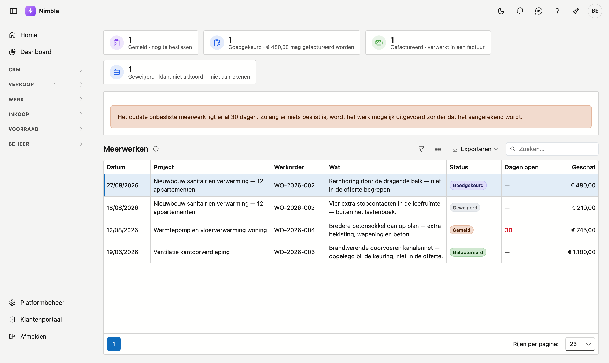

# Meerwerken

Een **meerwerk** is werk dat niet in de offerte stond en dat op de werf toch nodig blijkt. Uw ploeg meldt
het op een werkbon; op dit scherm ziet u alles wat er zo gemeld is, over alle projecten heen.

Het bestaat om één reden: **meerwerk dat blijft liggen, wordt uitgevoerd zonder dat het aangerekend wordt.**

## Het scherm openen

Klik in de zijbalk op **Werk** en daarna op **Meerwerken**.

## De vier standen

| Stand | Betekenis |
|---|---|
| **Gemeld** | De ploeg heeft het vastgesteld. Er is nog niets beslist — dit is het geval dat aandacht vraagt |
| **Goedgekeurd** | De klant is akkoord. Het mag uitgevoerd en aangerekend worden |
| **Geweigerd** | De klant gaat niet akkoord. Het werk wordt niet aangerekend |
| **Gefactureerd** | Verwerkt in een factuur. Hiermee is de kring rond |

Elke stand heeft een eigen tegel bovenaan, ook wanneer ze op nul staat. Zo ziet u in één oogopslag hoeveel
er wacht en voor hoeveel geld.

## De waarschuwing bovenaan

Ligt er een gemeld meerwerk lang genoeg, dan verschijnt er een balk met hoelang dat al duurt. Dat is geen
foutmelding maar een geheugensteun: zolang er niets beslist is, gaat het werk mogelijk door zonder dat
iemand het aanrekent.

De kolom **Dagen open** telt alleen bij **Gemeld**. Zodra er beslist is — goedgekeurd, geweigerd of
gefactureerd — stopt de teller en staat er een streepje.

## De kolommen

| Kolom | Wat het zegt |
|---|---|
| **Datum** | Wanneer het gemeld is op de werkbon |
| **Project** en **Werkorder** | Waar het vandaan komt |
| **Wat** | De omschrijving die de ploeg gaf |
| **Dagen open** | Hoelang het al onbeslist ligt |
| **Geschat** | Het bedrag dat de ploeg of werfleider inschatte |

!!! warning "Geschat is geen factuurbedrag"
    Het bedrag in deze lijst is een inschatting van de werf. Wat u werkelijk aanrekent, bepaalt u bij het
    opmaken van de factuur. De twee kunnen verschillen, en dat is normaal.

## Beslissen doet u op de werkbon

Dit scherm is een **overzicht**: het toont wat er wacht en hoelang al. Goedkeuren of weigeren doet u op de
werkbon zelf, waar ook de omschrijving en het bedrag staan.

Zo blijft er één plek waar een meerwerk beschreven en beslist wordt, en één plek waar u ziet wat er
openstaat.
