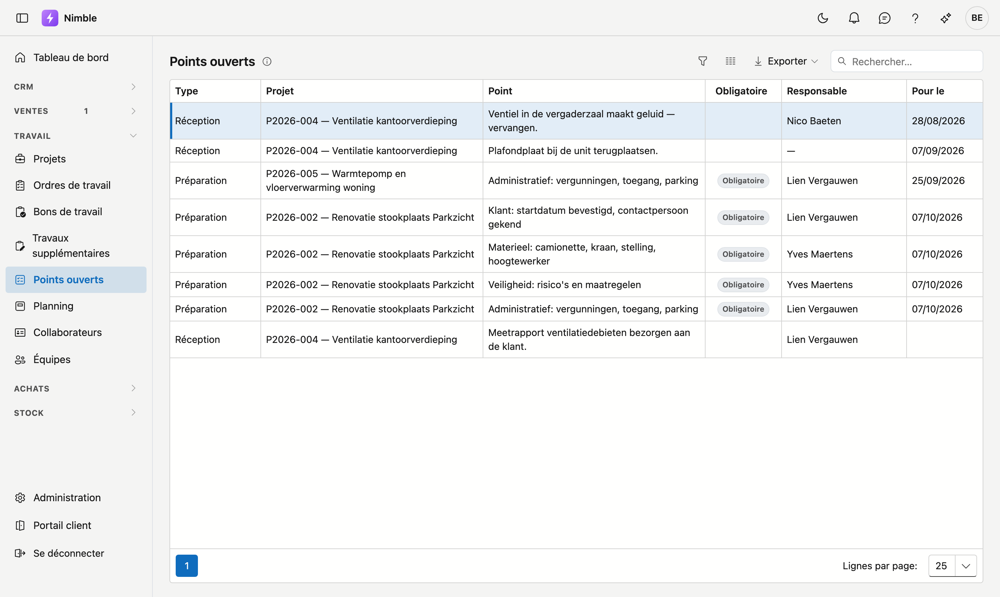

# Points ouverts

L'écran **Points ouverts** montre ce qui reste à faire sur l'ensemble des projets : les points ouverts de la
[préparation du chantier](projects.md#onglet-preparation) et de la [réception](projects.md#points-de-reception).
Vous ne devez donc pas ouvrir chaque projet séparément pour savoir ce qui attend encore.

## Ouvrir l'écran

Dans la barre latérale, sous **Travail**, cliquez sur **Points ouverts**.

## La liste

| Colonne | Ce qu'elle affiche |
|---|---|
| **Type** | **Préparation** ou **Réception** : l'onglet du projet d'où vient le point |
| **Projet** | Le code et le nom du projet |
| **Point** | Ce qui doit être fait |
| **Obligatoire** | Figure sur les points de préparation nécessaires pour qu'un chantier soit prêt à démarrer |
| **Responsable** | Qui s'en charge. Un tiret signifie que personne n'a encore été désigné |
| **Pour le** | La date à laquelle le point doit être réglé |

En haut figure le point dont la date est la plus proche. Les points sans date viennent en dernier.

## Votre propre liste

Filtrez la colonne **Responsable** sur votre nom. Vous ne voyez alors que les points dont vous vous chargez. Le
fonctionnement des filtres est décrit dans [Filtrer les listes](../lijsten-filteren.md).

## Cocher un point

Double-cliquez sur un point : le projet s'ouvre. Dans l'onglet **Préparation** ou **Réception**, vous cochez le
point. Un point coché disparaît de cette liste.

!!! info "Ce qui n'y figure pas"
    Les points cochés et les points d'un projet archivé ne figurent pas dans cette liste. Un projet sans
    préparation n'a pas non plus de points de préparation ici. Sur le projet, vous les ajoutez avec
    **Ajouter la liste standard**.

## Erreurs fréquentes

!!! warning "Un point sans responsable ou sans date reste en suspens"
    Un point avec un tiret sous **Responsable** ne figure dans la liste de personne, et un point sans date
    apparaît en dernier. Sur le projet, désignez toujours quelqu'un et indiquez une date.

## Voir aussi

- [Projets](projects.md) — les onglets Préparation et Réception
- [Préparation du chantier](../administration/site-preparation.md) — les points que chaque nouveau projet reçoit
- [Filtrer les listes](../lijsten-filteren.md) — rechercher, filtrer et choisir les colonnes
