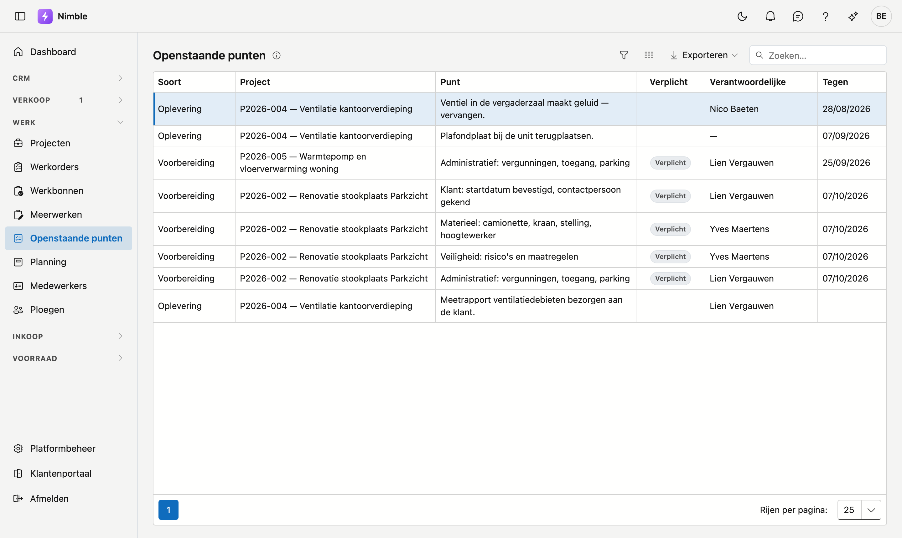

# Openstaande punten

Op **Openstaande punten** ziet u wat er over alle projecten heen nog moet gebeuren: de open punten van de
[werfvoorbereiding](projects.md#tabblad-voorbereiding) en van de [oplevering](projects.md#opleverpunten). U
hoeft dus niet elk project apart te openen om te weten wat er nog ligt.

## Het scherm openen

Klik in de zijbalk onder **Werk** op **Openstaande punten**.

## De lijst

| Kolom | Wat ze toont |
|---|---|
| **Soort** | **Voorbereiding** of **Oplevering**: van welk tabblad van het project het punt komt |
| **Project** | De code en de naam van het project |
| **Punt** | Wat er moet gebeuren |
| **Verplicht** | Staat bij de voorbereidingspunten die nodig zijn voor een startklare werf |
| **Verantwoordelijke** | Wie ervoor zorgt. Een streepje betekent dat er nog niemand aangeduid is |
| **Tegen** | Tegen wanneer het punt klaar moet zijn |

Bovenaan staat het punt met de vroegste datum. Punten zonder datum staan onderaan.

## Uw eigen lijst

Filter de kolom **Verantwoordelijke** op uw naam. U ziet dan enkel de punten waarvoor u zorgt. Hoe filteren werkt,
leest u bij [Lijsten filteren](../lijsten-filteren.md).

## Een punt afvinken

Dubbelklik op een punt: het project opent. Op het tabblad **Voorbereiding** of **Oplevering** vinkt u het punt af.
Een afgevinkt punt verdwijnt uit deze lijst.

!!! info "Wat er niet in staat"
    Afgevinkte punten en de punten van een gearchiveerd project staan niet in deze lijst. Een project zonder
    voorbereiding heeft hier ook geen voorbereidingspunten. Op het project voegt u ze toe met
    **Standaardlijst toevoegen**.

## Veelgemaakte fouten

!!! warning "Een punt zonder verantwoordelijke of datum blijft liggen"
    Een punt met een streepje bij **Verantwoordelijke** staat in niemands eigen lijst, en een punt zonder datum
    staat onderaan. Duid op het project altijd iemand aan en zet er een datum bij.

## Zie ook

- [Projecten](projects.md) — de tabbladen Voorbereiding en Oplevering
- [Werfvoorbereiding](../administration/site-preparation.md) — de punten die elk nieuw project krijgt
- [Lijsten filteren](../lijsten-filteren.md) — zoeken, filteren en kolommen kiezen
