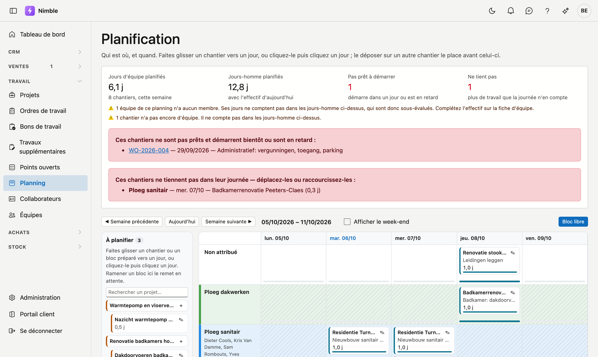
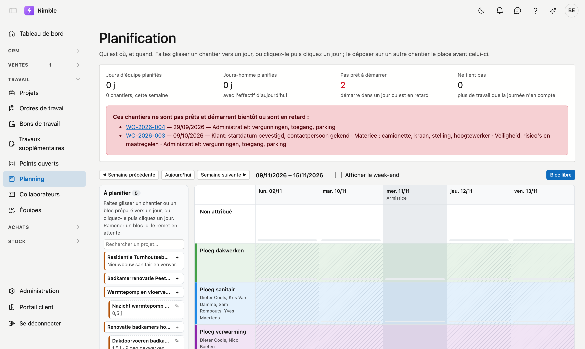
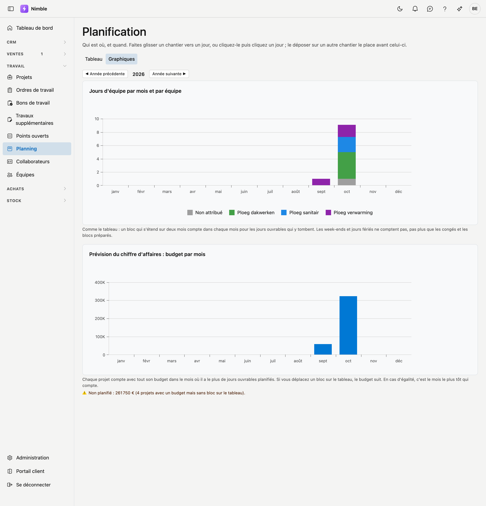

# Planning

Le **planning** montre qui est où, et quand : par équipe et par jour, les chantiers, semaine par semaine. Vous
planifiez un chantier en le faisant glisser vers un jour.

## Ouvrir l'écran

Cliquez dans la barre latérale sur **Travail → Planning**.

## Les compteurs en haut

| Compteur | Ce qu'il indique |
|---|---|
| **Jours d'équipe planifiés** | Combien de jours d'équipe sont planifiés cette semaine, et sur combien de chantiers |
| **Jours-homme planifiés** | Ces mêmes jours multipliés par le nombre de membres de chaque équipe — avec l'effectif actuel |
| **Pas prêt à démarrer** | Les chantiers qui démarrent dans un jour ou sont en retard, alors que leur préparation n'est pas terminée |
| **Ne tient pas** | Les chantiers qui portent plus de travail que leur journée n'en compte |

Si **Pas prêt à démarrer** ou **Ne tient pas** dépasse zéro, les chantiers concernés figurent en dessous.

Si une équipe n'a pas de membres, ou si un chantier n'a pas encore d'équipe, il n'est pas compté dans les
jours-homme. L'écran le signale alors sous les compteurs : le chiffre est alors sous-évalué. Complétez les
membres sur la [fiche d'équipe](teams.md).

## Le tableau

Chaque ligne est une équipe ; la ligne du haut **Non attribué** contient les chantiers qui n'ont pas encore
d'équipe. Sous le nom figurent les membres de l'équipe. La couleur que vous avez donnée à l'équipe sur la
[fiche équipe](teams.md) apparaît comme un trait devant le nom et teinte légèrement toute la ligne, pour voir aussi
sur un grand écran quelle ligne appartient à quelle équipe. Chaque colonne est un jour. Avec **◀ Semaine précédente**, **Aujourd'hui** et **Semaine suivante ▶**,
vous naviguez ; **Afficher le week-end** ajoute le samedi et le dimanche. Si votre entreprise travaille le samedi ou
le dimanche, ce jour figure toujours sur le tableau : l'administrateur le règle dans la
[fiche d'entreprise](../settings/company-profile.md#planning).

Un chantier figure comme carte sur son jour, avec sa durée. En haut de la carte figure le **nom du chantier** ;
s'il n'est pas rempli, le nom du projet. En dessous figurent ce qui se fait et dans quelle commune. Le numéro du
projet apparaît lorsque vous survolez la carte avec la souris. Si un chantier s'étend sur plusieurs jours, les
jours suivants indiquent *suite de* avec le jour de début. La petite barre en bas d'un jour montre le **taux de
remplissage** de ce jour ; si elle devient rouge, il y a plus de travail que le jour n'en compte. Un jour ouvrable où une équipe n'a encore rien est **hachuré
en gris** : vous voyez ainsi d'un coup d'œil où il reste de la place.

Une durée se compte en **jours ouvrables** : un chantier de trois jours à partir du vendredi se poursuit le
lundi et le mardi. Le samedi, le dimanche et les **jours fériés légaux** sont sautés, sauf si le chantier
commence ce jour-là. Si le samedi ou le dimanche est un jour ouvrable chez vous, le chantier se poursuit
simplement ce jour-là. Un jour férié est grisé sur le tableau, avec son nom sous la date. Si Nimble ne peut
momentanément pas récupérer les jours fériés, un message s'affiche au-dessus du tableau et ce jour compte comme
un jour ouvrable.

## Planifier un chantier

À gauche figure **À planifier** : les projets vendus ou en cours qui n'ont pas encore de planning, et les blocs
préparés. Avec **Rechercher un projet…**, vous retrouvez rapidement un projet.

- **Glisser :** faites glisser un chantier vers un jour, sur la ligne de la bonne équipe. Si vous le déposez
  **sur** un autre chantier, il se place avant celui-ci ; dans l'espace libre d'un jour, il se place à la fin.
  L'ordre d'une journée est l'ordre du travail.
- **Vers une autre semaine :** pendant le glissement, une bande **◀ Semaine précédente** et **Semaine suivante ▶**
  apparaît à gauche et à droite du tableau. Restez-y un instant : le tableau avance d'une semaine, et continue tant
  que vous y restez. Déposez ensuite le chantier sur un jour.
- **Cliquer :** cliquez un chantier, puis cliquez un jour. Cela fonctionne aussi avec un doigt sur une tablette, et
  aussi dans une autre semaine : naviguez avant de cliquer le jour.
- **Annuler :** vous avez cliqué un chantier, ou interrompu un glissement, et ne voulez finalement pas le placer ?
  Cliquez sur **Annuler** sous **À planifier**.
- **Cliquer une case :** cliquez une case sans avoir d'abord cliqué un chantier : le **Bloc de planning** s'ouvre
  avec cette équipe et ce jour déjà remplis. Choisissez le projet, ou laissez-le vide pour un bloc libre.
- **Remettre en attente :** faites glisser un bloc vers **À planifier** pour le remettre en attente, sans jour.

### Préparer un bloc

Si vous savez déjà combien de temps dure un chantier, mais pas encore quand, cliquez sur **Préparer un bloc**
près du projet. Le bloc figure alors sous **À planifier** avec sa durée, jusqu'à ce que vous le placiez sur un
jour. C'est aussi possible depuis le projet lui-même, dans l'onglet [Planning](projects.md#onglet-planning) de la
fiche du projet.

## Ouvrir un bloc

Cliquez sur l'icône d'une carte pour ouvrir le **Bloc de planning** :

| Champ | Signification |
|---|---|
| **Projet** | Le chantier. Vide = un **bloc libre**, par exemple pour de l'entretien ou une formation |
| **Équipe** | Qui l'exécute. Vide = **Non attribué** |
| **Jour** | Le jour de début. Vide = préparé, sans jour |
| **Durée (jours)** | La durée du travail, aussi en demi-journées |
| **Ordre de travail** | L'ordre de travail du projet auquel ce bloc appartient |
| **Description** | Ce qui se fait sur ce bloc, par exemple une phase. Obligatoire pour un bloc libre |
| **Note** | Une remarque pour l'équipe ou le planificateur |

Avec **Vers le projet**, vous ouvrez la fiche du projet. Avec Ctrl-clic (Cmd-clic sur un Mac), elle s'ouvre
dans un nouvel onglet, et le tableau reste affiché.

Plus rapide : un **double-clic** sur une carte ouvre directement la fiche du projet. Avec **Retour** dans le
navigateur, vous revenez à la même semaine. Un bloc libre n'appartient à aucun projet ; un double-clic n'y fait rien.

!!! warning "Une autre carte déjà choisie ?"
    Un double-clic, ce sont deux clics. Si une autre carte est déjà choisie (bordure bleue), le premier clic place
    cette carte avant celle sur laquelle vous double-cliquez — comme le ferait un simple clic. Cliquez d'abord sur
    **Annuler** si vous voulez seulement ouvrir la fiche.

**Bloc libre** en haut du tableau crée directement un bloc sans projet.

## Graphiques

Avec **Tableau | Graphiques** en haut, vous passez à deux graphiques sur une année ; **◀ Année précédente** et
**Année suivante ▶** permettent de naviguer.

- **Jours d'équipe par mois et par équipe** — une barre par mois, composée des équipes dans leur couleur ;
  **Non attribué** apparaît en gris. Le calcul est celui du tableau : un chantier sur deux mois compte dans chaque
  mois pour les jours ouvrables qui y tombent. Les blocs libres, comme les congés, ne comptent pas.
- **Prévision du chiffre d'affaires : budget par mois** — chaque projet compte avec tout son budget (hors TVA)
  dans le mois où il a le plus de jours ouvrables planifiés. Si vous déplacez un chantier sur le tableau, le budget
  suit. Les projets avec un budget mais sans bloc sur le tableau figurent sous le graphique, avec leur total. Seuls
  ceux qui peuvent voir les chiffres financiers voient ce graphique ; le budget se saisit dans la
  [fiche projet](projects.md).

!!! note "Des jours, pas des heures"
    Le planning compte en jours. Nimble ne fixe pas combien d'heures compte une journée d'équipe ; un bloc d'une
    demi-journée remplit donc une demi-journée, quelle que soit l'heure.

## Voir aussi

- [Projets](projects.md) — les chantiers que vous planifiez, avec leur préparation
- [Ordres de travail](work-orders.md) — le travail sur un projet
- [Équipes](teams.md) — qui fait partie d'une équipe, et donc combien de jours-homme compte un jour d'équipe
