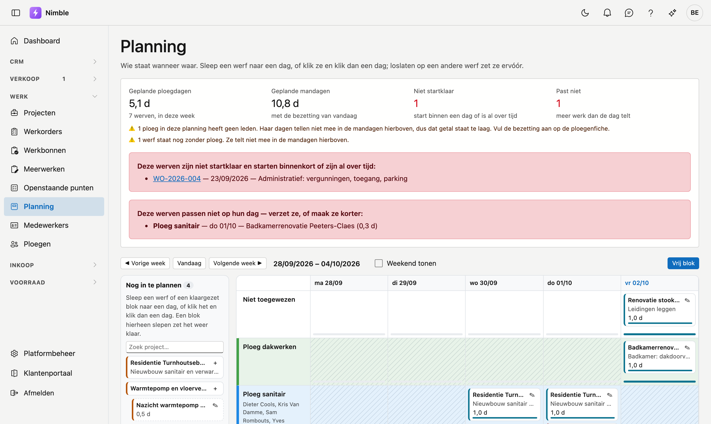
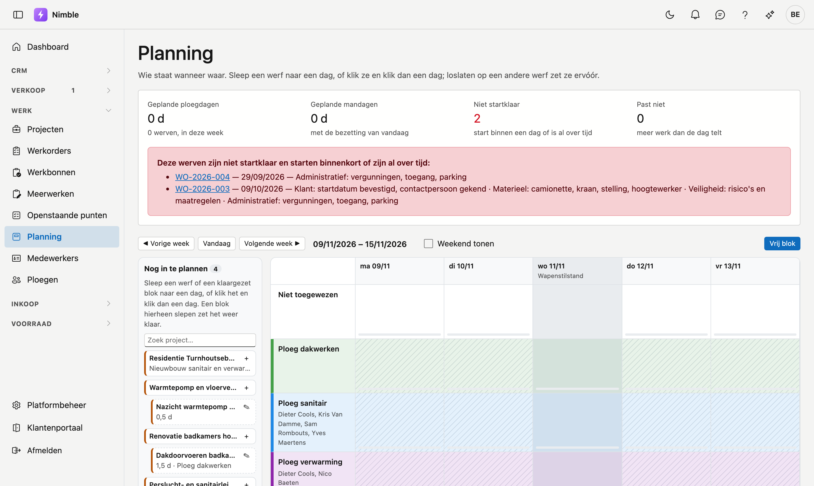

# Planning

Op de **planning** ziet u wie wanneer waar staat: per ploeg en per dag de werven, week per week. U plant een
werf door ze naar een dag te slepen.

## Het scherm openen

Klik in de zijbalk op **Werk → Planning**.

## De tellers bovenaan

| Teller | Wat het zegt |
|---|---|
| **Geplande ploegdagen** | Hoeveel ploegdagen er deze week ingepland zijn, en over hoeveel werven |
| **Geplande mandagen** | Dezelfde dagen maal het aantal leden van elke ploeg — met de bezetting van vandaag |
| **Niet startklaar** | Werven die binnen een dag starten of al over tijd zijn, terwijl hun voorbereiding niet rond is |
| **Past niet** | Werven die op hun dag meer werk dragen dan die dag telt |

Staat **Niet startklaar** of **Past niet** boven nul, dan staat eronder welke werven het zijn.

Heeft een ploeg geen leden, of staat een werf nog zonder ploeg, dan telt die niet mee in de mandagen. Het
scherm zegt dat dan onder de tellers: het getal staat dan te laag. Vul de leden aan op de
[ploegenfiche](teams.md).

## Het bord

Elke rij is een ploeg; de bovenste rij **Niet toegewezen** houdt werven die nog geen ploeg hebben. Elke kolom
is een dag. Met **◀ Vorige week**, **Vandaag** en **Volgende week ▶** bladert u; **Weekend tonen** voegt
zaterdag en zondag toe.

Een werf staat als kaart op haar dag, met haar duur. Loopt ze over meer dagen, dan staat op de volgende dagen
*loopt door van* met de startdag. Het balkje onderaan een dag toont **hoe vol die dag is**; wordt het rood, dan
staat er meer werk op dan de dag telt.

Een duur telt in **werkdagen**: een werf van drie dagen vanaf vrijdag loopt door op maandag en dinsdag.
Zaterdag, zondag en de **wettelijke feestdagen** slaat ze over, tenzij de werf er zelf op begint. Een feestdag
staat getint op het bord, met haar naam onder de datum. Kan Nimble de feestdagen even niet ophalen, dan staat
er een melding boven het bord en telt die dag als gewone werkdag.

## Een werf inplannen

Links staat **Nog in te plannen**: verkochte of lopende projecten die nog geen planning hebben, en klaargezette
blokken. Met **Zoek project…** vindt u een project snel terug.

- **Slepen:** sleep een werf naar een dag in de rij van de juiste ploeg. Laat u ze los **op** een andere werf,
  dan komt ze ervóór; in de lege ruimte van een dag komt ze achteraan. De volgorde op een dag is de volgorde
  van het werk.
- **Klikken:** klik een werf aan en klik dan een dag. Dat werkt ook met een vinger op een tablet.
- **Terugzetten:** sleep een blok terug naar **Nog in te plannen** om het weer klaar te zetten, zonder dag.

### Een blok klaarzetten

Weet u al hoelang een werf duurt, maar nog niet wanneer, klik dan op **Blok klaarzetten** bij het project. Het
blok staat dan bij **Nog in te plannen** met zijn duur, tot u het op een dag zet. Dat kan ook vanuit het project
zelf, op het tabblad [Planning](projects.md#tabblad-planning) van de projectfiche.

## Een blok openen

Klik op het pictogram van een kaart om het **Planningsblok** te openen:

| Veld | Betekenis |
|---|---|
| **Project** | De werf. Leeg = een **vrij blok**, bijvoorbeeld voor onderhoud of een opleiding |
| **Ploeg** | Wie het doet. Leeg = **Niet toegewezen** |
| **Dag** | De startdag. Leeg = klaargezet, nog zonder dag |
| **Duur (dagen)** | Hoelang het werk duurt, ook in halve dagen |
| **m²** | De oppervlakte, als richtwaarde |
| **Werkorder** | De werkorder van het project waar dit blok bij hoort |

**Vrij blok** bovenaan het bord maakt meteen een blok zonder project.

!!! note "Dagen, geen uren"
    De planning rekent in dagen. Hoeveel uren een ploegdag telt, legt Nimble niet vast; een blok van een halve
    dag vult dus een halve dag, ongeacht het uur.

## Zie ook

- [Projecten](projects.md) — de werven die u inplant, met hun voorbereiding
- [Werkorders](work-orders.md) — het werk op een project
- [Ploegen](teams.md) — wie er in een ploeg zit, en dus hoeveel mandagen een ploegdag is
