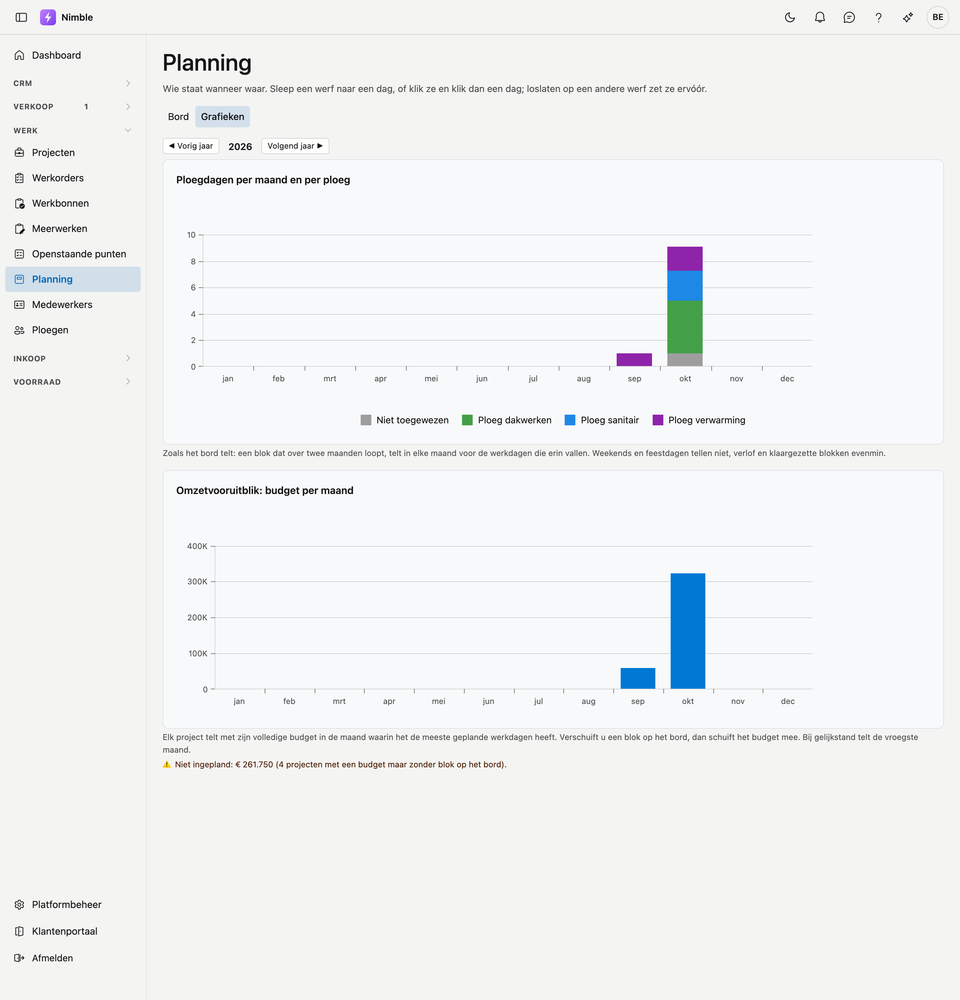

# Planning

Op de **planning** ziet u wie wanneer waar staat: per ploeg en per dag de werven, week per week. U plant een
werf door ze naar een dag te slepen.

## Het scherm openen

Klik in de zijbalk op **Werk → Planning**.

## De tellers bovenaan

| Teller | Wat het zegt |
|---|---|
| **Geplande ploegdagen** | Hoeveel ploegdagen er deze week ingepland zijn, en over hoeveel werven |
| **Geplande mandagen** | Dezelfde dagen maal het aantal leden van elke ploeg — met de bezetting van vandaag |
| **Niet startklaar** | Werven die binnen een dag starten of al over tijd zijn, terwijl hun voorbereiding niet rond is |
| **Past niet** | Werven die op hun dag meer werk dragen dan die dag telt |

Staat **Niet startklaar** of **Past niet** boven nul, dan staat eronder welke werven het zijn.

Heeft een ploeg geen leden, of staat een werf nog zonder ploeg, dan telt die niet mee in de mandagen. Het
scherm zegt dat dan onder de tellers: het getal staat dan te laag. Vul de leden aan op de
[ploegenfiche](teams.md).

## Het bord

Elke rij is een ploeg; de bovenste rij **Niet toegewezen** houdt werven die nog geen ploeg hebben. Onder de naam
staan de leden van de ploeg. De kleur die u de ploeg gaf op de [ploegenfiche](teams.md) staat als streep voor de
naam en kleurt de hele rij licht mee, zodat u ook op een groot scherm ziet welke rij van welke ploeg is. Elke kolom
is een dag. Met **◀ Vorige week**, **Vandaag** en **Volgende week ▶** bladert u; **Weekend tonen** voegt
zaterdag en zondag toe. Werkt uw bedrijf op zaterdag of zondag, dan staat die dag altijd op het bord: dat stelt
de beheerder in op de [bedrijfsfiche](../settings/company-profile.md#planning).

Een werf staat als kaart op haar dag, met haar duur. Bovenaan de kaart staat de **werfnaam**; is die niet
ingevuld, dan de projectnaam. Daaronder staat wat er gebeurt en in welke gemeente. Het projectnummer ziet u
wanneer u met de muis over de kaart gaat. Loopt een werf over meer dagen, dan staat op de volgende dagen
*loopt door van* met de startdag. Het balkje onderaan een dag toont **hoe vol die dag is**; wordt het rood, dan
staat er meer werk op dan de dag telt. Een werkdag waarop een ploeg nog niets heeft, is **grijs gearceerd**: zo
ziet u in één oogopslag waar er nog plaats is.

Een duur telt in **werkdagen**: een werf van drie dagen vanaf vrijdag loopt door op maandag en dinsdag.
Zaterdag, zondag en de **wettelijke feestdagen** slaat ze over, tenzij de werf er zelf op begint. Is de
zaterdag of de zondag bij u een werkdag, dan loopt een werf er gewoon over door. Een feestdag
staat getint op het bord, met haar naam onder de datum. Kan Nimble de feestdagen even niet ophalen, dan staat
er een melding boven het bord en telt die dag als gewone werkdag.

## Een werf inplannen

Links staat **Nog in te plannen**: verkochte of lopende projecten die nog geen planning hebben, en klaargezette
blokken. Met **Zoek project…** vindt u een project snel terug.

- **Slepen:** sleep een werf naar een dag in de rij van de juiste ploeg. Laat u ze los **op** een andere werf,
  dan komt ze ervóór; in de lege ruimte van een dag komt ze achteraan. De volgorde op een dag is de volgorde
  van het werk.
- **Naar een andere week:** tijdens het slepen verschijnt links en rechts van het bord een strook **◀ Vorige
  week** en **Volgende week ▶**. Blijf er even op: het bord springt een week, en blijft springen zolang u erop
  blijft. Laat de werf dan los op een dag.
- **Klikken:** klik een werf aan en klik dan een dag. Dat werkt ook met een vinger op een tablet, en ook in een
  andere week: blader gerust verder voor u de dag aanklikt.
- **Annuleren:** hebt u een werf aangeklikt, of een sleepbeweging afgebroken, en wilt u ze toch niet plaatsen,
  klik dan op **Annuleren** bij **Nog in te plannen**.
- **Een vakje aanklikken:** klik op een vakje zonder eerst een werf aan te klikken, dan opent het
  **Planningsblok** met die ploeg en die dag al ingevuld. Kies het project, of laat het leeg voor een vrij blok.
- **Terugzetten:** sleep een blok terug naar **Nog in te plannen** om het weer klaar te zetten, zonder dag.

### Een blok klaarzetten

Weet u al hoelang een werf duurt, maar nog niet wanneer, klik dan op **Blok klaarzetten** bij het project. Het
blok staat dan bij **Nog in te plannen** met zijn duur, tot u het op een dag zet. Dat kan ook vanuit het project
zelf, op het tabblad [Planning](projects.md#tabblad-planning) van de projectfiche.

## Een blok openen

Klik op het pictogram van een kaart om het **Planningsblok** te openen:

| Veld | Betekenis |
|---|---|
| **Project** | De werf. Leeg = een **vrij blok**, bijvoorbeeld voor onderhoud of een opleiding |
| **Ploeg** | Wie het doet. Leeg = **Niet toegewezen** |
| **Dag** | De startdag. Leeg = klaargezet, nog zonder dag |
| **Duur (dagen)** | Hoelang het werk duurt, ook in halve dagen |
| **Werkorder** | De werkorder van het project waar dit blok bij hoort |
| **Omschrijving** | Wat er op dit blok gebeurt, bijvoorbeeld een fase. Verplicht bij een vrij blok |
| **Notitie** | Een opmerking voor de ploeg of de planner |

Met **Naar het project** opent u de projectfiche. Met Ctrl-klik (Cmd-klik op een Mac) opent ze in een nieuw
tabblad, zodat het bord blijft staan.

Sneller: **dubbelklik** op een kaart opent meteen de projectfiche. Met **Terug** in de browser komt u weer in
dezelfde week uit. Een vrij blok hoort bij geen project; daar doet een dubbelklik niets.

!!! warning "Eerst een andere kaart aangeklikt?"
    Een dubbelklik is twee klikken. Is er al een andere kaart gekozen (blauw omrand), dan zet de eerste klik die
    kaart vóór de kaart waarop u dubbelklikt — zoals een gewone klik dat doet. Klik eerst op **Annuleren** als u
    enkel de fiche wilt openen.

**Vrij blok** bovenaan het bord maakt meteen een blok zonder project.

## Exporteren naar Excel

Met **Exporteren** op de balk boven het bord haalt u de planning binnen in Excel. U kiest de **week** die op het bord
staat, of de **maand** waarin die week begint — de keuze noemt de periode zelf, bijvoorbeeld *Week 41 (05/10 – 11/10)*
of *Oktober 2026*.

In het bestand staat een rij per ploeg en een kolom per werkdag. In elke cel staan de werven van die dag: het
projectnummer, de werfnaam en de fase. Een werf die over meer dagen loopt, staat op elke dag — ook als ze al vóór de
periode begon. Staan er twee werven op dezelfde dag, dan staan ze naast elkaar, gescheiden door een punt.

!!! note "Zonder ploegkleur"
    De kleuren van de ploegen staan nog niet in het Excel-bestand; de rijen dragen de naam van de ploeg.

## Grafieken

Met **Bord | Grafieken** bovenaan schakelt u naar twee grafieken over één jaar; met **◀ Vorig jaar** en
**Volgend jaar ▶** bladert u.

- **Ploegdagen per maand en per ploeg** — per maand een staaf, opgebouwd uit de ploegen in hun kleur;
  **Niet toegewezen** staat in het grijs. Er telt hetzelfde als op het bord: een werf die over twee maanden
  loopt, telt in elke maand voor de werkdagen die erin vallen. Vrije blokken, zoals verlof, tellen niet.
- **Omzetvooruitblik: budget per maand** — elk project telt met zijn volledige budget (excl. btw) in de maand
  waarin het de meeste geplande werkdagen heeft. Verschuift u een werf op het bord, dan schuift het budget mee.
  Projecten met een budget maar nog zonder blok op het bord staan onder de grafiek, met hun totaal. Deze grafiek
  ziet enkel wie de financiële cijfers mag zien; het budget vult u in op de [projectfiche](projects.md).

!!! note "Dagen, geen uren"
    De planning rekent in dagen. Hoeveel uren een ploegdag telt, legt Nimble niet vast; een blok van een halve
    dag vult dus een halve dag, ongeacht het uur.

## Zie ook

- [Projecten](projects.md) — de werven die u inplant, met hun voorbereiding
- [Werkorders](work-orders.md) — het werk op een project
- [Ploegen](teams.md) — wie er in een ploeg zit, en dus hoeveel mandagen een ploegdag is
