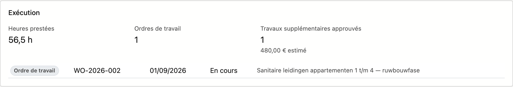
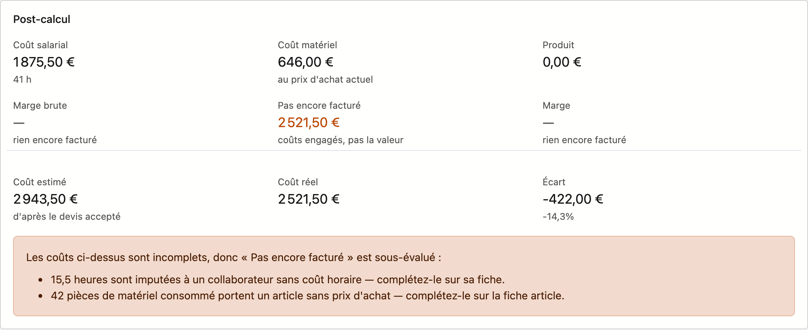

# Projets

Un projet est le chantier auquel tout se rattache : les devis, les ordres de travail, les bons de travail
et les factures y renvoient. L'écran **Projets** tient la liste à jour. Sur la fiche de projet, vous
enregistrez les données d'un chantier, vous voyez comment il se déroule sur le plan financier et dans
l'exécution, et vous suivez sa réception.

## Ouvrir l'écran

Dans la barre latérale, cliquez sur **Travail → Projets**.

## La liste

| Colonne | Ce que c'est |
|---|---|
| **Numéro** | Le numéro de projet |
| **Nom** | L'objet du projet |
| **Client** | La relation pour laquelle vous travaillez |
| **Statut** | **Actif**, **En attente** ou **Terminé** |
| **Date de début** / **Fin** | La période d'exécution |
| **Type de projet** | Le type de travail, par exemple une construction neuve |
| **Statut de production** | Où en est le travail sur le chantier. Le carré de couleur devant est la couleur que votre entreprise a donnée à ce statut |
| **Statut pipeline** | Où en est l'affaire sur le plan commercial |

Les trois dernières colonnes n'apparaissent que si votre entreprise a des valeurs dans cette liste de choix.
Ces listes se gèrent sous **Administration**.

- **Nouveau projet** ouvre une fiche vide.
- **Rechercher** filtre sur tout ce qui figure dans la liste.
- Les trois boutons à côté de Rechercher sont le filtre, le sélecteur de colonnes et **Exporter**.
- En bas, vous choisissez le nombre de lignes par page.

À droite se trouve le tiroir **Journal**. Il correspond au projet sur lequel se trouve votre curseur :
cliquez sur une ligne et dépliez le tiroir avec la flèche. Vous y trouvez les tâches, notes, pièces jointes
et l'historique de ce projet, sans ouvrir la fiche.

!!! tip "Un projet sans date de fin"
    La colonne **Fin** peut rester vide. Cela se produit pour un projet **En attente** : une date de début
    est convenue, mais pas encore de fin. Dès que le planning est fixé, vous complétez la date.

## La fiche de projet

Vous ouvrez une fiche en double-cliquant sur une ligne.

En haut figurent à gauche les onglets **Général** et **Réception**, et à droite **Tâches**, **Notes**,
**Pièces jointes** et **Historique**.

En bas se trouve la barre de boutons : **Enregistrer**, **Dossier de projet**, **Annuler** et, à part à
droite, **Supprimer**. La barre reste en place pendant que vous faites défiler la fiche.

- **Dossier de projet** n'apparaît que si vous pouvez consulter les chiffres financiers.
- Si vous ne pouvez pas modifier le projet, **Enregistrer** et **Supprimer** n'apparaissent pas, et
  **Annuler** devient **Vers la liste**.
- **Supprimer** demande d'abord une confirmation. Le projet va dans la corbeille.

### Onglet Général

| Champ | Remarque |
|---|---|
| **Numéro** | Obligatoire. Le numéro de projet auquel les devis et les factures renvoient |
| **Nom** | Obligatoire. L'objet du projet, en une phrase |
| **Client** | La relation pour laquelle vous travaillez. Choisissez dans la liste ; la croix vide le champ |
| **Description** | De la place pour ce qui a été convenu précisément |
| **Statut** | Où en est le projet : **Actif**, **En attente** ou **Terminé** |
| **Statut de production** | Où en est le travail sur le chantier, par exemple **En cours**. C'est indépendant du statut |
| **Type de projet** | Le type de travail |
| **Statut pipeline** | Où en est l'affaire sur le plan commercial — pas où en est le travail |
| **Date de début** / **Date de fin** | La période d'exécution |
| **Chantier** | Nom ou désignation du chantier, lorsqu'il porte un autre nom que le projet |
| **Rue**, **Code postal**, **Commune** | L'adresse du chantier. Tapez dans **Code postal** et choisissez dans la liste ; **Commune** se complète |

**Statut de production**, **Type de projet** et **Statut pipeline** n'apparaissent que si votre entreprise
a des valeurs dans cette liste de choix.

L'adresse du chantier est facultative. Si le chantier se trouve à l'adresse du client, vous pouvez
laisser ces champs vides.

Si vous cliquez sur **Enregistrer** alors que **Numéro** ou **Nom** est vide, la fiche indique en haut ce
qui manque.

Sous les données figurent jusqu'à quatre blocs que Nimble remplit lui-même. Vous ne pouvez pas les modifier.
Ils apparaissent sur un projet enregistré, et les trois derniers uniquement s'il y a quelque chose à montrer.

#### Le bloc Financier

| Montant | Ce qu'il représente |
|---|---|
| **Convenu** | Le total des devis acceptés pour ce projet |
| **Facturé** | Ce qui a déjà été facturé, avec en dessous le pourcentage du montant convenu |
| **Reste à facturer** | La différence entre les deux |
| **Solde ouvert** | Ce que le client doit encore payer |

Si l'on a facturé plus que le montant convenu, **Reste à facturer** s'affiche en orange, avec *facturé
au-delà du montant convenu* en dessous. C'est courant avec des travaux supplémentaires, mais vous le voyez
ainsi tout de suite. Si l'on a reçu plus que facturé, **Solde ouvert** indique *reçu plus que facturé*.

#### Le bloc Exécution

Ce bloc apparaît dès qu'un ordre de travail ou des heures prestées figurent sur le projet.

| Tuile | Ce qu'elle montre |
|---|---|
| **Heures prestées** | La somme des heures sur tous les bons de travail de ce projet |
| **Ordres de travail** | Le nombre d'ordres de travail |
| **Bons avec travaux supplémentaires** | Combien de travaux supplémentaires doivent encore être décidés. N'apparaît que s'il y en a |
| **Travaux supplémentaires approuvés** | Combien de travaux supplémentaires sont approuvés, avec le montant estimé. N'apparaît que s'il y en a |

Si un travail supplémentaire approuvé ne porte pas de montant, la tuile indique que le montant est
incomplet.

En dessous figure chaque ordre de travail avec son numéro, sa date planifiée, son statut et sa description.

#### Le bloc Post-calcul

Le post-calcul confronte les coûts réels du chantier à ce que vous avez facturé. Le bloc apparaît dès que
des coûts ou des factures figurent sur le projet.

| Tuile | Ce qu'elle montre |
|---|---|
| **Coût salarial** | Les heures des bons de travail multipliées par le **Coût horaire** de chaque collaborateur, avec en dessous le nombre d'heures |
| **Coût matériel** | Le matériel consommé, au prix d'achat actuel de l'article |
| **Produit** | Ce qui a été facturé, hors TVA |
| **Marge brute** | Le produit moins le coût salarial et le coût matériel |
| **Pas encore facturé** | Les coûts engagés qui ne sont pas encore couverts par une facture. C'est ce que le travail a coûté, pas ce qu'il vaut |
| **Marge** | La marge brute en pourcentage du produit |

Quelques cas à connaître :

- Si rien n'est encore facturé, **Marge brute** et **Marge** affichent un tiret avec *rien encore facturé*.
  Un projet en cours ne se lit alors pas comme déficitaire.
- S'il y a du chiffre d'affaires mais aucun coût, elles affichent un tiret avec *aucun coût comptabilisé*.
- Si l'on a facturé plus que les coûts comptabilisés, la cinquième tuile s'appelle **Facturé d'avance**.
- La **Marge** se colore en vert, orange ou rouge selon les seuils de marge de la
  [fiche d'entreprise](../settings/company-profile.md). Sans seuils, elle indique *aucun seuil de marge
  défini* et ne devient rouge qu'en cas de perte.

S'il y a un devis accepté sur le projet, trois montants suivent :

| Montant | Ce que c'est |
|---|---|
| **Coût estimé** | Le prix d'achat des lignes du devis accepté |
| **Coût réel** | Coût salarial plus coût matériel |
| **Écart** | La différence, en euros et en pourcentage. En rouge si le chantier revient plus cher que prévu |

!!! warning "Un cadre orange signifie : les chiffres sont incomplets"
    Nimble ne compte pas un prix manquant comme zéro sans le dire. S'il manque quelque chose, un cadre
    orange apparaît sous le bloc. Il indique quel chiffre est faussé, et pourquoi :

    - des heures sur un collaborateur sans coût horaire ;
    - du matériel consommé sur un article sans prix d'achat ;
    - des heures sur un bon de travail sans collaborateur ;
    - aucun coût comptabilisé.

    Les lignes du devis accepté sans prix d'achat sont aussi signalées : le coût estimé est alors
    sous-évalué. Complétez les données manquantes sur la fiche du collaborateur ou de l'article, et le
    post-calcul sera juste.

#### Le bloc Devis et factures

Ici figurent les devis et les factures de ce projet, avec numéro, date, statut et montant. Une note de
crédit porte sa propre étiquette. Cliquez sur un numéro pour ouvrir le document.

### Onglet Réception

Sur cet onglet, vous enregistrez la date de réception du chantier et ce qui doit encore être fait.

**Réceptionné le** est la date à laquelle vous avez remis le chantier. Le délai de garantie court à
partir de cette date. Si le champ reste vide, le chantier est considéré comme non réceptionné.

**Réceptionné par** indique qui a fait la réception, ou au nom de qui. Dans **Ce qui a été convenu**,
vous notez les remarques du client et les accords sur les points restants.

#### Points de réception

Un point de réception est une tâche à effectuer avant que le chantier soit entièrement terminé. Au-dessus
de la liste figurent quatre compteurs :

| Compteur | Ce qu'il compte |
|---|---|
| **Encore ouverts** | Les points qui ne sont pas encore cochés |
| **En retard** | Les points dont la date sous **Pour le** est dépassée |
| **Sans responsable** | Les points qui ne sont assignés à personne |
| **Sans date** | Les points sans date sous **Pour le** |

!!! warning "Un point sans responsable ni date reste en plan"
    Les deux derniers compteurs ont leur raison d'être. Un point dont personne ne sait qui s'en charge ni
    pour quand, n'est en pratique jamais traité. Indiquez donc toujours un nom et une date.

Sous la liste, vous ajoutez un point : remplissez **Quoi**, choisissez un **Responsable**, mettez une date
sous **Pour le** et cliquez sur **Ajouter un point**. Comme responsable, vous choisissez parmi les
collaborateurs actifs.

Dans la liste, vous marquez un point comme fait avec **Cocher** ; la colonne **Terminé** affiche alors la
date. La croix supprime un point. Les points cochés figurent en bas, en gris.

Une date dépassée s'affiche en rouge. Sur l'image ci-dessus, c'est le cas pour deux points.

#### Autorisation de facturation

Au bas de l'onglet, vous voyez si le projet peut être facturé. S'il n'est pas encore entièrement clôturé,
vous lisez pourquoi : le chantier n'est pas encore réceptionné, ou des points de réception sont encore
ouverts.

Ce bloc ne vous empêche **pas** de facturer : un état d'avancement précède justement la réception. C'est
un avertissement, pas un verrou.

Pour autoriser malgré tout la facturation de façon explicite, cochez **Autoriser malgré tout la
facturation** et indiquez le motif sous **Pourquoi**. Ce motif figure dans l'historique du projet. Sans
motif, l'autorisation ne compte pas.

## Le dossier de projet

Le bouton **Dossier de projet** ouvre un aperçu avant impression du projet, que vous pouvez enregistrer en
PDF. Le dossier contient les données et l'adresse du chantier, la situation financière, le post-calcul et
les ordres de travail.

## Voir aussi

- [Travailler avec une fiche](../fiches.md) — le fonctionnement des onglets et des boutons
- [Filtrer les listes](../lijsten-filteren.md) — rechercher, filtrer et choisir les colonnes
- [Relations](../relations.md) — les clients pour lesquels vous créez des projets
- [Ordres de travail](work-orders.md) — le travail sur un projet
- [Collaborateurs](staff.md) — le coût horaire utilisé par le post-calcul
